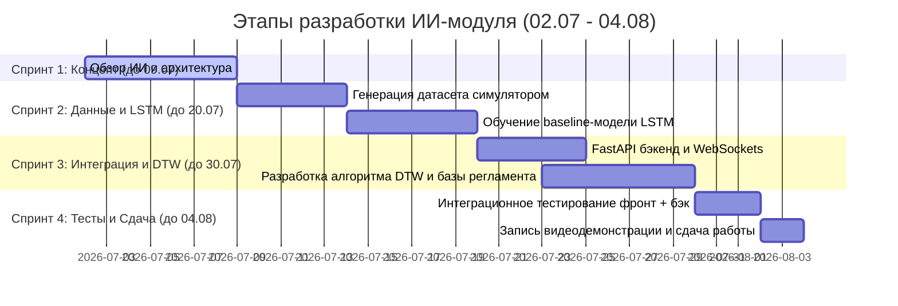

# Обзор ИИ-технологий для внедрения в MVP КТК ЭЛОУ-АВТ

Этот документ содержит аналитический обзор возможных методов и моделей искусственного интеллекта для реализации интеллектуального модуля Компьютерного тренажерного комплекса (КТК) установки ЭЛОУ-АВТ.

---

## 🎯 Основные задачи ИИ в рамках MVP
Для получения максимальной оценки (5 баллов по критерию ИИ) система должна решать три ключевые задачи:
1. **Прогноз аварийных рисков** до их фактического наступления (Predictive Maintenance / Anomaly Detection).
2. **Классификация и локализация ошибок** оператора во времени с определением причинно-следственных связей.
3. **Генерация персональных рекомендаций** и адаптивного сценария обучения.

---

## 🏗 Архитектура ИИ: 3 технологических сценария для MVP

### Сценарий А. Прогнозирование аварийных ситуаций (Анализ временных рядов)
Задача: Анализировать поток данных с датчиков (температура, давление, уровень) и выдавать вероятность аварии на $N$ шагов вперед.

| Модель / Алгоритм | Преимущества | Недостатки | Применимость в MVP |
| :--- | :--- | :--- | :--- |
| **LSTM / GRU** (Рекуррентные сети) | Отлично улавливают временные зависимости в показаниях приборов. | Требуют много обучающих данных; долгий инференс без GPU. | **Высокая** (классический подход для прогнозирования тренда давления/температуры). |
| **TCN** (Temporal Convolutional Networks) | Быстрее обучаются и выполняют инференс, чем LSTM, за счет сверток. | Хуже работают на очень длинных последовательностях. | **Средняя** (хорошая альтернатива LSTM для работы на CPU). |
| **Autoencoders** (Автокодировщики аномалий) | Могут обучаться без разметки аварий (unsupervised). Модель учит "норму", а отклонение считает аномалией. | Сложно локализовать конкретную причину аномалии. | **Высокая** (идеально для обнаружения неизвестных ранее типов отказов оборудования). |

> [!TIP]
> **Рекомендация для MVP:** Начать с легковесной модели **LSTM** или **GRU** на Python (PyTorch), обученной на логах симулятора Андрея. Модель будет принимать окно данных за последние 30 секунд и предсказывать давление/температуру на 15 секунд вперед.

---

### Сценарий Б. Анализ и классификация действий оператора
Задача: Сравнивать последовательность кликов и переключений оператора с «золотым стандартом» (инструкцией пуска/останова).

| Метод | Описание | Сложность внедрения | Плюсы для MVP |
| :--- | :--- | :--- | :--- |
| **DTW (Dynamic Time Warping)** | Алгоритм сравнения двух временных рядов. Позволяет измерить «расстояние» между текущими действиями оператора и эталонным шаблоном, даже если они не совпадают по времени. | Низкая (библиотека `fastdtw` в Python). | Быстрая интеграция без машинного обучения. |
| **HMM (Скрытые Марковские Модели)** | Моделируют процесс как последовательность состояний. Позволяют определить, на каком шаге инструкции находится оператор и какова вероятность ошибки на следующем шаге. | Средняя. | Отличная математическая база, легко интерпретировать результат. |
| **Transformer-based Sequence Classifiers** | Действия оператора кодируются как токены (слова), а сессия — как предложение. Легкий трансформер (класса BERT) классифицирует сессию на «успешную», «ошибочную» или «аварийную». | Высокая (требует разметки сотен сессий). | Максимальная точность на сложных сценариях. |

> [!TIP]
> **Рекомендация для MVP:** Использовать связку **DTW** (для проверки последовательности шагов регламента) и **деревьев решений (Random Forest / XGBoost)** для классификации типа ошибки оператора (например, «слишком быстрый нагрев», «несвоевременный дренаж»).

---

### Сценарий В. Генеративный ИИ для подсказок и рекомендаций (LLM & RAG)
Задача: Сгенерировать понятный текст для оператора, объясняющий, *почему* его действие было неверным, опираясь на регламент ЭЛОУ-АВТ.

*   **Подход:** Использование локальной квантованной языковой модели (например, **Llama-3-8B-Instruct-RU** или **Gemma-2-9B** через Ollama/vLLM на сервере).
*   **Архитектура RAG (Retrieval-Augmented Generation):**
    1. Технологический регламент ЭЛОУ-АВТ (из Google Drive со слайда 8) нарезается на куски и сохраняется в векторную базу данных (например, ChromaDB / FAISS).
    2. Когда ИИ фиксирует ошибку (например, перегрев печи), система извлекает из базы данных соответствующий пункт регламента (например, *"При превышении температуры печи выше 310°C оператор обязан..."*).
    3. Этот пункт регламента вместе со статусом датчиков портируется на вход LLM (System Prompt).
    4. Модель генерирует точную и юридически выверенную подсказку на русском языке.

---

## 📈 Дорожная карта разработки ИИ-модуля (Дистанционный этап)

Мы разделили разработку на 4 спринта, ориентируясь на официальный дедлайн дистанционного этапа (**04.08.2026**):

## 🛠 Предлагаемый стек технологий для ИИ-модуля:
* **Язык:** Python 3.10+
* **ML/DL:** PyTorch, Scikit-learn, Pandas (для прогнозирования рисков).
* **LLM/RAG:** LangChain / LlamaIndex, Ollama (локальный запуск моделей), ChromaDB (векторная база данных).
* **API:** FastAPI + WebSockets (для передачи телеметрии с фронтенда Дениса и возврата предсказаний ИИ в реальном времени).
