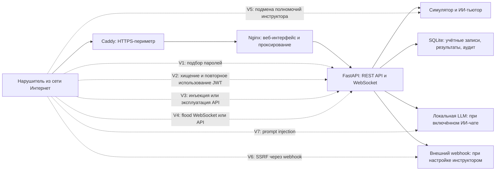
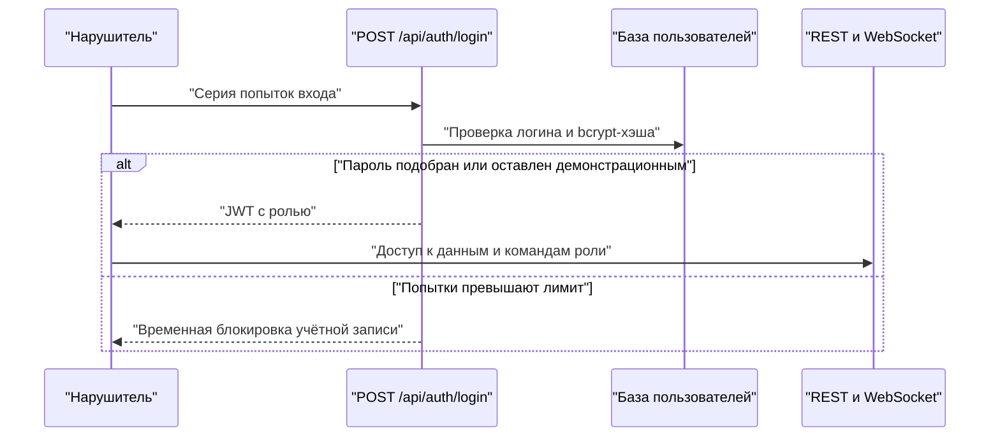
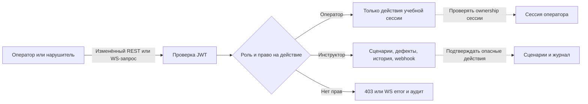
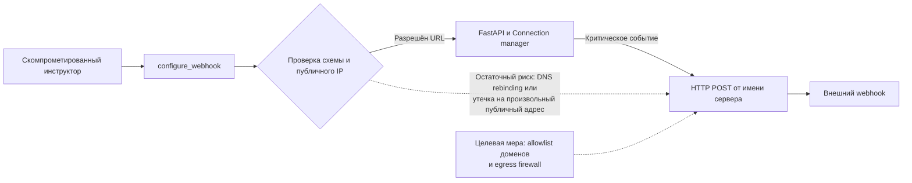

# Шаблоны векторов компьютерных атак

Документ подготовлен для модели угроз безопасности информации компьютерного тренажёрного комплекса «КТК ЭЛОУ-АВТ» (далее — КТК).

## 1. Назначение и источники

Документ содержит шаблоны векторов компьютерных атак, применимые к архитектуре КТК. Шаблон описывает возможную последовательность действий нарушителя, условия реализации, последствия и меры противодействия. Наличие шаблона не означает, что соответствующая уязвимость подтверждена в КТК: это предмет проверки при анализе защищённости и тестировании.

В качестве источников использованы:

- [CAPEC](https://capec.mitre.org/) — каталог шаблонов атак;
- [MITRE ATT&CK](https://attack.mitre.org/) — каталог тактик и техник нарушителя;
- [OWASP Top 10](https://owasp.org/Top10/2021/) и OWASP Cheat Sheets — источники рисков и мер защиты веб-приложений;
- [STIX 2.1](https://oasis-open.github.io/cti-documentation/stix/intro.html) — формат обмена данными об угрозах и индикаторах;
- [WASC Threat Classification](https://projects.webappsec.org/w/page/13246978/Threat%2520Classification) — дополнительная таксономия веб-угроз.

КТК не подключён к действующей АСУ ТП, ПЛК, КИПиА или исполнительным механизмам. Поэтому последствия компьютерных атак рассматриваются для конфиденциальности данных пользователей, целостности результатов обучения и доступности тренажёра, но не для непосредственного управления реальным производственным оборудованием.

## 2. Схема поверхности атаки

## 3. Векторы атак

### V1. Подбор паролей и использование предустановленных учётных записей

**Шаблоны и классификаторы:** CAPEC-112 «Brute Force», CAPEC-70 «Try Common or Default Usernames and Passwords», ATT&CK T1110 «Brute Force», OWASP A07:2021 «Identification and Authentication Failures».

**Вектор атаки.** Нарушитель направляет множество запросов к `POST /api/auth/login`, подбирая пароль, применяя password spraying или проверяя известные учётные данные. Дополнительный риск возникает при переносе демонстрационных учётных записей в производственную среду: при первом запуске в коде создаются предопределённые пользователи.

**Условия реализации.** Доступность интерфейса аутентификации нарушителю; слабый, типовой либо ранее раскрытый пароль; отсутствие или обход ограничений частоты запросов.

**Последствия.** Несанкционированный вход с ролью оператора или инструктора, просмотр результатов обучения, изменение сценариев, очистка истории сессий, настройка webhook.

**Реализованные меры.** Пароли хранятся в виде bcrypt-хэшей. После пяти неудачных попыток входа учётная запись блокируется на пять минут; события фиксируются в журнале аудита.

**Остаточный риск и необходимые меры.** В производственном развёртывании необходимо исключить создание демонстрационных учётных записей, обеспечить смену начальных паролей, добавить ограничение частоты по IP и на reverse-proxy, защиту учётных записей инструкторов и MFA при реальной эксплуатации.

### V2. Хищение и повторное использование JWT-токена

**Шаблоны и классификаторы:** CAPEC-102 «Session Sidejacking», CAPEC-60 «Reusing Session IDs», ATT&CK T1539 «Steal Web Session Cookie» как близкая техника хищения веб-сеанса, OWASP A07:2021.

**Вектор атаки.** JWT хранится в `sessionStorage`, а для WebSocket передаётся параметром URL. Нарушитель может получить токен через XSS, вредоносное расширение браузера, доступ к устройству пользователя или журналы промежуточных компонентов, после чего подключается к REST API либо WebSocket от имени владельца токена.

**Условия реализации.** Получение токена до истечения срока его действия; отсутствие отзыва или привязки токена к конкретному устройству.

**Последствия.** Повторное использование действительного токена. При захвате токена инструктора возможны управление сценариями, отказами и историей сессий.

**Реализованные меры.** JWT подписывается HMAC-SHA-256 и имеет срок жизни два часа. Nginx исключает query string из access-лога WebSocket.

**Остаточный риск и необходимые меры.** Следует убрать JWT из URL: выдавать короткоживущий одноразовый WebSocket-ticket через защищённый REST-запрос либо передавать токен первым сообщением WebSocket. Рекомендуется добавить идентификатор токена (`jti`), отзыв токенов при выходе, ограничение сессий и CSP для снижения риска XSS.

### V3. Эксплуатация публичного API и инъекции

**Шаблоны и классификаторы:** ATT&CK T1190 «Exploit Public-Facing Application», CAPEC-66 «SQL Injection», OWASP A03:2021 «Injection», WASC: Input Validation / SQL Injection.

**Вектор атаки.** Нарушитель подаёт специально сформированные данные в REST-запросах, JSON-командах WebSocket, импорте учебного сценария, параметрах ИИ-чата или идентификаторах сессий. Целью является обход проверок, отказ приложения, внедрение данных в запрос к БД либо изменение логики симулятора.

**Условия реализации.** Отсутствие строгой валидации входных данных, непараметризованный запрос к БД, небезопасная десериализация либо необработанное исключение.

**Последствия.** Нарушение целостности сценариев и оценок, раскрытие результатов обучения, отказ API или компрометация SQLite при появлении непараметризованных SQL-запросов.

**Реализованные меры.** Операции с SQLite используют параметризованные запросы. Импорт сценария проходит Pydantic-валидацию, запрещающую лишние поля. WebSocket отвергает некорректный JSON и проверяет тип команды.

**Остаточный риск и необходимые меры.** Необходимо применять строгие схемы ко всем входным данным, ограничить размеры HTTP- и WebSocket-сообщений, регулярно проводить SAST/DAST и негативные интеграционные тесты.

### V4. Обход разграничения доступа и злоупотребление полномочиями

**Шаблоны и классификаторы:** CAPEC-115 «Authentication Bypass», CAPEC-122 «Privilege Abuse», OWASP A01:2021 «Broken Access Control», ATT&CK T1078 «Valid Accounts».

**Вектор атаки.** Пользователь с ролью оператора изменяет вручную сформированный WebSocket-запрос, подставляет идентификатор чужой сессии или вызывает REST-метод инструктора напрямую. Пользователь с легитимной, но скомпрометированной учётной записью инструктора может злоупотребить разрешёнными функциями: удалить историю, изменить сценарий или настроить внешний webhook.

**Условия реализации.** Недостаточная проверка роли, владения сессией или полномочий для отдельной команды.

**Последствия.** Изменение результатов аттестации, нарушение доступности учебного процесса, ложные сообщения об авариях, отправка учебной телеметрии внешнему получателю.

**Реализованные меры.** REST-методы истории и сценариев используют проверку роли инструктора. WebSocket сопоставляет роль в запросе с ролью в JWT, запрещает оператору команды инструктора и защищает занятую операторскую сессию.

**Остаточный риск и необходимые меры.** Следует ввести разрешения на уровне отдельных действий, журналировать административные изменения, подтверждать разрушительные операции и регулярно выполнять тесты горизонтального и вертикального повышения привилегий.

### V5. Атаки на WebSocket: подмена сообщений, захват соединения и отказ в обслуживании

**Шаблоны и классификаторы:** CAPEC-125 «Flooding», ATT&CK T1499 «Endpoint Denial of Service», OWASP WebSocket Security Cheat Sheet и WSTG-CLNT-10.

**Вектор атаки.** Нарушитель открывает множество долгоживущих соединений или отправляет поток команд; направляет сообщения, не предусмотренные обычным интерфейсом; пытается установить соединение с другого origin. CORS сам по себе не защищает WebSocket, а проверка заголовка `Origin` в текущем обработчике не реализована.

**Условия реализации.** Доступность WebSocket извне; отсутствие общего лимита соединений, ограничения размера сообщения или проверки `Origin`.

**Последствия.** Исчерпание ресурсов процесса, искажение симуляции, переполнение журналов, снижение доступности для обучаемых.

**Реализованные меры.** На одно соединение установлен лимит 30 сообщений в секунду, некорректный JSON отклоняется, инструкторские команды для оператора блокируются и аудитируются.

**Остаточный риск и необходимые меры.** Рекомендуется проверять `Origin` по allowlist, установить общий лимит соединений и размер WebSocket-кадра на Nginx/Uvicorn, ограничить частоту по IP и пользователю, закрывать WebSocket при истечении JWT и проверять допустимость каждой команды по строгой схеме.

### V6. Server-Side Request Forgery через настройку webhook

**Шаблоны и классификаторы:** CAPEC-664 «Server-Side Request Forgery», OWASP A10:2021 «Server-Side Request Forgery».

**Вектор атаки.** Скомпрометированный или недобросовестный инструктор задаёт URL webhook. При критическом учебном событии сервер выполняет HTTP-запрос от своего имени. Целью может быть обращение к внутренним сервисам, облачным метаданным либо отправка данных на внешний ресурс.

**Условия реализации.** Возможность задать адрес получателя и недостаточная проверка DNS-имени, IP-адреса, перенаправлений или исходящих соединений.

**Последствия.** Разведка внутренней сети, получение данных от сервисов, доступных серверу, либо утечка технических журналов и телеметрии.

**Реализованные меры.** Разрешены только `http`/`https` и публичные IP-адреса; проверка повторяется непосредственно перед отправкой webhook.

**Остаточный риск и необходимые меры.** Следует заменить проверку «любой публичный адрес» на allowlist конкретных доменов получателей, выполнять DNS-разрешение и соединение с закреплённым проверенным IP, запретить редиректы и ограничить исходящие соединения контейнера сетевой политикой.

### V7. Подмена цепочки поставки, сценариев и ML-артефактов

**Шаблоны и классификаторы:** CAPEC-437 «Supply Chain», ATT&CK T1195 «Supply Chain Compromise», OWASP A08:2021 «Software and Data Integrity Failures».

**Вектор атаки.** Нарушитель изменяет зависимость, Docker-образ, ONNX-модель, её манифест либо JSON-сценарий на постоянном томе. Альтернативный путь — легитимный инструктор скомпрометированной учётной записью импортирует некорректный сценарий, меняющий эталонную последовательность и оценку.

**Условия реализации.** Компрометация репозитория, CI/CD, поставщика зависимости, файлового тома либо учётной записи инструктора.

**Последствия.** Искажение прогнозов, учебных рекомендаций и оценок; выполнение чужого кода через уязвимую зависимость; скрытая модификация логики продукта.

**Реализованные меры.** ONNX-модель сверяется с SHA-256 из манифеста; сценарии сохраняются атомарно; для импортируемого сценария задана строгая схема.

**Остаточный риск и необходимые меры.** Необходимо подписывать релиз и артефакты ключом, хранимым отдельно от пакета, вести SBOM, сканировать зависимости и образы, закреплять версии, разделить права на импорт и публикацию сценария, вводить согласование изменений.

### V8. Prompt injection в ИИ-чате

**Шаблоны и классификаторы:** OWASP LLM01:2025 «Prompt Injection». Вектор актуален только при включённом LLM-режиме.

**Вектор атаки.** Пользователь направляет в чат запрос, цель которого — изменить поведение модели, получить служебный контекст, сформировать недостоверную технологическую рекомендацию или вызвать чрезмерное потребление ресурсов локальной LLM.

**Условия реализации.** Возможность отправки произвольного текста в LLM и недостаточность системного промпта или простого сигнатурного фильтра для разделения инструкций и данных.

**Последствия.** Неверные учебные рекомендации, снижение доверия к тренажёру, попадание содержимого запроса в аудит-логи, чрезмерная нагрузка на LLM.

**Реализованные меры.** Имеется фильтр части характерных фраз и ограничение размера одного сообщения и количества сообщений в истории.

**Остаточный риск и необходимые меры.** Следует рассматривать ответ LLM как недоверенный контент, не предоставлять модели привилегированных инструментов и доступа к БД, применять семантические фильтры, лимиты запросов и токенов, а также отображать рекомендацию как справочную, требующую подтверждения инструктором.

## 4. Сводные приоритеты

1. **Высокий приоритет:** V1 — удаление демонстрационных учётных записей и защита входа; V2 — удаление JWT из URL; V4 — контроль полномочий инструктора; V6 — allowlist получателей webhook.
2. **Средний приоритет:** V5 — защита WebSocket от захвата и истощения ресурсов; V7 — подпись поставок и сценариев; V8 — усиление защиты ИИ-чата.
3. **Постоянный контроль:** V3 — проверка входных данных, сканирование зависимостей и тестирование публичных интерфейсов.

## 5. Нормативные и справочные ссылки

- [CAPEC-112: Brute Force](https://capec.mitre.org/data/definitions/112.html).
- [CAPEC-70: Try Common or Default Usernames and Passwords](https://capec.mitre.org/data/definitions/70.html).
- [CAPEC-66: SQL Injection](https://capec.mitre.org/data/definitions/66.html).
- [CAPEC-115: Authentication Bypass](https://capec.mitre.org/data/definitions/115).
- [CAPEC-125: Flooding](https://capec.mitre.org/data/definitions/125.html).
- [CAPEC-664: Server Side Request Forgery](https://capec.mitre.org/data/definitions/664.html).
- [CAPEC-437: Supply Chain](https://capec.mitre.org/data/definitions/437.html).
- [MITRE ATT&CK T1110: Brute Force](https://attack.mitre.org/techniques/T1110/).
- [MITRE ATT&CK T1190: Exploit Public-Facing Application](https://attack.mitre.org/techniques/T1190/).
- [MITRE ATT&CK T1499: Endpoint Denial of Service](https://attack.mitre.org/techniques/T1499/).
- [MITRE ATT&CK T1195: Supply Chain Compromise](https://attack.mitre.org/techniques/T1195/).
- [OWASP WebSocket Security Cheat Sheet](https://cheatsheetseries.owasp.org/cheatsheets/WebSocket_Security_Cheat_Sheet.html).
- [OWASP LLM01:2025 Prompt Injection](https://genai.owasp.org/llmrisk/llm01-prompt-injection/).
