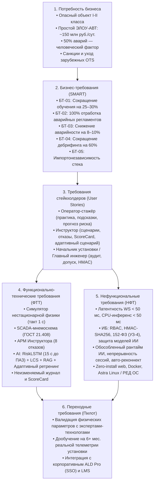

# 📋 Бизнес- и функционально-технические требования: КТК ЭЛОУ-АВТ
**Проект:** Компьютерный тренажерный комплекс установки ЭЛОУ-АВТ со Smart Tutor  
**Событие:** IT-Чемпионат нефтяной отрасли 2026 (Очный финал, РЭН-2026, ЦВЗ «Манеж», 14 октября 2026 г.)  
**Команда:** «Та самая команда» (HELOU AVT)  
**Регуляторный документ соревнований:** `docs/reference/final_rules_it_championship_2026.md`  
**Критерий оценки жюри в ПО «CASE-IN Симулятор»:**  
* **К6. «Презентация и оценка требований (БТ, ФТТ, НФТ)» (Слайды 3–4, вес: 0,10)**  
* Прямое влияние на критерии: **К1 (Техническая реализация, вес 0,25)**, **К2 (Демонстрация по БТ/ФТТ/НФТ, вес 0,15)**, **К5 (Искусственный интеллект, вес 0,10)**, **К7 (Инфраструктура, вес 0,10)**, **К8 (Информационная безопасность, вес 0,10)**.  
**Методологические стандарты:** BABOK v3 + Приказ Ростехнадзора № 533 + ГОСТ 21.408.

---

## 🎯 1. Соответствие критериям высшего балла (5/5) регламента Финала

Согласно Приложению № 3 официальных Правил Чемпионата, для получения максимальной оценки **5 баллов** по блоку требований необходимо выполнение обязательных условий:
1. **Чистота формулировок:** БТ, ФТТ и НФТ сформулированы на языке ценности и качества, **свободны от деталей технической реализации** и верифицируемы.
2. **Сквозная согласованность:** Для всей группы требований прослеживается **полная согласованность, полнота и реализуемость** (от проблемы до кода и тестов).
3. **Требования к ИИ на 5 баллов:** Классификация и локализация ошибок во времени + **интерпретированная обратная связь** + **адаптивный сценарий повторного обучения** + **прогноз риска ошибки до её совершения**.
4. **Требования к ИБ на 5 баллов:** Защита от НСД, подмены логов (HMAC-SHA256), **безопасность алгоритмов ИИ (защита от компрометации моделей и данных)**, мониторинг, аудит и схемы реагирования на инциденты.
5. **Требования к инфраструктуре на 5 баллов:** Жесткие пороги сетевых задержек (исключение рассинхронизации), **обособленные ресурсы для модуля ИИ**, непрерывность сессий и мониторинг.
6. **Регламентные ограничения презентации:** Ровно **13 содержательных слайдов** (без приложений, штраф -0,15 за перелимит), выступление **строго до 6 минут** (штраф -0,3 на 6:15).

---

## 💼 2. Проблематика и Бизнес-требования (БТ) — Слайд 3 макета

### 2.1. Проблематика и отраслевой контекст
* **Критичность объекта:** Установка ЭЛОУ-АВТ является головным технологическим процессом НПЗ (ОПО I–II класса опасности). Суточный простой установки обходится предприятию в **~150 млн рублей**.
* **Человеческий фактор:** Согласно отраслевым данным (*д.т.н. В.М. Дозорцев, 2024*), **свыше 50% аварийных остановов на НПЗ происходят из-за человеческого фактора**. Снижение числа аварий всего на **8%** полностью окупает разработку и внедрение компьютерных тренажёров.
* **Регуляторные требования:** Пункты 24–27 Федеральных норм и правил в области промышленной безопасности (Приказ Ростехнадзора № 533) предписывают обязательную регулярную тренажёрную подготовку оперативного персонала технологических установок по пуску, останову и ликвидации аварийных ситуаций.
* **Импортозамещение:** Уход с рынка зарубежных разработчиков высокоточных OTS (Honeywell UniSim, Schneider Electric SimSci, AspenTech, Yokogawa OmegaLand) требует создания отечественных легковесных web-тренажеров.

### 2.2. Реестр бизнес-требований (SMART)

| ID | Бизнес-требование | Содержание и обоснование | Целевая метрика (KPI) | Горизонт достижения |
|:---|:---|:---|:---|:---:|
| **БТ-01** | **Сокращение цикла подготовки оператора** | Сократить срок тренажёрной подготовки нового оператора технологической установки ЭЛОУ-АВТ на 25–30% за счёт интерактивной отработки регламентов и оперативной обратной связи с опережающим прогнозом рисков. | Время подготовки: **с 320 до 240 ч.** ($-25\%$) | 1-й год пилота |
| **БТ-02** | **100% готовность к ликвидации инцидентов** | Обеспечить обязательную практическую отработку и подтверждение навыков действий в **100% аварийных ситуаций** (7 регламентных сценариев) каждым оператором до допуска к реальному объекту. | Охват аварийных сценариев: **100% персонала** | Постоянно |
| **БТ-03** | **Снижение производственных инцидентов** | Снизить частоту технологических нарушений, прогаров труб печи П-1 и срывов режима колонны К-1 по вине персонала минимум на **8–10%** в первый год эксплуатации (что обеспечивает окупаемость КТК). | Инциденты из-за человеческого фактора: **$-10\%$** | 12 мес. после внедрения |
| **БТ-04** | **Оптимизация трудозатрат наставников** | Сократить время старших инструкторов на проведение дебрифинга тренировок на **60%** за счёт автоматизированного выявления нарушений алгоритмом LCS, формирования ScoreCard и рекомендации повторных сценариев. | Длительность разбора: **с 45 до 15 мин/сессия** | С момента запуска |
| **БТ-05** | **Импортонезависимость и оптимизация TCO** | Обеспечить функционирование тренажера на отечественном стеке (Astra Linux / РЕД ОС, Docker, Python, ONNX Runtime) без лицензионной зависимости от зарубежных OTS и без потребности в закупке GPU-серверов. | Доля суверенного ПО: **100%**; Зависимость от GPU: **0%** | MVP / Пилот |

---

## 👥 3. Требования стейкхолдеров (User Stories)

### 3.1. Оператор-стажёр (Trainee)
* **US-01 (Интерактивная практика):** *«Я как оператор хочу управлять виртуальной мнемосхемой установки (клапаны V-1, V-2, V-3, насосы, уставки регуляторов) в темпе 1:1, чтобы сформировать устойчивые навыки ведения технологического режима».*
* **US-02 (Прогноз риска до ошибки):** *«Я как оператор хочу видеть опережающий прогноз параметров на 15 секунд вперёд и индикатор риска ПАЗ, чтобы успевать предотвращать аварию до срабатывания аварийной блокировки».*
* **US-03 (Интерпретированная помощь):** *«Я как оператор хочу получать понятное объяснение допущенной ошибки со ссылкой на пункт регламента и рекомендацию адаптивного сценария для закрепления навыка».*

### 3.2. Инструктор производственного обучения (Instructor)
* **US-04 (Управление нештатными ситуациями):** *«Я как инструктор хочу иметь возможность активировать любой из 8 технологических отказов (заклинивание клапана, отказ насоса, обводнение) в любой момент тренировки, чтобы проверить стрессоустойчивость стажёра».*
* **US-05 (Объективный дебрифинг и адаптивность):** *«Я как инструктор хочу получать автоматически рассчитанный ScoreCard с локализацией ошибок во времени (LCS) и готовой рекомендацией адаптивного сценария повторного обучения под выявленные слабые места».*

### 3.3. Главный инженер / Начальник установки / Служба ИБ
* **US-06 (Контроль достоверности и аудит):** *«Я как руководитель опасного объекта хочу иметь криптографически подписанный архив результатов тренировок (HMAC-SHA256) и сквозной аудит-лог, исключающий фальсификацию оценок при допуске сотрудника к работе».*
* **US-07 (Безопасность алгоритмов ИИ):** *«Я как специалист ИБ хочу быть уверен, что веса моделей ИИ защищены от подмены и отравления данных, а веб-контур защищен от инъекций и атак SSRF».*

---

## ⚙️ 4. Функционально-технические требования (ФТТ) — Слайд 4 (Левая колонка)

| Подсистема | ID | Функциональное требование (ФТТ) | Реализация в КТК ЭЛОУ-АВТ |
|:---|:---|:---|:---|
| **1. Модуль физико-химической симуляции** | **ФТ-01** | Моделирование материальных и тепловых балансов сквозного технологического тракта ЭЛОУ $\rightarrow$ АТ (печь П-1, колонна К-1) $\rightarrow$ ВТ. | Контур П-1/К-1 детальный (первопринципная гидродинамика и теплообмен); ЭЛОУ и ВТ агрегированные. |
| | **ФТ-02** | Посекундный пересчёт состояния математической модели в темпе реального времени. | Дискретность расчётного шага: ровно $1{,}0\text{ с}$ без рассинхронизации. |
| | **ФТ-03** | Удержание технологических переменных в границах физической адекватности: $T \in [20, 600]^\circ\text{C}$, $P \in [0{,}02; 1{,}5]\text{ МПа}$, $L \in [0, 100]\%$. | Исключены математические расходимости и отрицательные значения. |
| | **ФТ-04** | Поддержка библиотеки из **7 базовых технологических сценариев**: штатный пуск, останов, останов К-1, аварийный сброс давления, циркуляция, прорыв солей с ЭЛОУ, прогар змеевика П-1. | Начальные условия загружаются из верифицированного конфигурационного реестра. |
| | **ФТ-05** | Поддержка динамической активации **8 типов технологических отказов оборудования**: отказ сырьевого насоса, закоксовывание змеевика, заклинивание клапанов и др. | Инжекция дефектов без прерывания тренировочной сессии. |
| **2. Модуль SCADA и АРМ Оператора** | **ФТ-06** | Интерактивная мнемосхема по стандарту ГОСТ 21.408 с отображением реальных позиций КИПиА (`WRA 4К-1`, `LRCA 604`, `TRCA`, `PRCA`). | Посекундное обновление анимаций потоков и значений приборов. |
| | **ФТ-07** | Дистанционное управление исполнительными механизмами: клапаны подачи сырья (V-1), топливного газа (V-2), орошения (V-3), насосы, уставки регуляторов. | Rate limiting и фильтрация повторных кликов. |
| | **ФТ-08** | Интерактивный журнал событий и аварийных тревог с цветовой индикацией: Норма $\rightarrow$ Предупреждение $\rightarrow$ Авария/ПАЗ. | Мгновенная фиксация времени срабатывания ($HH:mm:ss$). |
| | **ФТ-09** | Режимы работы: «Обучение с ИИ» (подсказки и прогноз включены) и «Экзамен» (подсказки скрыты, строгий аттестационный протокол). | Переключение режима доступно исключительно инструктору. |
| **3. Модуль АРМ Инструктора** | **ФТ-10** | Управление сессией: инициализация, старт, пауза, возобновление и экстренный сброс в начальное состояние сценария. | Управление передается через авторизованный WebSocket-канал. |
| | **ФТ-11** | Интерактивная панель ввода возмущений и аварий во время выполнения упражнения оператором. | Мгновенный отклик физической модели на введенный отказ. |
| | **ФТ-12** | Синхронное наблюдение за телеметрией, действиями оператора и динамикой риска в реальном времени. | Зеркалирование рабочего экрана оператора без задержки. |
| **4. Модуль ИИ-наставника (Smart Tutor)** | **ФТ-13** | **Прогноз риска ошибки до её совершения:** прогнозирование технологических параметров (T, P, L) на **15 секунд вперёд** моделью RiskLSTM по окну телеметрии $30\text{ с} \times 7\text{ параметров}$. | Формат ONNX Runtime (CPU), время отклика $< 50\text{ мс}$, заблаговременность оповещения $\ge 15\text{ с}$. |
| | **ФТ-14** | **Классификация и локализация ошибок во времени:** сопоставление действий оператора с регламентом на основе алгоритма LCS (Longest Common Subsequence). | Определение пропущенных, лишних и несвоевременных действий с привязкой к шкале времени. |
| | **ФТ-15** | **Интерпретированная обратная связь:** выдача понятного текстового объяснения сущности ошибки с точной выдержкой из техрегламента. | Локальный RAG-ретривер (TF-IDF) по регламенту ЭЛОУ-АВТ-6 без галлюцинаций. |
| | **ФТ-16** | **Адаптивный сценарий повторного обучения:** автоматическое формирование рекомендации целевого сценария для ликвидации выявленного пробела в навыках. | Генерация адаптивного тренировочного трека в итоговом отчете ScoreCard. |
| **5. Модуль аналитики и протоколирования** | **ФТ-17** | Формирование итогового аттестационного листа (ScoreCard) с детализацией нарушений технологического регламента и выставлением баллов (0–100). | Автоматический расчет по завершении сессии за $< 2\text{ с}$. |
| | **ФТ-18** | Экспорт машиночитаемого (JSON) и презентационного (PDF) протокола с фиксацией цифровой подписи сессии. | Готовность к передаче во внешние корпоративные LMS. |

---

## 🛡️ 5. Нефункциональные требования (НФТ) — Слайд 4 (Правая колонка)

| Категория качества | ID | Нефункциональное требование | Целевой показатель / Стандарт регламента | Метод проверки |
|:---|:---|:---|:---|:---|
| **Производительность (Performance)** | **НФТ-01** | Такт выдачи телеметрии WebSocket | Ровно $1{,}0\text{ с}$ (1 Гц) без накопления временного дрейфа | Логирование таймера симуляции |
| | **НФТ-02** | Сетевая задержка (Network Latency) | Задержка передачи команд и телеметрии $< 50\text{ мс}$ в LAN | WebSocket round-trip time (RTT) |
| | **НФТ-03** | Скорость инференса ИИ-модели | Время выполнения шага RiskLSTM $< 50\text{ мс}$ на CPU | Бенчмарк ONNX Runtime |
| | **НФТ-04** | Время формирования ScoreCard | Не более $2{,}0\text{ секунд}$ с момента завершения сессии | Замер времени эндпоинта `/sessions/complete` |
| **Информационная безопасность (Security)** | **НФТ-05** | Серверная ролевая модель (RBAC) | Жёсткая валидация JWT-токенов. Оператор изолирован от команд инструктора (`inject_defect`, `reset` возвращают 403 Forbidden). | 100% покрытие автотестами `test_auth_rbac.py` |
| | **НФТ-06** | Контроль целостности результатов (Integrity) | Протокол сессии подписывается криптографическим хэшем **HMAC-SHA256**. Подмена результатов в БД делает хэш невалидным. | Крипто-тест `domain/integrity.py` |
| | **НФТ-07** | Неизменяемый аудит-лог (Audit Trail) | Посекундная фиксация всех действий оператора и инструктора в журнале аудита со связкой по `session_id`. | Записи в таблице `audit_logs` |
| | **НФТ-08** | Безопасность алгоритмов ИИ | Верификация контрольной суммы весов ONNX-модели (SHA-256) при старте; защита от Prompt Injection в RAG; санитизация входной телеметрии от отравления данных. | Проверка контрольных сумм и middleware валидации |
| | **НФТ-09** | Защита от веб-угроз и 152-ФЗ | Защита от SSRF (белый список URL); rate limit WebSocket-команд (10 команд/с); пароли в виде bcrypt-хэшей (класс УЗ-4). | Документ `docs/security_compliance.md` |
| **Надёжность и архитектура (Reliability)** | **НФТ-10** | Непрерывность сессий и авто-реконнект | Автоматическое переподключение (auto-reconnect) клиента при обрыве связи с полным сохранением состояния модели на сервере. | Стендовый тест с принудительным разрывом сети |
| | **НФТ-11** | Обособленные ресурсы для модуля ИИ | Выделение изолированного вычислительного пула потоков для инференса ONNX, исключающего блокировку цикла физического симулятора. | Архитектура воркеров в FastAPI/Python |
| | **НФТ-12** | Доступность платформы (SLA) | Целевая доступность серверной части в период учебных смен $\ge 99{,}5\%$. | Мониторинг healthcheck эндпоинтов Caddy |
| **Совместимость и TCO (Portability)** | **НФТ-13** | Нулевая установка на клиенте (Zero-Install) | Полное функционирование АРМ Оператора и Инструктора в веб-браузерах (Яндекс.Браузер, Chromium, Firefox) без локальных плагинов. | Проверка в трёх браузерах |
| | **НФТ-14** | Импортонезависимость среды развёртывания | Контейнеризованное развертывание (Docker / Podman) под управлением отечественных ОС (Astra Linux, РЕД ОС, ALT Linux). | Развертывание Docker Compose под Linux |
| | **НФТ-15** | Отсутствие зависимости от GPU | Полное исполнение симулятора, backend и инференса ONNX на стандартных серверных процессорах x86_64 без дискретных видеокарт. | Подтверждено на стандартном CPU-рантайме |

---

## 🔗 6. Сквозная матрица трассируемости (Traceability Matrix)

Матрица наглядно доказывает жюри взаимосвязь и проверяемость решений:

| Бизнес-требование | Функциональные требования | Нефункциональные требования | Модули архитектуры | Метод проверки и фактическое подтверждение |
|:---|:---|:---|:---|:---|
| **БТ-01** (Ускорение обучения на 25–30%) | ФТ-06, ФТ-07, ФТ-13, ФТ-15, ФТ-16 | НФТ-01, НФТ-02, НФТ-03, НФТ-13 | Frontend SCADA, `elou_tutor/ml`, RAG-сервис | Интерактивный web-интерфейс с предиктивной индикацией; тесты времени инференса ONNX $<50$ мс. |
| **БТ-02** (100% отработка аварий) | ФТ-04, ФТ-05, ФТ-10, ФТ-11, ФТ-13 | НФТ-01, НФТ-10, НФТ-11 | Симулятор физики (`elou_tutor/simulation`), АРМ Инструктора | 7 сценариев и 8 отказов покрыты тестами (`pytest tests/test_simulation.py`). |
| **БТ-03** (Снижение инцидентов на 8–10%) | ФТ-01, ФТ-02, ФТ-03, ФТ-13 | НФТ-01, НФТ-03, НФТ-11 | Физическая модель, RiskLSTM predictor | Срабатывание ПАЗ предотвращается опережающим алертом за 17 секунд (ML evaluation report). |
| **БТ-04** (Сокращение дебрифинга на 60%) | ФТ-14, ФТ-15, ФТ-16, ФТ-17, ФТ-18 | НФТ-04, НФТ-06, НФТ-07 | Модуль оценки LCS (`elou_tutor/tutor`), ScoreCard | Автогенерация ScoreCard за $<2$ с, визуализация пропущенных шагов и рекомендация сценария. |
| **БТ-05** (Суверенитет и TCO) | ФТ-09, ФТ-10 | НФТ-05, НФТ-06, НФТ-08, НФТ-14, НФТ-15 | FastAPI RBAC, HMAC Security, Docker Compose | 156 тестов бэкенда, 6 контрактов слоёв архитектуры, работа на CPU без GPU. |

---

## 🚦 7. Границы MVP и переходные требования к промышленному пилоту

Честная инженерная позиция исключает необоснованные заявления («оверклейм»):

| Компонент / Направление | Реализовано и верифицировано в MVP | Целевой этап промышленного пилота на НПЗ |
|:---|:---|:---|
| **Математическая модель процесса** | Нестационарная гидродинамическая модель ЭЛОУ-АТ-ВТ с жесткими физическими пределами. | Точная параметрическая калибровка коэффициентов по 6+ месяцам архивной телеметрии установки ЭЛОУ-АВТ-6. |
| **Нейросетевая модель прогноза** | Обучена на синтетических аварийных сценариях; точность $R^2 = 0{,}985$, $F_1 = 0{,}730$. | Дообучение на обезличенных записях реальных нештатных ситуаций НПЗ; расширение предиктивного окна. |
| **База данных и аудит** | Локальная SQLite в режиме WAL (достаточно для малых групп и стенда). | Отказоустойчивый кластер PostgreSQL с непрерывной репликацией и резервным копированием. |
| **Корпоративная интеграция** | Изолированная ролевая модель JWT. | Интеграция с корпоративной службой каталогов ALD Pro / Active Directory по протоколам SAML/OIDC, а также с корпоративной LMS. |
| **Правовой статус результатов** | Инструмент практического обучения и объективного дебрифинга. | Формализация методики допуска оперативного персонала в соответствии с внутренней нормативной базой компании. |

---

## 🎙️ 8. Речевой модуль для спикера (Слайды 3 и 4, тайминг: 0:00 – 0:45)

> *(Слайд 3: Проблематика и Бизнес-требования)*  
> «Уважаемые члены жюри! Установка первичной переработки нефти ЭЛОУ-АВТ — это непрерывный опасный производственный объект первого класса. Любой её аварийный останов обходится предприятию в 150 миллионов рублей в сутки. По отраслевой статистике более 50% аварийных остановов вызваны человеческим фактором. После ухода западных поставщиков тренажёров перед отраслью встала задача создания доступного суверенного решения.  
> 
> Опираясь на стандарт BABOK, мы выделили пять бизнес-требований:  
> 1. Сократить срок подготовки оператора на 30%.  
> 2. Обеспечить 100% отработку аварийных сценариев по 533-му приказу Ростехнадзора.  
> 3. Снизить аварийность на установке минимум на 8–10%, что гарантирует полную окупаемость проекта.  
> 4. Сократить время дебрифинга наставником в три раза за счёт автоматического скоринга.  
> 5. Обеспечить 100% независимость от зарубежных лицензий и отсутствие потребности в дорогих GPU.  
> 
> *(Слайд 4: Функциональные и нефункциональные требования)*  
> Для реализации этих целей система объединяет пять функциональных контуров: сквозную нестационарную физику с шагом в одну секунду, SCADA-мнемосхему по ГОСТу, АРМ Инструктора с вводом восьми типов отказов и модуль ИИ-наставника. Наша нейросеть RiskLSTM прогнозирует риск ошибки за 15 секунд до её совершения, алгоритм LCS локализует отклонения от регламента, а система выдает интерпретированную обратную связь и адаптивный сценарий повторного обучения.  
> 
> Нефункциональные требования гарантируют задержку веб-сокета менее 50 миллисекунд, защиту моделей ИИ от компрометации, нулевую установку на клиенте и подтверждение целостности протоколов алгоритмом HMAC-SHA256.  
> 
> Перейдем к архитектуре решения...»
