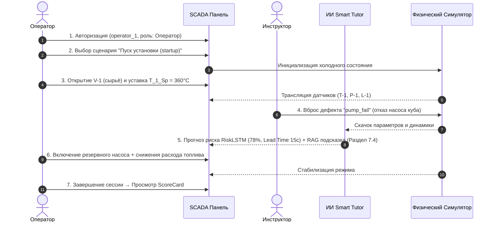

# 🎬 Сценарий интерактивной видеодемонстрации — ЭЛОУ-АВТ Smart Tutor

**Цель демонстрации:** Продемонстрировать полный функционал комплекса в реальном времени (Критерий К2 — вес 0.15) с участием Оператора, Инструктора и ИИ-тьютора.

**Хронометраж:** 4–5 минут  
**Среда:** Локальный запуск (`backend` FastAPI + `frontend` React + `elou_tutor` simulator).

---

## ⏱️ Пошаговый тайминг и действия

---

### Раздел 1: Вход в систему и инициализация (0:00 — 0:45)
- **Действие оператора:** На экране логина выбирается роль **Оператор**, вводится логин `operator_1`.
- **Экран:** Переход на SCADA-панель ЭЛОУ-АВТ.
- **Голосовое сопровождение / Описание:**
  > «Приветствуем жюри! Перед вами компьютерный тренажёрный комплекс ЭЛОУ-АВТ Smart Tutor. Ситуация: оператор приступает к смене и выбирает сценарий **"Холодный пуск печи П-1 и колонны К-1"**. Обратите внимание на главную мнемосхему: все клапаны перекрыты, датчики показывают начальное состояние. На панели справа отображается журнал событий `AlarmLog` и таймер сессии».

---

### Раздел 2: Управление технологическим процессом (0:45 — 2:00)
- **Действие оператора:**
  1. Нажатие на клапан `V-1` (Подача нефтяного сырья в печь) — статус изменяется на `Открыт`.
  2. Установка регулятора температуры печи `T_1_Sp` на значение **360.0 °C**.
- **Реакция системы:** На графиках трендов виден плавно растущий график температуры `T_1` и стабилизация уровня `L_1` в колонне.
- **Голосовое сопровождение / Описание:**
  > «Оператор начинает процедуру вывода печи на режим: открывает подачу сырья V-1 и задаёт целевую температуру змеевика. Физическая модель реального времени вычисляет динамику теплообмена и гидравлики с частотой 1 Гц. Все ограничения технологического регламента (ПАЗ и отсечка топливного газа) активны».

---

### Раздел 3: Инструкторский вброс аварии и отклик ИИ (2:00 — 3:15)
- **Действие инструктора (ARM Instructor / параллельное окно):** Инструктор выбирает дефект **`pump_fail`** (отказ циркуляционного насоса куба печи) и нажимает «Активировать».
- **Реакция системы:**
  1. В `AlarmLog` появляется критическое предупреждение: `CRITICAL: Отказ циркуляционного насоса П-2! Риск прогара змеевика!`.
  2. В блоке **ИИ-ассистента (RiskPredictor)** индикатор риска мгновенно меняет цвет на красный с оценкой **78%** и плашкой **Lead Time = 15 сек** (прогноз прогара до физического превышения уставки).
  3. Модуль **RAG-подсказок** выводит выдержку из **Раздела 7.4 Технологического регламента ЭЛОУ-АВТ**:  
     > *«При останове насоса циркуляции куба печи П-1 немедленно переключить на резервный насос П-2Б и снизить подачу топливного газа для предотвращения коксования».*
- **Голосовое сопровождение / Описание:**
  > «Инструктор создаёт внештатную ситуацию — отказ насоса куба. Не нейросеть ждёт аварии, а рантайм-модель RiskLSTM предупреждает оператора за 15 секунд ДО достижения критического порога. RAG-ассистент на базе векторного поиска мгновенно выдаёт точный пункт техрегламента без галлюцинаций».

---

### Раздел 4: Ликвидация аварии и нормализация (3:15 — 4:00)
- **Действие оператора:**
  1. Оператор оперативно включает резервный агрегат (нажатие `V-3` / резервный контур).
  2. Корректирует уставку топлива `T_1_Sp` до безопасных **340.0 °C**.
- **Реакция системы:** Уровень риска ИИ снижается до безопасных 12%, графики температуры выравниваются в зелёной зоне.
- **Голосовое сопровождение / Описание:**
  > «Оператор следует подсказке ИИ и правилам ИБ/ТБ, включает резерв и снижает тепловую нагрузку. Авария предотвращена, установка возвращена в штатный режим».

---

### Раздел 5: Карточка оценки квалификации ScoreCard (4:00 — 5:00)
- **Действие оператора:** Нажатие кнопки **«Завершить сессию»**.
- **Реакция системы:** Открывается модальное окно `ScoreCard.tsx`.
  - **Итоговая оценка:** `92 / 100` (Grade A).
  - **LCS-анализ траектории:** Зафиксирована правильная последовательность действий. Time localization показала реакцию на аварийный сигнал за 8.5 секунд.
  - **Персональная рекомендация ИИ:** *«Рекомендуемый следующий сценарий: Overpressure Relief (Сброс избыточного давления) для закрепления навыков работы с предохранительными клапанами V-2»*.
- **Голосовое сопровождение / Описание:**
  > «По завершении тренировки модуль Тьютора вычисляет LCS-выравнивание действий оператора с эталонной траекторией, формирует хэш целостности протокола HMAC-SHA256 для защиты от подделки и выдаёт адаптивную рекомендацию на следующую тренировку. Продукт готов к промышленному внедрению!»
