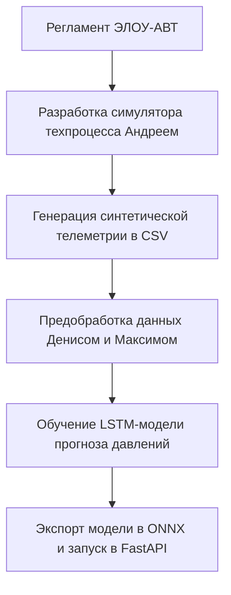

# Анализ Q&A вебинара IT-чемпионата 2026

Этот документ обобщает ключевые тезисы и ответы экспертов Газпромнефти на вебинаре открытия (01.07.2026), а также их влияние на наш план разработки MVP.

---

## 🚨 Ключевое изменение, меняющее план работы
> [!IMPORTANT]
> **Реальной телеметрии для обучения ИИ-моделей НЕ БУДЕТ.**
> Эксперты прямо заявили: *«Телеметрию мы предоставлять не можем... в рамках исходных данных её нет»*.
> 
> **Что это меняет в нашем плане:**
> Мы не можем просто взять готовый датасет и обучить модель. **Симулятор Андрея становится главным источником данных (генератором датасета).** 
> Нам необходимо разработать симулятор таким образом, чтобы он мог работать в ускоренном режиме и выплевывать тысячи строк синтетической телеметрии (как нормальной работы, так и аварийных сценариев). И уже на этих **синтетических данных** мы будем обучать нашу LSTM-модель прогнозирования рисков.

---

## 💡 Важные инсайты и подтверждения нашей стратегии

### 1. Подтверждение отказа от тяжелых LLM
*   **Слова экспертов:** *«Если вы применяете языковые модели, внимательно проработайте с ограничениями. У языковых моделей требуются большие ресурсы и некоторые ограничения по лицензиям...»*.
*   **Влияние на наш план:** Это на 100% подтверждает правильность выбранного нами вчера **Гибридного Smart-MVP**. Отказ от генерации подсказок тяжелыми LLM «на лету» в пользу структурированной локальной базы знаний (поиск по коду ошибки из регламента) убережет нас от:
    * Проблем с лицензиямиopensors-моделей в корпоративном контуре.
    * Зависаний демонстрации из-за отсутствия GPU на презентационном ноутбуке.

### 2. Выбор тех-стека (React / FastAPI / Python)
*   **Слова экспертов:** *«Ограничений по языкам программирования нет... рассматривайте opensourse-продукты с точки зрения технических и юридических ограничений»*.
*   **Влияние на наш план:** Наш стек (React, FastAPI, PyTorch, Docker) полностью легитимен. Все библиотеки имеют opensource лицензии (MIT/Apache), проходящие под критерии импортозамещения. Использование веб-интерфейса вместо Unity/Unreal одобряется экспертами (не накладывает ограничений на презентационное оборудование).

### 3. Обязательные артефакты для сдачи отборочного этапа (до 04.08)
*   **Что нужно сдать (дедлайн дистанционной части — 04.08.2026):**
    1.  **Презентация** по критериям кейса.
    2.  **Пояснительный документ** с подробным описанием решения (алгоритмы, пошаговый план).
    3.  **Видеодемонстрация (скринкаст)** работающего софта.
*   **Влияние на наш план:** 
    *   Часть 2 (пояснительный документ) мы закроем нашими архитектурными файлами (`docs/ai_architecture.md`, `walkthrough.md`, документ ИБ от Екатерины).
    *   Внутренний рубеж 09.07 служит для защиты концепта и прототипа. Съемку и монтаж финального видеоролика работы SCADA-панели и симулятора планируем на конец июля (перед очным этапом).

### 4. Требование к масштабируемости под другие установки
*   **Слова экспертов:** *«Мы бы хотели впоследствии ваше решение каким-то образом переиспользовать, по возможности модернизировать... ваше решение должно масштабироваться и иметь возможность модернизации»*.
*   **Влияние на наш план:** Мы не должны намертво зашивать в коде только схему ЭЛОУ-АВТ. В пояснительной записке мы должны отразить, что наша архитектура является **конфигурируемой**. 
    *   *Решение:* Описать структуру JSON-конфига, который может описывать граф любой другой установки (узлы, датчики, трубы, клапаны). При загрузке этого JSON фронтенд должен динамически рендерить мнемосхему, а бэкенд — подгружать соответствующие веса LSTM и базу регламента.

### 5. Выделение "Уровня 2" КТК (Сценарии дефектов)
*   **Слова экспертов:** *«Второй уровень создания модели — формализация типовых дефектов... моделирование сценарного обучения, когда инструктор задает сценарий, а оператор показывает, как справляется»*.
*   **Влияние на наш план:** В симулятор необходимо явно добавить функционал запуска аварийных сценариев (дефектов) «из коробки».
    *   *Решение:* Сделать на фронтенде скрытую «Панель Инструктора» (или вынести кнопки в Header), где можно принудительно запустить сбои: *«Отказ входного насоса»*, *«Прогар змеевика печи П-1»*, *«Зависание клапана V-2»*. Оператор должен будет обнаружить сбой по приборам и ликвидировать его согласно регламенту.

### 6. Обучение "Инженерной интуиции" оператора
*   **Слова экспертов:** *«Опытный оператор по мельчайшим колебаниям может определить, что происходит... У молодого специалиста такой наработанности нет...»*.
*   **Влияние на наш план:** Нам нужно помочь оператору видеть эти «мельчайшие колебания» трендов.
    *   *Решение:* Добавить в ИИ-ассистент или мнемосхему мини-графики трендов (sparklines) для каждого датчика, которые показывают скорость изменения параметра (производную $dT/dt$, $dP/dt$). Если датчик стабилен — линия ровная, если начинает резко расти — ИИ подсвечивает тренд стрелкой вверх до того, как сработает аларм превышения уставки.

---

## 📈 Корректировка дорожной карты разработки ИИ

