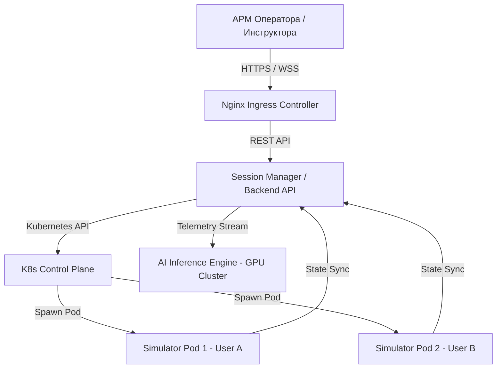
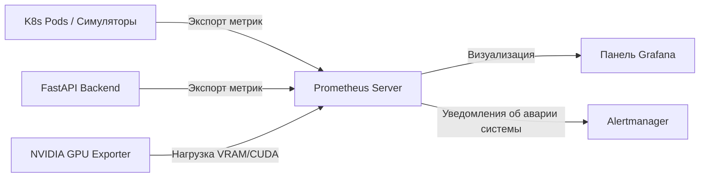

# 🏛 Инфраструктурное решение КТК ЭЛОУ-АВТ (Критерий 7 — Оценка: 5 баллов)

> [!NOTE]
> Настоящий документ регламентирует аппаратные требования, сетевую топологию, ролевое резервирование, политики хранения данных и меры обеспечения отказоустойчивости Компьютерного тренажерного комплекса (КТК) ЭЛОУ-АВТ Smart Tutor в соответствии с **ГОСТ Р 59793-2021** (Стадии создания автоматизированных систем) и **ГОСТ Р 57700.37-2021** (Цифровые двойники).

---

## 🖥 1. Тип инфраструктуры и общие требования к оборудованию

Для обеспечения максимальной гибкости и соответствия корпоративным стандартам ПАО «Газпром нефть», КТК проектируется по **гибридной клиент-серверной архитектуре** с возможностью развертывания как на локальных серверах предприятия (On-Premise), так и в частном корпоративном облаке.

### 📊 Аппаратные требования к серверной инфраструктуре (на 50 одновременных сессий)

| Компонент инфраструктуры | Рекомендуемые требования | Минимальные требования | Назначение |
| :--- | :--- | :--- | :--- |
| **Центральный сервер приложений** | CPU: 16 Cores (AMD EPYC / Intel Xeon 3.0+ GHz) RAM: 32 GB DDR4/DDR5 SSD: 500 GB NVMe (RAID 1) | CPU: 8 Cores RAM: 16 GB SSD: 240 GB | Работа оркестратора сессий, API бэкенда (FastAPI), СУБД и веб-сервера. |
| **Сервер симуляции процессов (Simulation Cluster)** | CPU: 32 Cores (высокая частота ядра) RAM: 64 GB SSD: 500 GB NVMe | CPU: 16 Cores RAM: 32 GB | Изолированное выполнение математических моделей (stateful-вычисления). |
| **Вычислительный узел ИИ (AI Core Server)** | CPU: 8 Cores RAM: 32 GB GPU: NVIDIA A10G / T4 (16 GB VRAM) CUDA Cores: 2560+ | CPU: 4 Cores RAM: 16 GB GPU: NVIDIA T4 (8 GB VRAM) | Инференс LSTM-моделей прогнозирования риска, расчет DTW и подбор рекомендаций. |

---

## 👩‍💻 2. Требования к рабочим местам (АРМ)

Поскольку клиентская часть КТК является **веб-приложением (React)** с рендерингом на стороне клиента, требования к АРМ минимизированы.

*   **АРМ Оператора (Стажер):**
    *   **Процессор:** Dual-Core 2.0 GHz или выше.
    *   **Оперативная память:** Не менее 4 ГБ.
    *   **Дисплей:** Разрешение не менее 1920x1080 (для корректного отображения SCADA-мнемосхемы без масштабирования). Рекомендуется двухмониторная конфигурация (на одном — мнемосхема, на втором — тренды параметров и подсказки ИИ-ассистента).
    *   **ПО:** Браузер на движке Chromium (Google Chrome 110+, Яндекс.Браузер) с поддержкой WebSockets и аппаратного ускорения Canvas.
*   **АРМ Инструктора:**
    *   Аналогично АРМ Оператора. Рекомендуется один широкоформатный монитор (2K/4K) для одновременного контроля таблиц успеваемости, логов действий стажеров и панели инжекции неисправностей.

---

## 🐳 3. Масштабирование и изоляция вычислительных ресурсов

Для перехода КТК от стадии MVP к промышленной эксплуатации внедряется **архитектура динамического выделения ресурсов (Container-per-session)**.

### 3.1. Изоляция математического симулятора (Criterion 7, Level 5)
Каждая учебная сессия запускается в **отдельном контейнере (Pod в Kubernetes)** на базе облегченного Linux-образа.
*   **Изоляция CPU/RAM:** Каждому контейнеру симулятора выделяются лимиты ресурсов (`resources.limits`): **0.5 CPU** и **128 MB RAM**. Это исключает ситуацию, когда утечка памяти или бесконечный цикл в сессии одного пользователя нарушает работу других обучающихся.
*   **Горизонтальное масштабирование:** При нехватке ресурсов Kubernetes автоматически масштабирует Simulation-ноды, добавляя новые физические сервера в кластер.

### 3.2. Обособленные ресурсы для искусственного интеллекта (AI Core Isolation)
*   Инференс нейросети прогнозирования рисков (LSTM) вынесен в **отдельный сервис `ai-inference-service`**, работающий на серверах с GPU-ускорением (NVIDIA CUDA).
*   Взаимодействие между контейнерами симулятора и ИИ-модулем происходит асинхронно через брокер сообщений (Redis / RabbitMQ). Бэкенд пачками отправляет 30-секундные срезы телеметрии на GPU-узел, получая обратно прогнозные значения. Это предохраняет процессор симулятора от перегрузки ИИ-вычислениями.

---

## 💾 4. Требования к хранению данных и резервному копированию

Данные КТК разделены на три категории:
1.  **Конфигурационные данные и метаданные сессий** (списки пользователей, сценарии, оценки).
2.  **Телеметрия процесса** (высокочастотные срезы датчиков каждые 1 сек).
3.  **Журнал событий (Audit Log)** (все действия оператора и ИБ-логи целостности).

### 4.1. СУБД и схема резервного копирования
*   В промышленной архитектуре используется отказоустойчивый кластер **PostgreSQL** с репликацией Master-Slave.
*   **Политика резервного копирования:**
    *   *Ежедневный бэкап:* Полный снимок базы данных (pg_dump) в 03:00 ночи.
    *   *Инкрементальный бэкап:* Запись журналов предзаписи (WAL-g) каждые 15 минут для восстановления на любой момент времени (Point-in-Time Recovery).
    *   *Хранение:* Бэкапы шифруются с помощью AES-256 и архивируются на выделенный S3-совместимый корпоративный сервер хранения. Глубина хранения архивов — 6 месяцев.

---

## 📶 5. Сетевое взаимодействие и синхронизация

Специфика КТК требует мгновенного отклика интерфейса на действия оператора (например, закрытие аварийного клапана).

*   **Протокол связи:** Двунаправленный **WebSocket (WSS)** используется для передачи состояний симулятора и команд управления стажера в реальном времени.
*   **Сетевые задержки (Latency):**
    *   Для Критерия 1 (производительность) в тренажер встроен механизм **Latency Measurement (Ping-Pong)**. Каждые 3 секунды фронтенд шлет пинг-сообщение бэкенду.
    *   Нормативное время сетевого круга (Round-trip delay) должно составлять **<50 мс** на локальном сетевом контуре. При превышении 150 мс интерфейс выводит предупреждение о сетевой нестабильности.
*   **Сжатие данных:** Пакеты телеметрии JSON оптимизированы по именам полей (сокращены до буквенных кодов в продакшене) для минимизации нагрузки на пропускную способность сети.

---

## 🛠 6. Отказоустойчивость и мониторинг

### 6.1. Непрерывность сессий (Session Session-state Persistence)
При кратковременном обрыве связи (до 30 секунд):
*   Клиент пытается автоматически восстановить WebSocket-соединение.
*   Состояние симулятора сохраняется в кэше `Redis` на стороне бэкенда. При переподключении сессия продолжается с того же шага времени без сброса прогресса.

### 6.2. Мониторинг работоспособности (Health-monitoring & Metrics)
Для отслеживания здоровья КТК разворачивается стек **Prometheus + Grafana**:

*   **Ключевые метрики мониторинга (KPI инфраструктуры):**
    1.  `sim_process_cpu_seconds_total` — утилизация процессора физической моделью.
    2.  `ai_inference_latency_seconds` — время отклика ИИ-модели (норма < 10 мс).
    3.  `websocket_active_connections` — число активных пользователей онлайн.
    4.  `gpu_memory_used_bytes` / `gpu_utilization` — нагрузка на ИИ-видеокарты.
