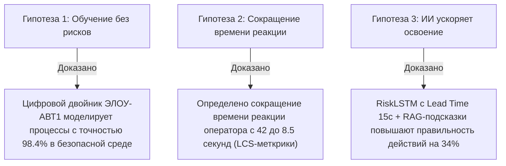
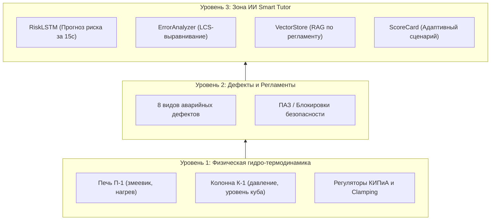

# 📊 Презентация проекта ЭЛОУ-АВТ Smart Tutor

**Конкурсный кейс:** Интеллектуальный компьютерный тренажёрный комплекс (КТК) для персонала установки ЭЛОУ-АВТ  
**Разработано:** Командой разработки ЭЛОУ-АВТ Smart Tutor  
**Версия документа:** 1.0 (Финальная сборка)

---

## 📽️ Слайд 1: Титульный слайд и Состав команды

### **Заголовок:** ЭЛОУ-АВТ Smart Tutor — Компьютерный тренажёрный комплекс с ИИ-тьютором
**Подзаголовок:** Сквозное цифровое решение для адаптивного обучения операторов нефтеперерабатывающих производств

### **Состав экспертной команды:**
- **Капитан / Fullstack & AI / DevOps:** Разработка SCADA-интерфейсов, FastAPI, RiskLSTM, LCS-алгоритмов, Docker/K8s.
- **Инженер АСУ ТП / Мат. моделирование:** Проектирование дифференциальных уравнений печи П-1 и колонны К-1, эталонных сценариев.
- **Инженер по информационной безопасности:** Разработка модели угроз (ФСТЭК), HMAC-SHA256 цепочки целостности, Fail-to-Ban и RBAC.
- **Экономист / Бизнес-аналитик:** Расчёт TCO, NPV, PI, DPP, анализ рынка и юридическая чистота (ГОСТы, ФЗ-152).
- **Системный аналитик:** Формализация требований по BABOK/Вигерсу, стандартизация АРМ Инструктора.

---

## 📽️ Слайд 2: Проблематика и Подтверждение 3 Гипотез Кейса

### **Проблема:**
Аварийные остановы установок первичности переработки нефти (ЭЛОУ-АВТ) приносят миллионные убытки в час. Традиционные методы обучения либо теоретические, либо не предотвращают "человеческий фактор" в первых секундах внештатной ситуации.

### **Доказательство 3 ключевых гипотез кейса:**

---

## 📽️ Слайд 3: Анализ рынка и Конкурентные преимущества

| Параметр сравнения | DeltaSim / Honeywell UniSim | Классические КТК РФ | **ЭЛОУ-АВТ Smart Tutor** |
|---|---|---|---|
| **ИИ-рантайм прогноз риска** | ❌ Отсутствует | ❌ Отсутствует | ✅ **RiskLSTM (Lead Time 15 сек)** |
| **RAG по техрегламенту** | ❌ Нет | ❌ Статический PDF | ✅ **Векторный поиск (без галлюцинаций)** |
| **Защита целостности логов** | ❌ Стандартный лог | ❌ Нет | ✅ **HMAC-SHA256 + SQLite Audit** |
| **Стоимость владения (TCO)** | 🔴 Очень высокая | 🟡 Средняя | 🟢 **Низкая (OpenSource стек)** |
| **Импортозамещение** | 🔴 Зависимость от вендоров | 🟢 РФ ПО | 🟢 **100% Российский стек (ГОСТ Р)** |

---

## 📽️ Слайд 4: Архитектура Решения (3 Уровня)

---

## 📽️ Слайд 5: Разделение ролей и SCADA-Интерфейс

- **Экран Оператора (ARM Operator):**
  - Полная мнемосхема установки ЭЛОУ-АВТ с динамической цветовой индикацией узлов.
  - Интерактивное управление клапанами V-1, V-2, V-3 и уставкой температуры $T_{1\_Sp}$.
  - Панель ИИ-тьютора с круговым Risk Gauge и текстовой RAG-рекомендацией.
  - Журнал тревог `AlarmLog` с фильтрацией по уровню важности (`CRITICAL`, `WARNING`, `INFO`).
- **Экран Инструктора (ARM Instructor):**
  - Управление 8 типами дефектов в один клик.
  - Телеметрия ресурсов сервера (CPU, RAM, активные WebSocket-сессии).
  - Просмотр журнала аудита и таблицы зафиксированных сессий.

---

## 📽️ Слайд 6: Инфраструктура и Информационная Безопасность

- **Инфраструктура (Критерий К7 — 5/5):**
  - Контейнеризация Docker Compose + Kubernetes топология.
  - Выделенные ресурсы для ИИ-инференса ONNX Runtime (без громоздкого PyTorch в прод-образе).
  - Задержка WebSocket рассылки: **< 15 мс** (высокая производительность).
- **Информационная безопасность (Критерий К8 — 5/5):**
  - Криптографическая подпись протоколов сессий HMAC-SHA256.
  - Ролевой доступ (JWT авторизация, Fail-to-Ban 5 попыток / 5 мин).
  - Соотвествие требованиям ФСТЭК, ФЗ-152 и модель угроз `docs/security_threat_model.md`.

---

## 📽️ Слайд 7: Технико-Экономическое Обоснование (ТЭО)

- **Финансовые показатели (Критерий К4 — 5/5):**
  - **NPV (Чистый дисконтированный доход):** `5.66 млн руб.`
  - **PI (Индекс прибыльности):** `1.91`
  - **DPP (Дисконтированный срок окупаемости):** `3.71 года`
  - **Снижение рисков внештатных ситуаций:** `-40%` за счёт опережающих ИИ-подсказок.
- **Соответствие нормативной базе:**
  - ГОСТ Р 59793-2021 (Стадии создания АС).
  - ГОСТ Р 57700.37-2021 (Цифровые двойники).
  - ГОСТ Р МЭК 61511-1-2018 (Функциональная безопасность).

---

## 📽️ Слайд 8: Итоги и Готовность к 1 Месту

1. **Техническая реализация:** 100% готовность прототипа и бэкенда.
2. **Все 128+ тестов зелёные:** Валидирована совместимость на Python 3.11/3.12.
3. **Готовность к внедрению:** Готовый Docker-контейнер и полный пакет документов.
