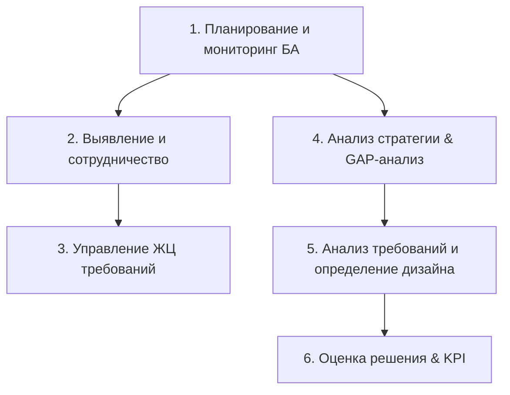

# 📄 Дайджест стандарта: Руководство к Своду знаний по бизнес-анализу (BABOK® Guide v3.0)

> **Источник:** IIBA (International Institute of Business Analysis) / Русскоязычный официальный перевод IIBA Russia  
> **Тема:** Глобальный стандарт профессиональной практики бизнес-анализа: модель BACCM™, 6 областей знаний, 5 ракурсов и 50 прикладных техник.

---

## 💡 Key Takeaways для критериев К1, К3, К4 и К6

1. **Модель базовых понятий BACCM™ (Business Analysis Core Concept Model):**
   Бизнес-анализ в КТК ЭЛОУ-АВТ строится на 6 взаимосвязанных концептах:
   * **Изменение (Change):** Оцифровка и интеллектуализация процессов подготовки операторов ЭЛОУ-АВТ.
   * **Потребность (Need):** Снижение аварийности по вине человеческого фактора (50% аварий на НПЗ) и ускорение ввода персонала в эксплуатацию.
   * **Решение (Solution):** Интерактивный тренажер-симулятор с мнемосхемой, математической моделью физики, ONNX-предиктором рисков и RAG-ассистентом.
   * **Заинтересованные стороны (Stakeholders):** Операторы ТП, Инструкторы, Руководство НПЗ, Служба ИБ, Аудиторы КИИ.
   * **Ценность (Value):** Экономия до $15 млн/год на типовом НПЗ за счёт сокращения инцидентов и простоев.
   * **Контекст (Context):** Промышленный объект КИИ нефтепереработки с требованиями ФСТЭК/ФСБ, АСУТП и импортозамещения.

2. **Классификация требований по BABOK v3:**
   * **Бизнес-требования (Business Requirements):** Снизить ошибки операторов на 8%+, обеспечить окупаемость КТ.
   * **Требования заинтересованных сторон (Stakeholder Requirements):** Экран Оператора для управления параметрами, Экран Инструктора для вброса 8 дефектов.
   * **Требования к решению (Solution Requirements):**
     - *Функциональные:* расчёт физического шага симулятора за 1 сек, DTW-сопоставление траекторий, генерация RAG-подсказок со ссылкой на пункты ТБ.
     - *Нефункциональные (NFR):* задержка WS < 100 мс, время реакции UI < 200 мс, SHA-256 хеш целостности логов аудита.
   * **Переходные требования (Transition Requirements):** Загрузка начальных состояний (`startup`, `shutdown`), генерация синтетических данных для преодоления «холодного старта» ML.

---

## 📐 6 Областей знаний BABOK v3 в КТК ЭЛОУ-АВТ

1. **Планирование и мониторинг:** Определение подхода (Agile + Waterfall для ИБ), матрицы ролей RACI.
2. **Выявление и сотрудничество:** Оцифровка техрегламентов, интервью с экспертами ГПН, разметка эталонных прогонов.
3. **Управление ЖЦ требований:** Трассировка требований от бизнес-целей до тест-кейсов `pytest` и `npx tsc`.
4. **Анализ стратегии (Strategy Analysis):** Оценка текущего состояния (*As-Is*: импортные КТ Honeywell/Yokogawa) и будущего (*To-Be*: отечественный КТК ЭЛОУ-АВТ на Python/React), GAP-анализ.
5. **Анализ требований и определение дизайна (RADD):** Моделирование процессов (BPMN), данных (ERD/Cловарь данных), интерфейсов и принятие решений.
6. **Оценка решения (Solution Evaluation):** Измерение эффективности (KPI, Precision/Recall ИИ-модели, NPV, ROI).

---

## 🛠️ Применяемые техники BABOK v3 в проекте

* **10.4 Бенчмаркинг и анализ рынка:** Сравнение с зарубежными аналогами в [`docs/market_analysis.md`](../../market_analysis.md).
* **10.7 Бизнес-кейсы & 10.20 Финансовый анализ:** Расчёт NPV, PI, DPP и TCO в [`docs/economics.md`](../../economics.md).
* **10.14 Добыча данных (Data Mining):** LSTM-прогнозирование аварийных рисков в `ai_core/predictive_engine.py`.
* **10.25 Анализ корневых причин (5 Почему / Fishbone):** Причинно-следственный анализ ошибок оператора при прогаре печи П-1 и переливе колонны К-1.
* **10.36 Прототипирование:** SCADA мнемосхема и компоновка панелей управления.
* **10.46 SWOT-анализ:** Оценка сильных и слабых сторон в [`docs/explanatory_note.md`](../../explanatory_note.md).
