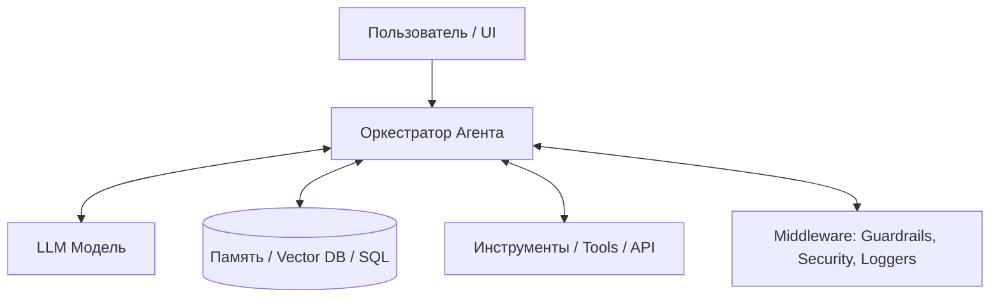

# 📄 Дайджест лекции: ИИ-агенты. От LLM к мультиагентным системам

> **Источник:** IT CAMP  
> **Спикер:** Ильгиз Шарафуддинов (Руководитель практики фронтенд-разработки в «Газпром нефти», преподаватель УГАТУ)  
> **Тема:** Архитектура ИИ-агентов, паттерны ReAct, инструментарий (Tools), Middleware, RAG и переход к мультиагентным системам.

---

## 🎯 Основные концепты и тезисы

### 1. Фундаментальное отличие LLM от ИИ-Агента

```text
  LLM (Модель)                 = Мощный предсказатель следующего токена (текст в текст)
  ИИ-Агент (Agentic System)    = LLM + Обвязка (Промпт + Tools + Циклы рассуждений + Память + Middleware)
```

#### Ограничения классической LLM без обвязки:
* ❌ **Не умеет совершать действия:** Не может забронировать переговорку, выполнить SQL-запрос или вызвать API без внешних тулов.
* ❌ **Отсутствие памяти:** Помнит диалог только в рамках текущего контекстного окна сессии.
* ❌ **Отсутствие свежих/корпоративных данных:** Ограничена датой среза обучения (knowledge cutoff) и не знает о внутренних регламентах компании.
* ❌ **Деградация длинного контекста:** Теряет логику при больших объёмах сообщений («забывает» середину).

---

## 🏗️ Полная архитектура ИИ-Агента



### Составные части обвязки (Agent Harness):
1. **Tools (Инструменты):** Описание параметров функций (название, описание, JSON Schema параметров), которые LLM может вызывать для взаимодействия с внешним миром.
2. **ReAct Loop (Reasoning + Acting):** Итеративный цикл: *Мысль (Reason) → Вызов инструмента (Action) → Наблюдение результата (Observation) → Решение*.
3. **Memory Layer:** Хранение истории сессий (short-term) и векторных эмбеддингов базы знаний (long-term RAG).
4. **Middleware & Guardrails:**
   * **Retries:** Повторные попытки при сбоях API LLM.
   * **Security & PII Masking:** Маскирование чувствительных данных.
   * **Context Management:** Автоматическая суммаризация или обрезка контекста.
   * **Human-in-the-Loop:** Запрос подтверждения человека перед выполнением критических действий (например, останов печи или сброс параметров).

---

## 👥 Переход к Мультиагентным системам (Multi-Agent Systems)

При усложнении задачи один универсальный агент начинает путаться. Решение — **разделение обязанностей (Single Responsibility Principle)** между несколькими агентами:

1. **Planner Agent (Планировщик):** Декомпозирует сложную задачу на последовательные подзадачи.
2. **Specialized Worker Agents (Узкие специалисты):** Выполняют свою узкую задачу со своими тулами (например, поиск по регламенту ЭЛОУ-АВТ, вычисление телеметрии).
3. **Critic / Reviewer Agent (Критик):** Проверяет ответ worker-агента на ошибки и соответствие регламенту.

---

## 💡 Применение в кейсе КТК ЭЛОУ-АВТ Smart Tutor

В нашем проекте агентная архитектура применяется в **ИИ-ассистенте Оператора / Инструктора**:

1. **Агент-Аналитик ТБ (RAG):** Ищет пункты технологического регламента и аварийные уставки печи П-1 и колонны К-1.
2. **Агент-Физик (Telemetry Tool):** Запрашивает текущее состояние симулятора через API бэкенда (`furnace_temp`, `column_pressure`).
3. **Агент-Оценщик (Evaluator Agent):** Сравнивает действия оператора с эталонной траекторией DTW и выдает мотивированную обратную связь с Human-in-the-Loop контролем Инструктора.
