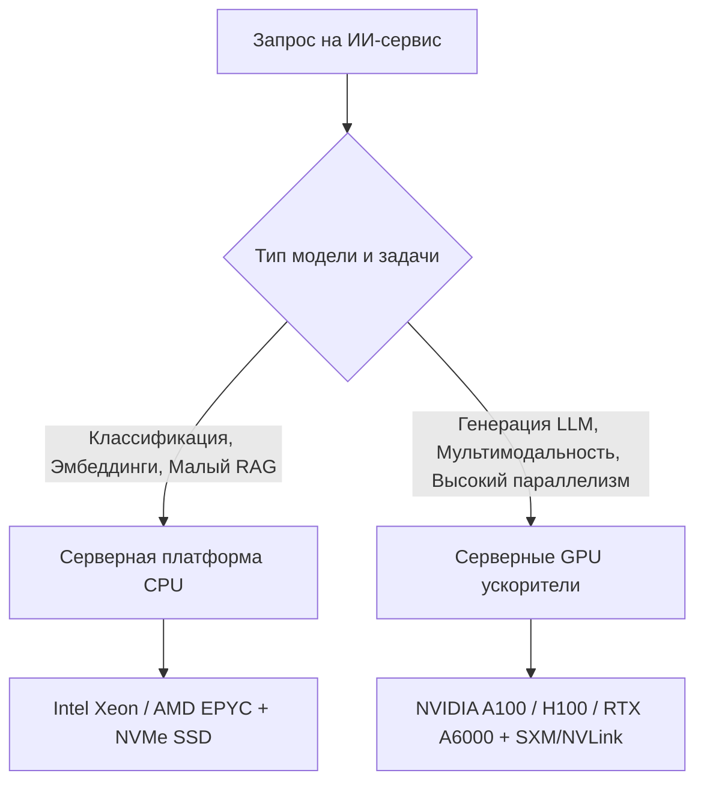

# 📄 Дайджест презентации: Инфраструктура ИТ-предприятия и нюансы внедрения ИИ

> **Источник:** Газпром Нефть (IT CAMP 2026)  
> **Тема:** Построение, развитие и управление ИТ-инфраструктурой предприятия, облачные технологии, российские ОС, контейнеризация и аппаратное обеспечение ИИ-нагрузок (CPU vs GPU).

---

## 💡 Key Takeaways для разделов «Инфраструктура К7» и «Архитектура К3»

1. **Двухуровневая ИТ-модель предприятия:**
   * **Видимый слой:** Приложения, сервисы и интерфейсы (SCADA Оператора, Инструкторская станция, RAG-чат).
   * **Невидимый слой:** Вычислительная инфраструктура (сервера, гипервизоры, GPU), сетевой ландшафт (ЛВС, SDN) и инженерные системы (электропитание, охлаждение, КИИ/пожаротушение).

2. **Отечественные ОС для КИИ и суверенного контура (К8):**
   * **Astra Linux:** Основана на Debian, сертификаты ФСТЭК/ФСБ, мандатное разграничение доступа (Parsec), применение в критической инфраструктуре ТЭК.
   * **Ред ОС:** Основана на RPM/RHEL, оптимизирована под отечественные процессоры (Эльбрус, Байкал).

3. **Стек контейнеризации и оркестрации (К7):**
   * **Docker / Podman:** Изоляция микросервисов бэкенда. Podman обеспечивает **rootless-режим** без центрального демона для защиты от контейнерных атак.
   * **Kubernetes (k8s):** Оркестрация, автомасштабирование под нагрузку, self-healing и нулевой простой при обновлениях.

---

## 🖥️ Выбор аппаратного обеспечения под ИИ-нагрузки (CPU vs GPU)

### Матрица принятия решений (CPU vs GPU):

| Параметр | Можно начинать с CPU | Лучше задействовать GPU |
|---|---|---|
| **Тип задачи** | Классификация, векторные эмбеддинги, правила | Генерация ответов LLM, видео, мультимодальность |
| **Ответ модели** | Короткий текст, число, метка класса | Длинный развёрнутый ответ с RAG-контекстом |
| **Параллелизм** | Умеренная параллельность | Сотни одновременных запросов обучаемых |
| **Дисковая подсистема** | SATA SSD | **Исключительно NVMe SSD** (иначе GPU простаивает!) |

---

## 📐 Формула расчёта VRAM для LLM и Инференса

$$\text{VRAM} = (\text{Количество параметров B}) \times (\text{Размер параметра в байтах}) + \text{KV Cache} + \text{Активации} + \text{Запас 20--50\%}$$

### Размерность весов по форматам:
* **FP32:** 4 байта на параметр.
* **FP16 / BF16:** 2 байта на параметр (стандарт для большинства моделей).
* **INT8 / FP8:** 1 байт на параметр (квантование без существенной потери точности).
* **INT4:** 0.5 байта на параметр (максимальное сжатие для запуска на edge-устройствах).

### Требования к серверу под 1 GPU:
* **RAM сервера:** $\text{RAM} = 2 \times \text{VRAM}$ (для инференса) или $4\text{--}8 \times \text{VRAM}$ (для fine-tuning / обучения).
* **CPU ядра:** $4\text{--}8$ ядер на каждый 1 GPU.

---

## ❄️ Тепловыделение и охлаждение GPU-кластеров

| Уровень TDP | GPU Графика | Тип охлаждения |
|---|---|---|
| **До 150 Вт** | T4, L4, RTX A2000, RTX A4000 | Пассивное / Воздушное |
| **150–350 Вт** | A100 PCIe, L40S, H100 PCIe, RTX A6000 | Воздушное в серверной стойке |
| **350–700 Вт** | A100 SXM, H100 SXM, H200 SXM, B100 | **Прямое жидкостное охлаждение (DLC)** |
| **700–1000 Вт** | B200 SXM | **Direct-to-Chip Liquid Cooling (DLC)** |

---

## 🔒 Обеспечение надёжности и Резервное копирование (3-2-1)

* **RTO (Recovery Time Objective):** Допустимое время восстановления сервиса после аварии.
* **RPO (Recovery Point Objective):** Допустимое время потери данных (точка отката).
* **Правило 3-2-1:** 3 копии данных на 2 разных носителях, 1 из которых хранятся вне основного ЦОД (в облачном S3 хранилище).
