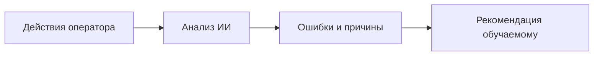
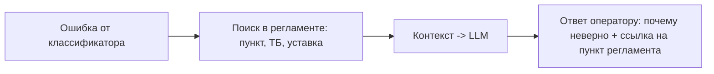

# 📄 Дайджест презентации: ИИ в тренажёре оператора (IT CAMP 2026)

> **Источник:** Консультация IT CAMP 2026  
> **Спикер:** Евгений Вылегжанин (Главный разработчик в Газпромнефть — ЦР, эксперт по ИИ)  
> **Тема:** Как применить искусственный интеллект в кейсе КТК для установки ЭЛОУ-АВТ  

---

## 💡 Key Takeaways & Фокус кейса

1. **Ядро тренажёра (физика) ≠ ИИ:** Мат. модель ЭЛОУ-АВТ, термодинамика, гидравлика, уставки и SCADA-интерфейс — это **симуляция**, а не ИИ. 
2. **За что жюри ставит баллы по ИИ (К5):** ИСКЛЮЧИТЕЛЬНО за слой интеллектуального анализа действий обучаемого оператора поверх физического симулятора.



---

## 🏗️ 3-уровневая архитектура тренажёра

| Уровень | Компонент | Технология | Отношение к ИИ |
|---|---|---|---|
| **Уровень 1** | **Физика** | Матмодели ректификации, гидравлики, теплообмена | ❌ Симуляция (не ИИ) |
| **Уровень 2** | **Дефекты** | Формализованные типовые отказы оборудования | ⚠️ Знания об отказах (рантайм) |
| **Уровень 3** | **Анализ действий** | Оценка обучаемого, классификация ошибок, RAG | ✅ **Зона ИИ (критерий К5)** |

---

## 🎯 Шкала оценки жюри по ИИ-части (Вес: 0.10 в КТК)

```text
[1 балл]  --> Фиксация действий и сравнение с эталонным сценарием (Rule-based baseline)
[2 балла] --> Идентификация и классификация типовых ошибок оператора методами ИИ
[3 балла] --> Классификация + локализация ошибок во времени и причинно-следственные связи
[4 балла] --> Интерпретируемая обратная связь: почему действие неверно (LLM + RAG по регламенту)
[5 баллов]--> Адаптивный сценарий переобучения и прогноз риска ошибки ДО её совершения
```

> ⚠️ **Важная рекомендация спикера:** Реалистичная цель — сделать надежные 3–4 балла с работающим демо в реальном времени, а не заявить 5 баллов на словах без демонстрации.

---

## ⚖️ Чёткое разделение: Что ИИ, а что НЕ ИИ

| ❌ Это НЕ ИИ (симуляция / правила) | ✅ Это ИИ (оценивается жюри) |
|---|---|
| Математическая модель процессов ЭЛОУ-АВТ | Классификация типов ошибок оператора |
| Проверка порогов («параметр вышел за уставку») | Анализ последовательности действий (траектория во времени / DTW) |
| Сравнение с эталоном по правилам (baseline) | Объяснение по регламенту через **LLM / RAG** (ссылки на пункты ТБ) |
| 3D-визуализация мнемосхемы (графика ≠ интеллект) | Прогноз риска аварии и адаптивный подбор сценария |

---

## 📊 Решение проблемы «Холодного старта» данных

* **Проблема:** На старте разработки нет реальных обучаемых операторов для обучения классификатора.
* **Решение в проекте:**
  1. **Разметка эксперта:** «Золотой» эталонный прогон сценария от технологического эксперта.
  2. **Синтетика из симулятора:** Генерация «неправильных» траекторий в симуляторе с намеренным внесением ошибок (пропуск шага, задержка, перегрев).
  3. **Rule-based baseline:** Стартовая проверка правил.

### Типология ошибок для разметки (3–5 классов):
1. **Пропуск шага:** Не выполнено обязательное регламентное действие.
2. **Неверный порядок:** Нарушена последовательность выполнения.
3. **Поздняя реакция:** Превышено допустимое время реагирования.
4. **Неверное значение / Нарушение ТБ:** Выход управляющего воздействия за технологическую уставку.

---

## 🧠 Схема RAG-объяснений (Уровень 4 балла)



---

## 📈 Метрики качества ИИ-модуля

1. **Классификация ошибок:** `Precision` / `Recall` по типам. **Recall приоритетнее** для критических технологических ошибок (цена пропуска аварии высока!).
2. **Локализация во времени:** Точность определения секунды/шага ошибки.
3. **Обратная связь:** Оценка полезности и соответствия регламенту экспертом.
4. **Прогноз риска:** Заблаговременность предикта и низкое число ложных тревог.

---

## 🚫 4 Главные ошибки команд на защите

1. **«Заявили 5, показали 1»:** В презентации амбициозный ИИ, на живом демо — только проверка правил.
2. **ИИ = Физика:** Выдача термодинамических дифференциальных уравнений за ИИ.
3. **LLM без Grounding:** Галлюцинации LLM без привязки к техрегламенту ЭЛОУ-АВТ.
4. **Нет данных и метрик:** Отсутствие доказательной базы качества модели (precision/recall).
