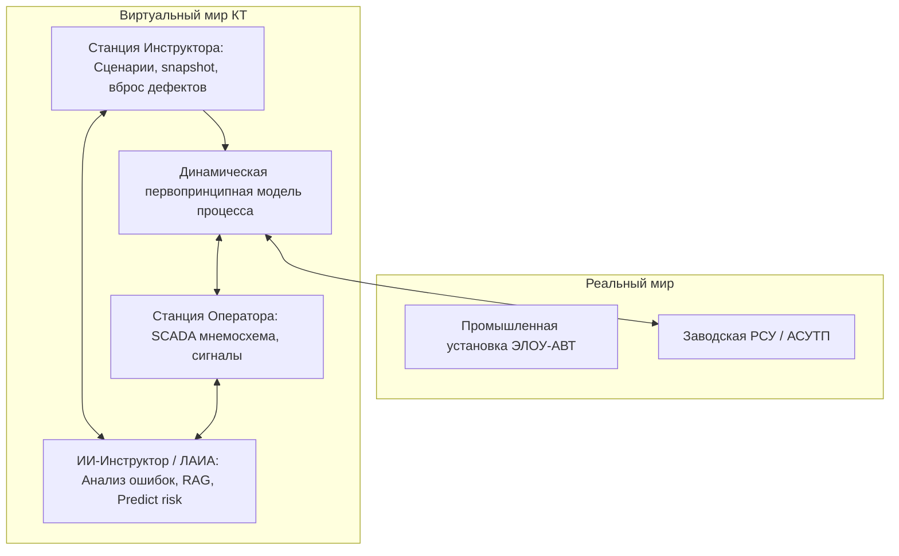

# 📄 Дайджест презентации: Компьютерные тренажеры для обучения операторов ТП (IT CAMP 2026)

> **Источник:** IT CAMP 2026 (29 июля 2026 г.)  
> **Спикер:** Дозорцев Виктор Михайлович, д.т.н., Директор по развитию бизнеса ООО «Центр цифровых технологий» (группа Рубитех), основоположник систематической теории КТ в России.  
> **Тема:** История, текущее состояние, проблемы, импортозамещение и ИИ-тренды в тренажёростроении для промышленности.

---

## 💡 Key Takeaways для защиты проекта КТК

1. **Экономика человеческого фактора (для раздела Экономика К4):**
   * **50% всех крупных аварий** в нефтегазовой и химической отрасли вызваны человеческим фактором (оборудование — 30%, технология — 20%).
   * **40% инцидентов с ущербом от $2 млн** происходят из-за прямых ошибок операторов.
   * Типовой НПЗ (10 млн т/год сырой нефти) теряет из-за ошибок операторов **> $15 млн в год**. 
   * Внедрение КТ окупается при снижении аварийности всего на **8%**.

2. **«Парадокс автоматизации» Л. Бэйнбридж (1983):**
   Чем более автоматизирован технологический процесс, тем сложнее задача оператора в аномальной ситуации. Вырваться из замкнутого круга усложнения систем управления можно только через качественный компьютерный тренинг.

3. **Критичность импортозамещения в РФ:**
   Все мировые вендоры КТ (Honeywell, Yokogawa, AspenTech, Schneider Electric, ABB, Siemens) ушли с рынка РФ после 2022 года. Рынок КТ оценивается в **$3.1 млрд (2025)** с ростом до **$5 млрд (2035)**. Разработка отечественного КТ КТК ЭЛОУ-АВТ прямо закрывает задачу суверенного импортозамещения.

4. **Передовой тренд: КТ как Личностно-Адаптируемый Интеллектуальный Агент (ЛАИА):**
   Переход от классического статичного КТ к персональному ИИ-партнеру (Venger & Dozortsev, 2023), который строит когнитивную модель обучаемого, предсказывает ошибки и генерирует адаптивные траектории.

---

## 🏗️ Архитектура и технические составляющие КТ

### Составные части КТ:
1. **Динамическая модель технологического процесса (Уровень 1):** Физико-химические уравнения тепломассообмена, ректификации и гидравлики.
2. **Эмуляторы/Стимуляторы РСУ и ПАЗ (Противоаварийная защита):** Имитация алгоритмов отсечек и автоматики.
3. **Станция Оператора:** Мнемосхемы, регуляторы, тренды, аварийные сигнализации (SCADA).
4. **Станция Инструктора:** Загрузка начальных состояний (`Freeze`, `Start`, `Stop`), ускорение/замедление времени, вброс неисправностей оборудования, сохранение «снимков» (snapshots) и протоколирование.
5. **ИИ-Модуль (ИИ-Инструктор):** Автоматическая оценка компетенций, RAG-объяснение ошибок по регламенту, адаптация сложности.

---

## 📊 Классификация Цифровых Двойников (ЦД) в КТ

| Тип ЦД | Задачи в промышленности | Подходящий метод моделирования |
|---|---|---|
| **Информационный ЦД** | 3D/VR визуализация строящегося объекта | Фундаментальное |
| **Диагностический ЦД** | Поиск узких мест, мониторинг ТП и оборудования | Фундаментальное + Данные (ML) + Гибридное |
| **Предиктивный ЦД** | **Компьютерный тренинг персонала**, прогноз аномалий, виртуальные анализаторы | **Фундаментальное + Гибридное** |
| **Операционный ЦД** | Балансировка данных, оптимизация производства | Гибридное |

> ⚠️ **Предупреждение д.т.н. В.М. Дозорцева:** В критически важных для безопасности областях промышленного производства чистый «чёрный ящик» (ML без физики) **неприемлем**. Обязателен гибридный подход: глубокая физическая модель + ИИ-надстройка.

---

## 📈 Тренды развития ИИ в тренажёростроении (2024–2026)

1. **ИИ-Инструктор (Verniani, 2024):** Автоматический анализ действий оператора в реальном времени, выдача подсказок, RAG-объяснение причин нарушений по регламенту и протоколирование.
2. **Интеллектуальная оценка компетенций (Marcano 2020, Дозорцев 2024):** Оценка навыков не просто по бинарным правилам, а по траекториям действий во времени (DTW).
3. **Адаптация сложности (Kluge et al., 2009):** Генерация и модификация сценариев под профиль слабостей обучаемого.
4. **Когнитивное моделирование (He et al., 2024):** Учёт когнитивной нагрузки, внимания и стресса оператора для предупреждения ошибок.

---

## 📚 Ссылки на авторитетную литературу (для Сводной записки и Презентации)

* **Дозорцев В.М.** *Компьютерные тренажеры для обучения операторов технологических процессов.* — М.: Синтег, 1999.
* **Дозорцев В.М. и др.** *Нормативно-описательный метод оценки операторов.* // Автоматизация в промышленности, 2024, №10.
* **Venger A.L., Dozortsev V.M.** *Trust in Artificial Intelligence in Operator Training Simulators.* // Mathematics, 2023.
* **Verniani A. et al.** *Features of adaptive training with AI instructor.* // Front. In Virt. Real., 2024.
