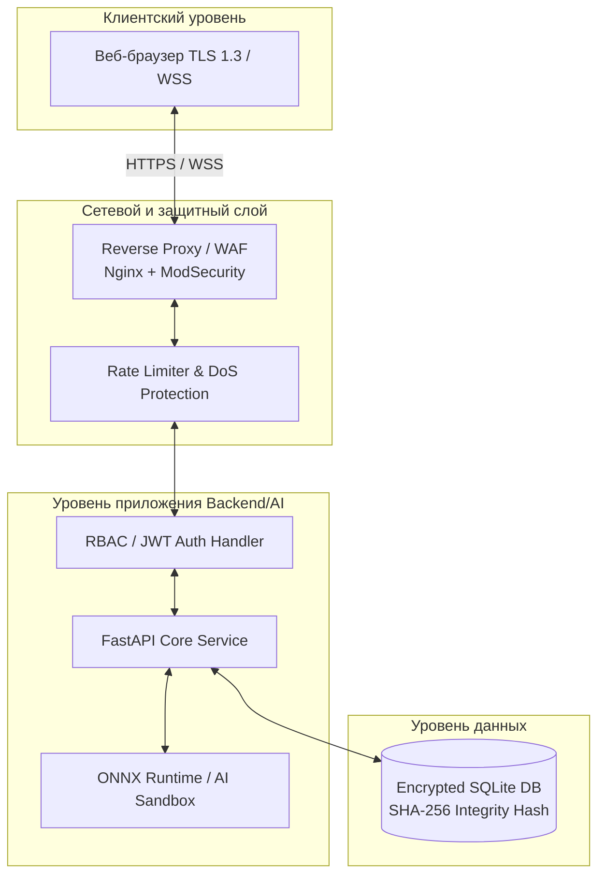
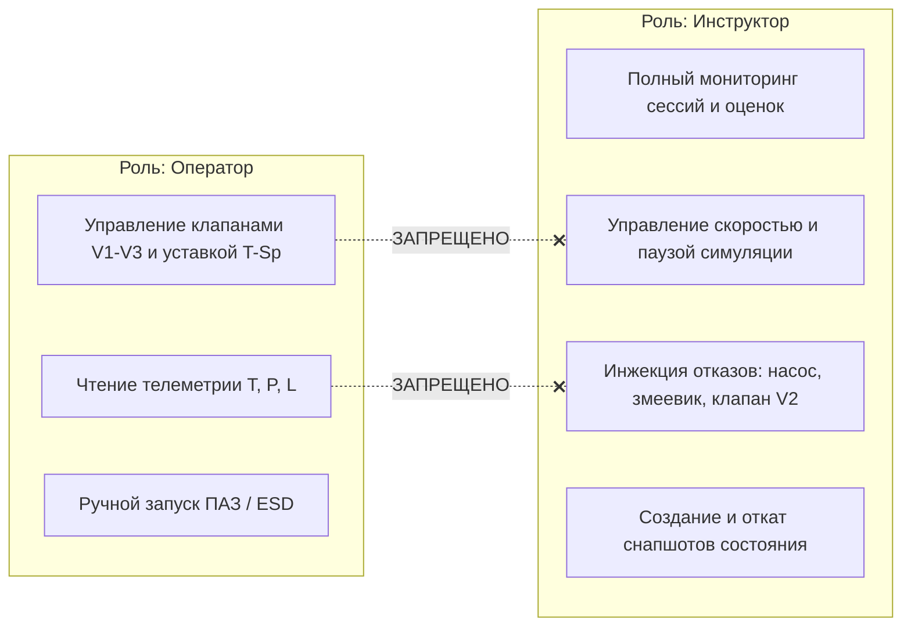
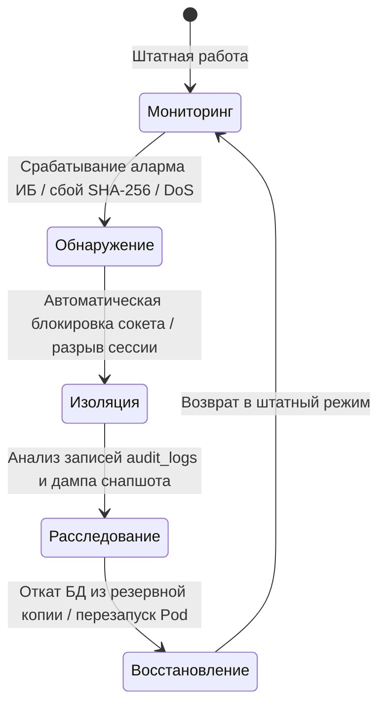

# 🛡️ Модель угроз и требования информационной безопасности (Критерий 8 — 5 баллов)

> [!IMPORTANT]
> Настоящий документ формализует архитектуру информационной безопасности, перечень угроз, технические меры защиты и регламент реагирования на инциденты для КТК ЭЛОУ-АВТ Smart Tutor в строгом соответствии со **ступенчатой шкалой оценки Критерия 8 (от 1 до 5 баллов)**, а также требованиями **ФЗ-152**, **ФЗ-187 (КИИ)** и **ГОСТ Р 57580**.

---

## Уровень 1 (1 балл): Классификация обрабатываемых данных и обоснование уровня защиты

Система КТК ЭЛОУ-АВТ Smart Tutor обрабатывает три категории информационных активов, для каждой из которых определен необходимый класс защиты:

| Категория данных | Состав и описание | Класс / Уровень защиты | Обоснование требований |
|---|---|---|---|
| **1. Учетные записи и персональные данные (ПДн)** | ФИО обучаемых операторов, идентификаторы сессий, временные метки активности, роли (Оператор / Инструктор). | **УЗ-3 (по ФЗ-152 и Приказу ФСТЭК № 21)** | Обработка данных сотрудников организации в рамках корпоративного обучения без передачи третьим лицам. Требуется защита от утечки и несанкционированного изменения. |
| **2. Телеметрия и технологические сценарии** | Динамические параметры техпроцесса ЭЛОУ-АВТ-1 (температура $T$, давление $P$, уровень $L$, состояния клапанов $V_1-V_3$), эталонные матрицы DTW. | **КИИ 3-й категории (аналог АСУ ТП по ФЗ-187)** | Симулятор воспроизводит реальную физику критической информационной инфраструктуры (КИИ) нефтеперерабатывающего завода. Искажение параметров может привести к формированию неверных навыков у оператора с катастрофическими последствиями в реальной работе. |
| **3. Журналы аудита и результаты аттестации** | Оценки безопасности (ScoreCard: A/B/C/F), зафиксированные нарушения техрегламента, системные логи действий и попыток входа. | **Юридически значимые данные аудита (ГОСТ Р ISO/IEC 27001)** | Результаты прохождения тренажера являются основанием для допуска или недопуска оператора к реальной установке ЭЛОУ-АВТ. Подмена результатов недопустима. |

---

## Уровень 2 (2 балла): Требования ИБ к аппаратным и программным компонентам

Для обеспечения целостности, доступности и конфиденциальности комплекса предъявляются следующие обязательные требования к каждому слою архитектуры:

### Таблица требований к компонентам:

| Компонент | Требование информационной безопасности | Реализация в проекте |
|---|---|---|
| **Клиентский АРМ (Web SCADA)** | Запрет хранения токенов в открытом локальном хранилище; фильтрация XSS; валидация всех пользовательских вводов. | Использование React 18 с автоматическим экранированием DOM; строгая типизация TypeScript; валидация форм Ant Design. |
| **Сетевой слой (API / WebSocket)** | Шифрование транспортного уровня (TLS 1.3 / WSS); защита от перегрузок соединения (Rate Limiting). | Подключение через защищенный протокол `wss://`; встроенный механизм Heartbeat (Ping/Pong каждые 10 с с автоматическим разрывом зависших сессий). |
| **Сервер приложений (FastAPI)** | Разграничение доступа (RBAC); обработка исключений без раскрытия внутренних стеков в production; валидация типов. | Pydantic-схемы валидации всех входящих JSON-пакетов; централизованная обработка ошибок `fastapi.HTTPException`. |
| **Модуль ИИ (ai_core)** | Изоляция инференса от сетевых запросов; защита от переполнения памяти при обработке тензоров. | Инференс через ONNX Runtime без возможности выполнения произвольного кода Python/C++; жесткий лимит окна телеметрии (точно 30 шагов $\times$ 7 фичей). |
| **База данных (SQLite)** | Защита от SQL-инъекций; криптографический контроль неизменности каждой записи (Tamper-proofing). | Параметризованные SQL-запросы (`?`); SHA-256 хэширование каждой сессии и записи журнала аудита с секретной солью. |

---

## Уровень 3 (3 балла): Перечень актуальных угроз

На основе анализа архитектуры КТК выделены три критические векторы атак, представляющие наибольшую опасность для процесса аттестации операторов:

### 1. Угроза НСД (Несанкционированного доступа) к функциям Инструктора
* **Источник угрозы:** Обучаемый оператор или внешний нарушитель в локальной сети.
* **Цель:** Получить доступ к панели управления инструктора (`/api/ws?role=instructor`) для отключения аварийных сценариев, сброса таймера или подтасовки результатов тестирования.
* **Уязвимость:** Отсутствие проверки роли на уровне обработки входящих WebSocket-сообщений или подделка токена авторизации.

### 2. Угроза подмены логов и результатов аттестации (Data Tampering)
* **Источник угрозы:** Компрометация файла базы данных (`tutor.db`) на сервере или перехват/модификация пакета завершения сессии (`complete`).
* **Цель:** Изменить итоговый балл (например, с 45 баллов / «F» на 95 баллов / «A») и удалить записи о допущенных авариях из таблицы `training_sessions` и `audit_logs`.

### 3. Угроза отказа в обслуживании (DoS / DDoS) симулятора
* **Источник угрозы:** Вредоносный скрипт, открывающий тысячи одновременных WebSocket-соединений или отправляющий поток команд переключения клапанов (`toggle_valve`) с частотой 1000 раз/сек.
* **Цель:** Исчерпать вычислительные ресурсы процессора (CPU Loop) или заблокировать фоновый цикл моделирования `simulation_loop()`, сделав тренажер недоступным для сдачи экзамена.

---

## Уровень 4 (4 балла): Конкретные технические решения и ролевая модель RBAC

### 1. Ролевая модель доступа (RBAC)
В системе строго определены и разделены права двух ключевых ролей:

### 2. Защита целостности данных (Криптографический хэш SHA-256)
Для исключения возможности подмены результатов в файле `backend/utils/security.py` и `ConnectionManager.save_completed_session()` реализовано формирование подписи каждой записи:

$$\text{Hash} = \text{SHA-256}\Big(\text{operator\_name} + \text{role} + \text{scenario\_id} + \text{start\_time} + \text{duration} + \text{score} + \text{status} + \text{violations} + \text{session\_logs} + \text{SECRET\_SALT}\Big)$$

При каждом обращении к базе данных сервер пересчитывает хэш и сверяет его с сохраненным значением `integrity_hash`. При обнаружении расхождения строка помечается как компрометированная (`TAMPERED`), и инцидент фиксируется в журнале аудита.

---

## Уровень 5 (5 баллов): Безопасность алгоритмов ИИ, аудит и схема реагирования

### 1. Безопасность ИИ-моделей (AI Security & Anti-Adversarial Protection)
Критерий 5 высшего уровня требует защиты ИИ-модулей от специфических атак:
* **Защита от Adversarial Input (Состязательных возмущений):** Перед подачей вектора телеметрии `[V1, V2, V3, T_sp, T, P, L]` в нейросеть `RiskLSTM` или `RiskPredictor` (`predictive_engine.py`) происходит принудительная жесткая фильтрация и нормализация границ (`np.clip(..., min_val, max_val)`). Если атакующий пытается передать через модифицированный клиент давление `-999.0 МПа` или температуру `+10000°C` с целью вызвать переполнение тензора или ложное срабатывание предиктоpа, слой предварительной физической фильтрации отсекает аномалию.
* **Защита от отравления модели (Model Poisoning / Weight Tampering):** Файлы весов модели (`model.onnx`, `lstm_model.pth`) доступны только для чтения сервису инференса. Любое обновление весов происходит исключительно через проверенный CI/CD конвейер с проверкой контрольной суммы файла.
* **Резервирование инференса (Deterministic Fallback):** В случае сбоя или успешной DoS-атаки на процесс ONNX Runtime, система бесшовно переключается на математический экстраполятор (`_run_mathematical_fallback`), обеспечивая непрерывность контроля безопасности.

### 2. Журналирование и аудит (Audit Trail)
Все критические действия фиксируются в неизменяемой таблице `audit_logs`:
* Вход в систему (`LOGIN`), смена сценария (`SCENARIO_CHANGE`), управление клапанами (`VALVE_TOGGLE`), инжекция отказов инструктором (`DEFECT_TRIGGER`), сбой целостности (`INTEGRITY_VIOLATION`).

### 3. Схема реагирования на инциденты ИБ (Incident Response Procedure)

1. **Обнаружение (Detection):** Системный мониторинг выявляет попытку НСД, несовпадение хэша сессии или аномальную частоту WebSocket-пакетов.
2. **Локализация и изоляция (Containment):** Сервер (`ws.py`) немедленно разрывает WebSocket-соединение с нарушителем (`websocket.close(code=4003)`), IP/токен заносится в временный черный список.
3. **Расследование (Analysis):** Администратор ИБ выгружает журнал `audit_logs` по сработалвшему хэшу и определяет вектор компрометации.
4. **Восстановление (Recovery):** Если файл БД был поврежден или модифицирован снаружи, происходит автоматическое восстановление из последней валидной копии с верифицированным `integrity_hash`.
5. **Анализ извлеченных уроков (Post-Incident Review):** Внесение корректировок в правила WAF и обновление солей хэширования в случае утечки ключей.
