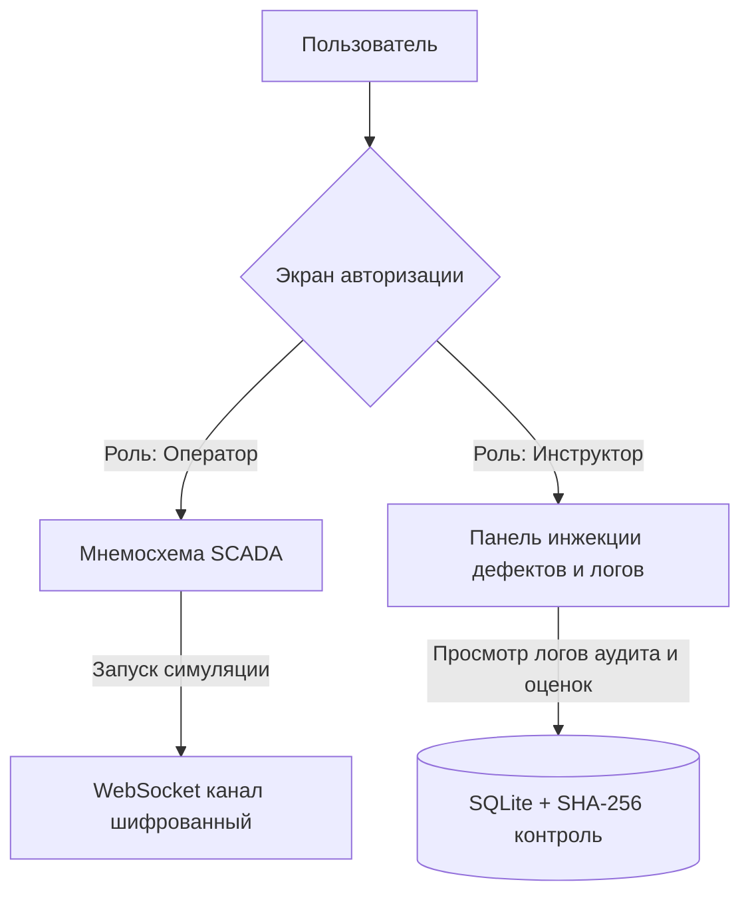

# Модель угроз информационной безопасности (ИБ)

> [!IMPORTANT]
> Настоящий документ описывает модель угроз и реализованные меры безопасности для обеспечения выполнения требований по информационной безопасности КТК ЭЛОУ-АВТ Smart Tutor (Критерий 8).

---

## 1. Архитектура безопасности и разграничение прав доступа
Доступ к функциям КТК разграничен на основе ролевой модели (Role-Based Access Control - RBAC):

### Права доступа по ролям:
*   **Оператор:** Имеет право управлять регулирующими органами (клапаны V-1, V-2, V-3) и уставкой температуры печи П-1. Не имеет доступа к ручному запуску отказов оборудования и просмотру детального системного лога аудита.
*   **Инструктор:** Имеет доступ к инжекции неисправностей, сбросу сессии, просмотру логов действий всех операторов и итоговых оценок. Не управляет технологическим процессом напрямую.

---

## 2. Модель угроз и уязвимостей

### Угроза 1: Несанкционированная модификация результатов обучения (подмена оценок)
*   **Описание:** Пользователь (обучаемый оператор) пытается напрямую изменить базу данных SQLite (таблицу `training_sessions`), чтобы повысить свой балл или сократить время прохождения сценария.
*   **Меры противодействия (Реализовано):** Каждая запись о сессии подписывается криптографическим хэшем SHA-256:
    $$\text{hash} = \text{SHA256}(\text{id} + \text{operator\_name} + \text{score} + \text{duration} + \text{SECRET\_SALT})$$
    При загрузке истории сессий бэкенд пересчитывает хэш для каждой строки. В случае несовпадения генерируется предупреждение о нарушении целостности данных (`integrity_valid = False`), а в интерфейсе отображается индикатор компрометации.

### Угроза 2: Компрометация лога аудита действий
*   **Описание:** Попытка удалить или изменить записи о допущенных критических ошибках или авариях в логах безопасности.
*   **Меры противодействия (Реализовано):** Логи аудита записываются в таблицу `audit_logs` и защищаются аналогичным криптографическим хэшем SHA-256 с солью, делая невозможным незаметное изменение или удаление строк злоумышленником.

### Угроза 3: Отказ в обслуживании (DoS) через WebSocket соединения
*   **Описание:** Попытка заблокировать сервер путем открытия сотен неактивных WebSocket-сессий.
*   **Меры противодействия (Реализовано):** Механизм WebSocket Heartbeat (Ping-Pong) на стороне сервера. Неактивные соединения автоматически закрываются в течение 10 секунд, освобождая ресурсы сервера.

---

## 3. Требования к безопасности ИИ-модели
*   **Защита от Adversarial-атак (состязательных атак):** Входные данные телеметрии перед передачей в LSTM проходят строгую валидацию на физические лимиты (температура не может быть отрицательной, давление ограничено пределами прочности). Это исключает подачу аномальных векторов для вызова отказа или некорректного расчета риска моделью.
*   **Изоляция модели:** Инференс ИИ-модели вынесен в ONNX Runtime. Это устраняет необходимость запуска тяжелого PyTorch-окружения с компиляторами C++ в продакшн-контейнере, уменьшая площадь потенциальной атаки на ОС.
