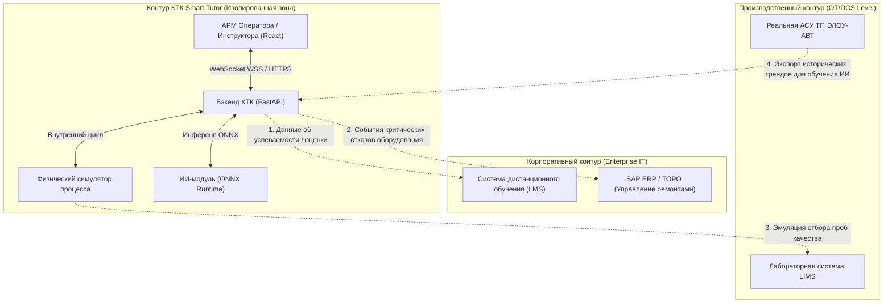
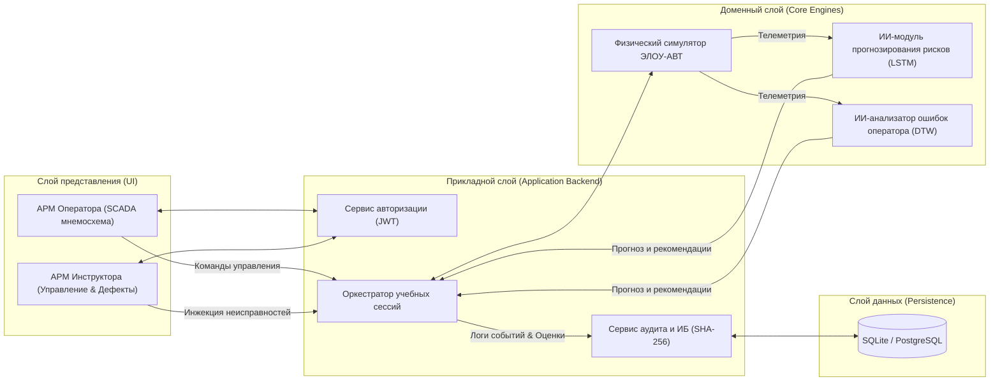
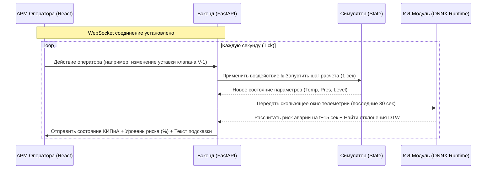
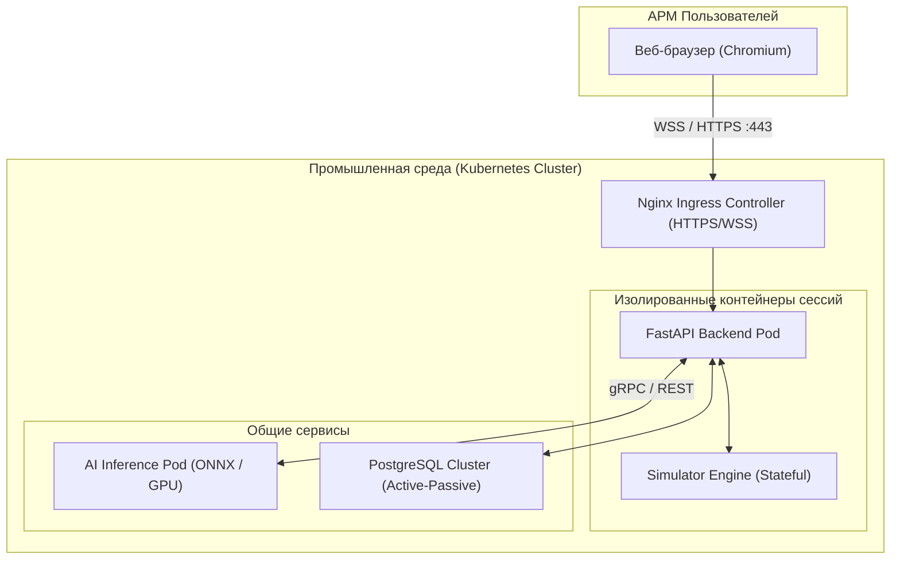
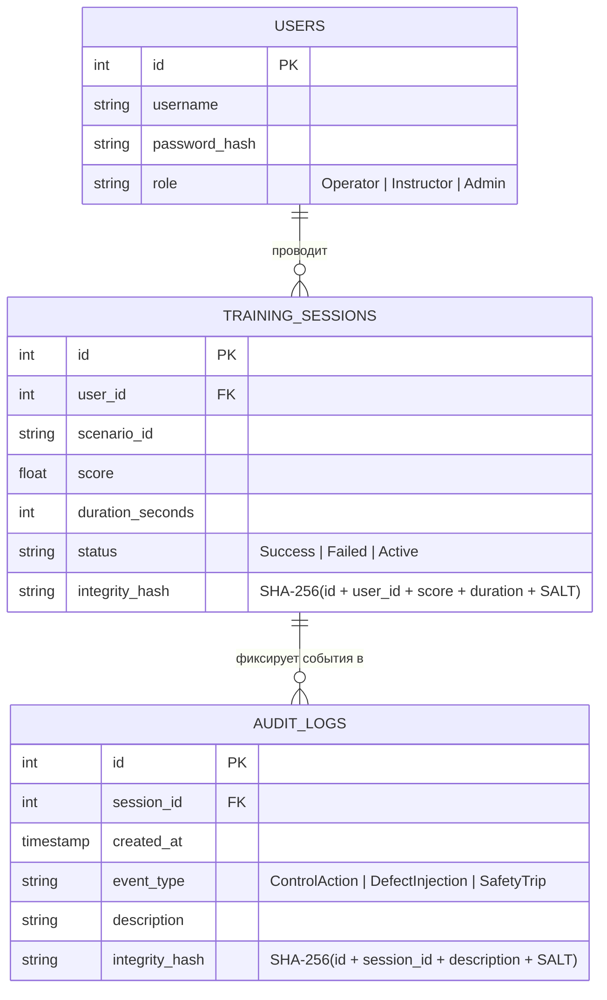

# Архитектура ИТ-решения КТК ЭЛОУ-АВТ Smart Tutor

> [!NOTE]
> Настоящий документ представляет собой архитектурное описание (Solution Architecture) Компьютерного тренажерного комплекса (КТК) «ЭЛОУ-АВТ Smart Tutor». Документ разработан в соответствии с методологией **View Model 4+1** и стандартами проектирования ИТ-решений, принятыми в группе компаний ПАО «Газпром нефть».

---

## 1. Роль и место решения в ИТ-ландшафте предприятия

КТК ЭЛОУ-АВТ Smart Tutor интегрируется в существующий ИТ-ландшафт нефтеперерабатывающего завода (НПЗ) в качестве связующего звена между производственными системами (OT-контур) и корпоративными сервисами обучения (IT-контур).



### Потоки интеграции:
1. **Экспорт оценок в LMS:** Передача итоговых результатов прохождения сценариев стажерами для формирования личного профиля компетенций.
2. **Интеграция с SAP ERP / ТОРО:** Передача логов отказов оборудования для обучения планированию технического обслуживания и ремонтов (ТОиР).
3. **Эмуляция данных LIMS:** Симулятор моделирует отбор проб качества нефтепродуктов (фракций), предоставляя данные по запросу из виртуального интерфейса LIMS.
4. **Использование исторических трендов АСУ ТП:** Загрузка реальных исторических данных технологического процесса для дообучения прогнозных ИИ-моделей в автономном режиме.

---

## 2. Обоснование выбора варианта реализации (3 варианты)

В соответствии со стандартами Solution Architecture, были проанализированы три альтернативных варианта реализации КТК:

| Критерий | Вариант А: Коробочное ПО (Honeywell UniSim / Yokogawa OTS) | Вариант Б: Собственная веб-разработка (ВЫБРАННЫЙ) | Вариант В: Гибридное решение (Коробочный симулятор + кастомный ИИ) |
| :--- | :--- | :--- | :--- |
| **Стоимость (TCO)** | 🔴 **Крайне высокая** (дорогие лицензии на каждое рабочее место + поддержка). | 🟢 **Низкая** (разработка на open-source стеке, отсутствие лицензионных отчислений). | 🟡 **Средняя** (лицензирование только расчетного ядра симулятора). |
| **Импортозамещение** | 🔴 **Критическая зависимость** от зарубежных вендоров. Риск отзыва лицензий. | 🟢 **100% независимость**. Соответствие требованиям Минцифры РФ. | 🟡 **Частичная зависимость** от зарубежного ядра симуляции. |
| **Гибкость и ИИ** | 🔴 **Низкая**. Закрытые проприетарные API делают интеграцию сложных ИИ-ассистентов крайне сложной. | 🟢 **Максимальная**. Полный контроль над кодом позволяет бесшовно встраивать LSTM и DTW алгоритмы. | 🟢 **Высокая**. Кастомная ИИ-надстройка поверх открытых интерфейсов симулятора. |
| **Развертывание** | 🔴 **Сложное** (требует установки тяжелого desktop-клиента на каждое АРМ). | 🟢 **Простое** (веб-приложение, запуск в браузере на любом АРМ без установки ПО). | 🟡 **Среднее** (требует выделенных серверов под симулятор). |
| **Масштабируемость** | 🔴 **Ограниченная** лицензионными ключами. | 🟢 **Высокая** (ограничена только мощностью серверного оборудования). | 🟡 **Ограниченная** лицензиями вендора на расчетное ядро. |

**Обоснование выбора:** Вариант Б выбран как единственный, обеспечивающий технологический суверенитет, гибкость интеграции интеллектуальных ИИ-ассистентов и минимальную совокупную стоимость владения (TCO).

---

## 3. Логическое представление (Logical View)

Логическая архитектура разделяет систему на независимые слои, обеспечивая разграничение зон ответственности и ролевую модель безопасности.



### Ролевая модель доступа (RBAC):
*   **Стажер (Оператор):** Доступ только к `АРМ Оператора`. Разрешено управление регулирующей арматурой и уставками. Запрещен доступ к запуску неисправностей и просмотру логов безопасности.
*   **Инструктор:** Доступ к `АРМ Инструктора`. Разрешено управление жизненным циклом сессии (пуск, пауза, сброс), инжекция комплексных неисправностей, просмотр защищенных логов аудита и оценок. Запрещено прямое управление процессом.
*   **Администратор:** Полный доступ к конфигурации системы, управлению пользователями и сценариями обучения.

---

## 4. Представление разработки (Development View)

Проект разработан по структуре **Monorepo**, разделенной на изолированные пакеты с четкими границами зависимостей.

```
elou-avt-smart-tutor/
├── frontend/             # Клиентское SPA (React 18 + TS + Ant Design)
│   └── src/services/     # Единственная точка вызова API бэкенда (api.ts)
├── backend/              # Асинхронный веб-сервер (FastAPI + Pydantic)
│   ├── routes/           # REST-роутеры и WebSocket-обработчики
│   ├── models/           # Схемы валидации данных Pydantic
│   └── db/               # Модуль доступа к БД и криптографического контроля
├── simulator/            # Математический симулятор физики техпроцесса (NumPy/SciPy)
├── ai_core/              # Инференс ИИ-моделей (ONNX Runtime, FastDTW)
└── docs/                 # Документация проекта
```

### Обоснование технологического стека:
*   **React + TypeScript:** Обеспечивает строгую типизацию интерфейса SCADA, предотвращая ошибки рендеринга динамических параметров КИПиА в реальном времени.
*   **FastAPI:** Выбран из-за высокой производительности (сравнима с Node.js и Go), встроенной поддержки асинхронных WebSocket-соединений и автоматической генерации OpenAPI-схем по docstrings функций.
*   **ONNX Runtime:** Используется для инференса LSTM-моделей на CPU. Это исключает необходимость развертывания тяжелого PyTorch-окружения на сервере приложений, уменьшая объем Docker-образа и снижая требования к ресурсам.

---

## 5. Процессное представление (Process View)

Процессное представление описывает асинхронный цикл обмена данными в реальном времени, обеспечивающий мгновенный отклик системы.



### Характеристики производительности:
*   **Время круга (Round-trip latency):** Норматив составляет **<50 мс** на локальном сетевом контуре. В интерфейс встроен пинг-механизм для контроля задержки.
*   **Время расчета шага физики:** `<5 мс` на один шаг симулятора.
*   **Время инференса LSTM + DTW:** `<15 мс` на один шаг инференса через ONNX Runtime.

---

## 6. Физическое представление (Deployment View)

Архитектура развертывания поддерживает два режима: локальный (для разработки и MVP) и промышленный (для продуктивной среды предприятия).



### Описание сетевого взаимодействия:
*   Внешний трафик шифруется по протоколам **HTTPS** (для REST API и статики фронтенда) и **WSS** (для WebSocket-соединений).
*   Внутри кластера Kubernetes трафик между бэкендом и ИИ-модулем изолирован и может использовать протокол **gRPC** для снижения сетевых накладных расходов.
*   Каждая пользовательская сессия выполняется в изолированном контейнере с жестким ограничением ресурсов (`0.5 CPU` и `128 MB RAM`), что исключает взаимовлияние пользователей друг на друга при сбоях.

---

## 7. Сценарии (Use Cases)

### UC-01: Прохождение тренировки по сценарию «Пуск установки»
*   **Актер:** Стажер (Оператор).
*   **Поток событий:**
    1. Стажер открывает АРМ, выбирает сценарий «Пуск установки» из холодного состояния.
    2. Бэкенд инициализирует физический симулятор с начальными значениями (температура печи `20°C`, задвижки закрыты).
    3. Стажер открывает клапан сырья `V-1`. Симулятор начинает рассчитывать уровень в колонне.
    4. Стажер включает нагрев печи `П-1`.
    5. ИИ-модуль анализирует траекторию действий стажера и сверяет с эталоном.

### UC-02: Инжекция неисправности инструктором
*   **Актер:** Инструктор.
*   **Поток событий:**
    1. Инструктор в панели управления выбирает активную сессию Стажера и инжектирует дефект «Отказ сырьевого насоса».
    2. Бэкенд передает команду в симулятор. Симулятор принудительно обнуляет расход на входе, имитируя поломку насоса.
    3. Давление и температура на установке начинают аварийно изменяться.
    4. ИИ-модуль фиксирует рост риска аварии и выводит предупреждение стажеру.

---

## 8. Реестр интеграционных интерфейсов

### 8.1. WebSocket API (Протокол реального времени)
Используется для обмена сообщениями во время активной сессии симуляции.

#### Сообщение от клиента (Действие оператора):
```json
{
  "action": "control",
  "target": "valve_V1",
  "value": 45.5,
  "timestamp": 1718385600
}
```

#### Сообщение от сервера (Телеметрия + ИИ):
```json
{
  "type": "telemetry_update",
  "timestamp": 1718385601,
  "data": {
    "furnace_temp": 305.2,
    "column_press": 0.38,
    "column_level": 55.4
  },
  "ai": {
    "risk_score": 12.5,
    "predicted_temp_15s": 309.8,
    "recommendations": [
      {
        "code": "ERR_TEMP_RISE",
        "text": "Внимание! Температура печи приближается к критическому порогу 310°C. Согласно п. 5.2 регламента, увеличьте подачу пара."
      }
    ]
  }
}
```

### 8.2. REST API (Управление и Аудит)
*   `POST /api/auth/login` — Авторизация пользователя, возвращает JWT-токен и роль.
*   `POST /api/sessions/start` — Инициализация новой сессии обучения.
*   `POST /api/instructor/inject-defect` — Запуск неисправности в сессии (доступно только роли `Instructor`).
*   `GET /api/sessions/history` — Получение результатов прошлых сессий с проверкой контрольной суммы SHA-256 на стороне бэкенда для защиты от подделки оценок.

---

## 9. Логическая модель данных (ЛМД)

Схема базы данных КТК ориентирована на обеспечение полной прослеживаемости процесса обучения и некорректируемости результатов (ИБ-контроль).



### Обеспечение целостности данных (Критерий 8):
Для предотвращения несанкционированной модификации оценок в БД, поле `integrity_hash` в таблицах `TRAINING_SESSIONS` и `AUDIT_LOGS` рассчитывается при каждой записи. При чтении записей бэкенд верифицирует хэши. В случае расхождения запись помечается как скомпрометированная в панели инструктора.
