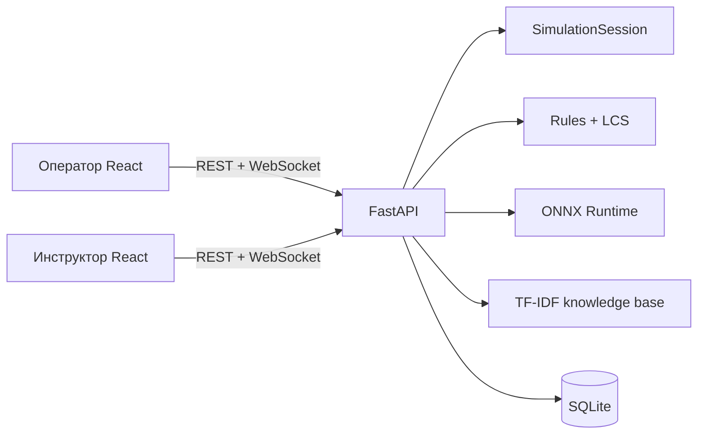

# Архитектура решения: текущее состояние и цель пилота

## Текущий MVP

```mermaid
flowchart LR
    OP[Оператор React] -->|REST + WebSocket| API[FastAPI]
    IN[Инструктор React] -->|REST + WebSocket| API
    API --> SIM[SimulationSession]
    API --> TUTOR[Rules + LCS]
    API --> ML[ONNX Runtime]
    API --> RAG[TF-IDF knowledge base]
    API --> DB[(SQLite)]
```

- Frontend: React 19, TypeScript, Ant Design, Recharts.
- Backend: FastAPI, Pydantic, WebSocket services.
- Состояние симуляции хранится в процессе backend; SQLite хранит пользователей, сессии и аудит.
- ONNX выполняется на CPU. При недоступности модели используется численный baseline.
- Один backend обслуживает несколько сессий, но нагрузка 50 сессий ещё не подтверждена испытанием.

## Известные ограничения

- потеря всех WebSocket-клиентов приводит к удалению активной in-memory сессии;
- SQLite и локальное состояние подходят для MVP, но ограничивают горизонтальное масштабирование;
- heartbeat подтверждает связь ping/pong, но серверный timeout stale-сокета не доказан;
- нет подтверждённой интеграции с промышленной АСУ ТП, LDAP/AD или LMS;
- Prometheus/Grafana, Redis, PostgreSQL и Kubernetes не являются частью работающего MVP.

## Цель пилота

Для пилота предлагаются PostgreSQL, общий session store, централизованный IAM, метрики, backup/restore и отдельный контур интеграции с источником телеметрии. Выбор Kubernetes, Redis и GPU должен следовать из нагрузки; текущая ONNX-модель работает на CPU и сама по себе не требует GPU.

Целевая архитектура — план, а не описание уже развёрнутой системы.
