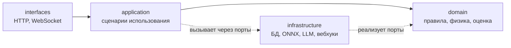

# Перевод бэкенда на слоистую архитектуру

**Дата:** 2026-08-01
**Ветка:** `backend`
**Статус:** согласовано, к реализации после сдачи 04.08

---

## 1. Цель

Разделить бэкенд на слои с однонаправленными зависимостями, чтобы правила
техрегламента, физика установки и оценка оператора перестали зависеть от
FastAPI, SQLite и WebSocket и стали проверяемыми в отрыве от них.

Из тактического DDD берём только то, что окупается на текущем объёме кода:
агрегат, объекты-значения, доменные события, порты и репозитории. Без CQRS,
без event sourcing, без фабрик и спецификаций — на ~2500 строк это была бы
церемония без выгоды.

Переход идёт вертикальными срезами (strangler): после каждого среза
приложение работает и весь набор тестов зелёный.

---

## 2. Текущее состояние

Замеры на 2026-08-01, после закрытия критических дефектов ревью (127 тестов).

### 2.1. Структура — это папки, а не слои

Каталоги `routes/`, `services/`, `db/`, `utils/`, `models/` делят код по
техническому типу файла. Правило зависимостей не задано и не проверяется,
поэтому нарушается в обе стороны.

### 2.2. Зависимости направлены внутрь ядра

```
simulator/elou_avt_model.py:46   →  backend.services.scenario_manager
ai_core/error_analyzer.py:33     →  backend.services.scenario_manager
```

Физическая модель и модуль оценки читают JSON-файл через слой приложения.
Симулятор невозможно запустить без пакета `backend`. Оба импорта спрятаны
внутрь функций и обёрнуты в перехват исключений, поэтому недоступность
реестра сценариев молча подменяется поведением по умолчанию.

### 2.3. `SimulationSession` — божественный объект

403 строки, пять несвязанных ответственностей в одном классе:

| Ответственность | Методы |
| :--- | :--- |
| Транспорт WebSocket | `broadcast_state`, `send_state_to`, наборы сокетов |
| Доменное состояние | `record_action`, `reset_session`, `add_log`, дефекты, режим |
| Оркестрация оценивания | `get_full_state` — вызывает предиктор и анализатор |
| Персистентность | `save_completed_session` — пишет в БД и в журнал аудита |
| Исходящая интеграция | `send_webhook_notification` — HTTP-запрос наружу |

Изменить правила оценки нельзя, не трогая класс, который держит сокеты.

### 2.4. Нет слоя доступа к данным

Соединение с БД открывается напрямую из двух модулей вне слоя `db/`:

- `backend/utils/security.py` — пять точек: журнал аудита, счётчики блокировок;
- `backend/routes/auth.py:31` — роут ходит в базу сам.

`utils/security.py` при этом смешивает четыре темы: хэширование целостности,
JWT, запись журнала и хранение попыток входа. Это модуль доступа к данным
под именем «утилиты».

Транзакционной границы нет: сохранение результата сессии и запись в журнал
идут разными соединениями, и при сбое между ними история расходится с журналом.

### 2.5. Три источника правды об ожидаемых действиях

| Источник | Что содержит |
| :--- | :--- |
| `backend/data/scenarios.json` | `checklist` с условиями, `golden_sequence` |
| `ai_chat_service.get_scenario_checklist_progress` | хардкод шагов и порогов 240/245 °C |
| `ai_core/error_analyzer` | `golden_sequence` и правила нарушений |

Они уже расходились: баг с `V2_OPEN_RELIEF` и `SP_DOWN_HEAT` в эталонах жил
именно на этом стыке, а `evaluate_condition` в чат-сервисе дублирует
вычисление условий чек-листа.

### 2.6. Прочее

- Три глобальных синглтона с состоянием: `manager`, `vector_store`
  (строится на импорте модуля), `_shared_predictor`.
- `ai_core/config.py` стал общей свалкой: пороги техрегламента, веса риска
  и гиперпараметры обучения модели в одном файле, который читают и backend,
  и симулятор, и офлайн-пайплайн.
- В `ai_core/` лежит офлайн-обучение (`train`, `evaluate`, `data_generator`,
  `export_onnx`, `baselines` — около 690 строк) и 6,4 МБ датасетов, которые
  без нужды попадают в образ сервиса.

---

## 3. Целевая архитектура

### 3.1. Слои

```
backend/
├── domain/              чистый Python: ни FastAPI, ни sqlite3, ни HTTP
│   ├── process/         model.py (физика), regulations.py (пороги регламента)
│   ├── training/        session.py (агрегат), scoring.py, alignment.py, rules.py
│   ├── scenario.py      Scenario + чек-лист — единый источник правды
│   ├── alarms.py        политика алармов и эскалации
│   ├── events.py        AlarmRaised, SessionCompleted, AccidentOccurred
│   └── ports.py         протоколы: SessionRepository, AuditLog,
│                        RiskForecaster, ScenarioRepository, WebhookSender
├── application/         сценарии использования, оркестрация, транзакции
│   ├── training_service.py     выполнение команд оператора и инструктора
│   ├── simulation_ticker.py    такт симуляции
│   ├── session_registry.py     владение сессиями и лимиты
│   ├── tutoring_service.py     чат-ассистент
│   └── event_dispatcher.py     доставка доменных событий подписчикам
├── infrastructure/      реализации портов
│   ├── db/              соединение, миграции, репозитории, единица работы
│   ├── ml/              onnx_forecaster.py — адаптер к ONNX Runtime
│   ├── rag/             векторный поиск по базе знаний
│   ├── llm/             клиент локальной LLM
│   ├── webhook.py       исходящие уведомления
│   └── scenario_file_repo.py   атомарное чтение и запись реестра
├── interfaces/          доставка
│   ├── http/            роутеры REST
│   ├── ws/              соединения и рассылка
│   └── schemas/         Pydantic DTO
├── config.py            настройки приложения из окружения
└── main.py              композиция зависимостей

ml/                      офлайн-пайплайн обучения, не часть сервиса
├── train.py, evaluate.py, export_onnx.py, data_generator.py, baselines.py
├── config.py            гиперпараметры модели
└── data/, artifacts/    датасеты и веса
```

### 3.2. Правило зависимостей



Домен не импортирует ничего из остальных слоёв и никаких сторонних
фреймворков — только стандартную библиотеку и NumPy.

**Правило проверяется автоматически.** Архитектурный тест обходит `domain/`
и падает, если находит импорт `fastapi`, `sqlite3`, `urllib`, `starlette` или
любого модуля из `application`, `infrastructure`, `interfaces`. Без такой
проверки слои остаются договорённостью на словах — это уже подтвердилось
на текущем коде.

---

## 4. Ключевые доменные решения

### 4.1. `TrainingSession` — агрегат

Единственная граница согласованности: состояние процесса, действия с
отметками времени, активированные дефекты, режим, журнал событий. Всё, что
сейчас размазано между `SimulationSession` и `simulation_loop`.

Наружу агрегат отдаёт не изменённое состояние, а список произошедших событий.

### 4.2. Доменные события вместо прямых вызовов инфраструктуры

Сейчас `add_log` сам отправляет HTTP-вебхук, а `save_completed_session` сам
пишет в БД и в журнал аудита — поэтому класс, владеющий сокетами, знает про
HTTP и SQL.

Домен будет поднимать события (`AlarmRaised`, `SessionCompleted`,
`AccidentOccurred`, `EscalationTriggered`), а слой приложения раздавать их
подписчикам: рассылка в сокеты, запись в журнал, отправка вебхука.

Это разом разбирает божественный объект и удешевляет тесты: проверить, что
домен поднял нужное событие, можно не поднимая ни HTTP, ни базу.

### 4.3. Сценарий — единый источник правды

Объект-значение `Scenario` (идентификатор, начальное состояние, чек-лист с
условиями, эталонная последовательность). Его читают и симулятор, и оценка,
и чат-ассистент. Хардкод шагов и порогов из `ai_chat_service` уходит,
`evaluate_condition` переезжает в домен в единственном экземпляре.

Сценарий передаётся внутрь как параметр — этим и снимается обратная
зависимость ядра на `backend`.

### 4.4. Репозитории и единая транзакция

Порты `SessionRepository`, `AuditLog`, `ScenarioRepository` объявлены в
домене, реализованы в инфраструктуре. Сохранение результата сессии и запись
в журнал аудита выполняются в одной транзакции.

### 4.5. Разделение `ai_core` и `simulator` по роли

Каталоги не переносятся целиком — их содержимое раскладывается по слоям:

| Что | Куда | Почему |
| :--- | :--- | :--- |
| `simulator/elou_avt_model.py` | `domain/process/model.py` | Физика установки — сердце предметной области |
| `ai_core/error_analyzer.py` | `domain/training/scoring.py` | Правила оценки — бизнес-логика |
| `ai_core/sequence_alignment.py` | `domain/training/alignment.py` | Часть той же оценки |
| `ai_core/tech_regulations.py` | `domain/training/rules.py` | Справочник нарушений |
| Пороги из `ai_core/config.py` | `domain/process/regulations.py` | Требования техрегламента |
| `ai_core/predictive_engine.py` | `infrastructure/ml/onnx_forecaster.py` | Адаптер к ML-рантайму за портом `RiskForecaster` |
| Гиперпараметры из `ai_core/config.py` | `ml/config.py` | Нужны только обучению |
| `train`, `evaluate`, `export_onnx`, `data_generator`, `baselines`, датасеты | `ml/` | Другой жизненный цикл и другие зависимости; в образе сервиса не нужны |

Рантайму API из `ai_core` сейчас нужны ровно три модуля — `config`,
`error_analyzer`, `predictive_engine`. Остальное едет в образ впустую.

---

## 5. План срезов

Каждый срез по TDD: сначала падающие тесты, затем реализация, в конце весь
набор зелёный. Промежуточных состояний со сломанным приложением нет.

### Срез 0 — каркас и фитнес-функция

Создать пустые пакеты слоёв, добавить архитектурный тест правила
зависимостей, собрать композицию в `main.py`. Код не переносится.

*Готово, когда:* архитектурный тест существует и проходит на пустом домене.

### Срез 1 — доступ к данным за портами

Вынести из `utils/security.py` и `routes/auth.py` всю работу с БД в
`infrastructure/db/`: репозитории сессий, журнала аудита, пользователей и
попыток входа. Ввести единицу работы и объединить сохранение сессии с
записью в журнал в одну транзакцию.

*Готово, когда:* `sqlite3` и `get_db_connection` не встречаются вне
`infrastructure/db/`; сбой записи журнала откатывает сохранение сессии.

### Срез 2 — сценарий как доменный объект

Ввести `domain/scenario.py` и порт `ScenarioRepository` с файловой
реализацией. Убрать дублирование чек-листа из `ai_chat_service`. Передавать
сценарий в симулятор и в оценку параметром — этим снять оба обратных импорта
ядра на `backend`.

*Готово, когда:* `grep "from backend" simulator/ ai_core/` пуст; условия
чек-листа вычисляются в одном месте; пороги 240/245 °C берутся из регламента.

### Срез 3 — физика в домен

Перенести модель установки в `domain/process/`, пороги техрегламента в
`domain/process/regulations.py`.

*Готово, когда:* модель импортируется без пакета `backend`; тесты физики
проходят без поднятия приложения.

### Срез 4 — оценивание в домен

Перенести анализатор ошибок, выравнивание последовательностей и справочник
нарушений в `domain/training/`.

*Готово, когда:* оценка сессии считается на чистых данных без обращения к
файловой системе.

### Срез 5 — предиктор за портом

Объявить порт `RiskForecaster` в домене, реализовать ONNX-адаптер в
инфраструктуре, внедрять через композицию вместо глобального синглтона.

*Готово, когда:* домен не знает про ONNX; в тестах подставляется двойник.

### Срез 6 — агрегат и события

Собрать `TrainingSession` как агрегат, ввести доменные события и диспетчер.
Разобрать `SimulationSession` и `simulation_loop` по слоям:

| Что сейчас | Куда |
| :--- | :--- |
| Пороги алармов и логика эскалации из `simulation_loop` | `domain/alarms.py` |
| Обход сессий и такт симуляции | `application/simulation_ticker.py` |
| `claim_session`, лимит числа сессий, владение | `application/session_registry.py` |
| Наборы сокетов, `broadcast_state`, `send_state_to` | `interfaces/ws/` |
| `send_webhook_notification` | подписчик события в `infrastructure/webhook.py` |
| `save_completed_session` | подписчик события через `SessionRepository` |

*Готово, когда:* в домене нет ни одного вызова HTTP или БД; рассылка,
журнал и вебхук подписаны на события; множитель скорости и пауза остаются
рабочими (проверяется существующими тестами).

### Срез 7 — транспорт

Перенести роутеры и обработчик WebSocket в `interfaces/`, DTO — в
`interfaces/schemas`.

*Готово, когда:* формат ответов API и WS-пакета не изменился (проверяется
существующими интеграционными тестами).

### Срез 8 — чат и поиск по базе знаний

Разложить `ai_chat_service` на прикладной сервис и инфраструктурные адаптеры
LLM и векторного поиска. Убрать построение индекса на импорте модуля.

*Готово, когда:* импорт пакета не выполняет ввод-вывод.

### Срез 9 — вынос `ml/` и чистка

Отделить офлайн-пайплайн, разделить конфигурацию, обновить Dockerfile и
документацию структуры в `backend/README.md`.

*Готово, когда:* образ сервиса не содержит датасетов и кода обучения.

---

## 6. Что не входит в объём

- Смена СУБД. SQLite остаётся.
- Изменение контракта API и формата WS-пакета. Фронтенд только что приведён
  в соответствие; любое расхождение ломает демонстрацию.
- Пересмотр модели аутентификации и ролей — сделано и проверено.
- CQRS, event sourcing, асинхронный доступ к БД через ORM.
- Переработка физической модели и алгоритмов оценки по существу: перенос
  без изменения поведения.

---

## 7. Риски

**Регрессия поведения при переносе.** Основная защита — 127 существующих
тестов, которые должны оставаться зелёными после каждого среза. Дополнительно
интеграционные тесты фиксируют формат ответов, поэтому расхождение контракта
обнаружится сразу.

**Расползание объёма.** Соблазн «заодно улучшить» физику или правила оценки
велик. Срез считается выполненным только при неизменном поведении; любое
содержательное изменение оформляется отдельно.

**Скрытые зависимости от порядка импорта.** Сейчас `vector_store` строит
индекс на импорте модуля, а конфигурация читается в трёх местах. Срез 8
устраняет это явно, до него порядок импортов не менять.

**Рассинхронизация с фронтендом.** Работы идут в разных worktree. Любое
изменение, задевающее контракт, согласуется до реализации, а не после.

---

## 8. Критерии готовности

1. Архитектурный тест правила зависимостей проходит.
2. `grep "from backend" simulator/ ai_core/` не даёт совпадений.
3. `sqlite3` не используется вне `infrastructure/db/`.
4. Условия чек-листа, пороги регламента и эталоны сценариев имеют по одному
   источнику правды.
5. Ни один модуль домена не импортирует FastAPI, Starlette или urllib.
6. Все тесты зелёные, формат API и WS-пакета не изменился.
7. Образ сервиса не содержит кода обучения и датасетов.

---

## 9. Открытые вопросы

Ни одного блокирующего. Решения по глубине DDD, способу перехода, границам
работ и судьбе `ai_core`/`simulator` приняты и зафиксированы выше.
