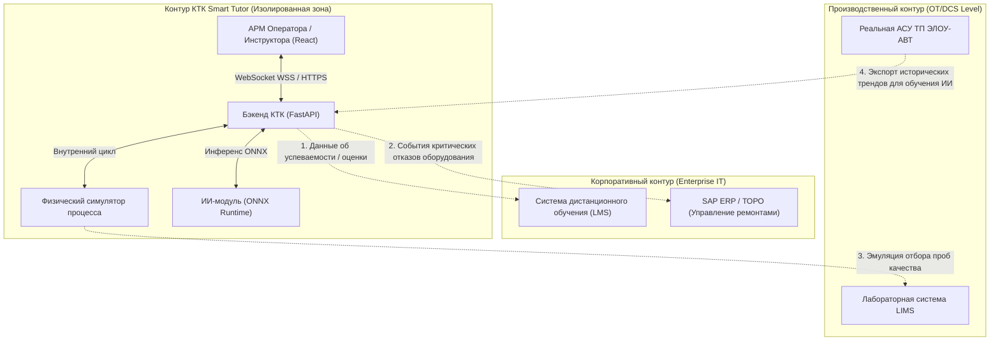
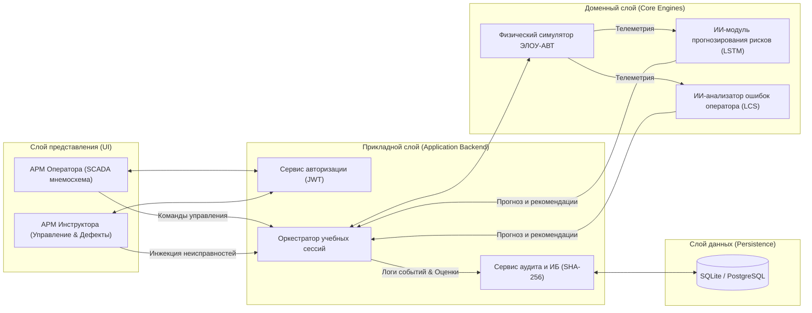
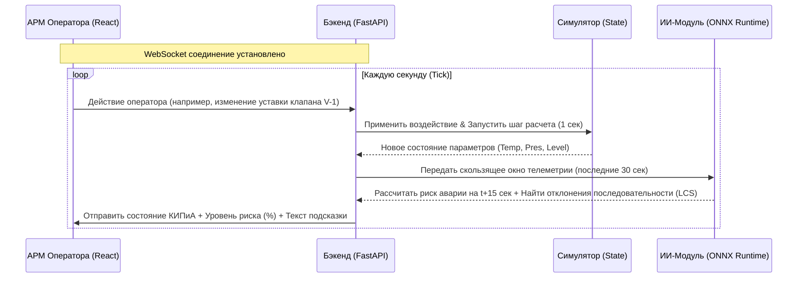
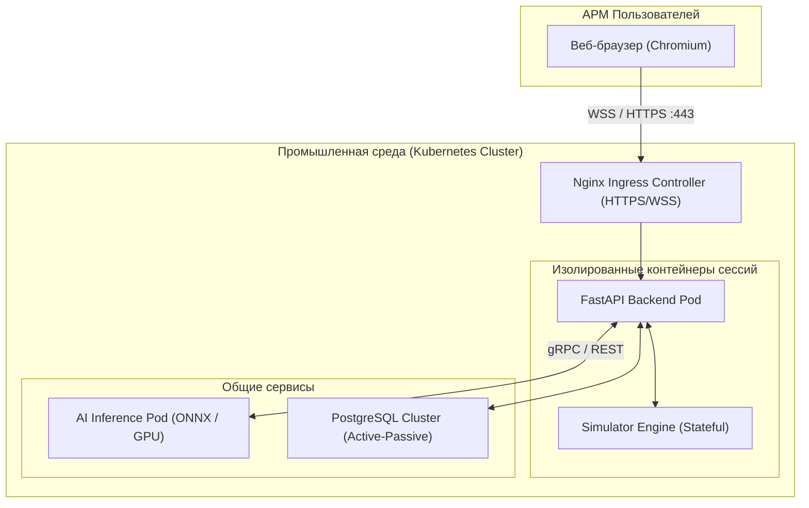
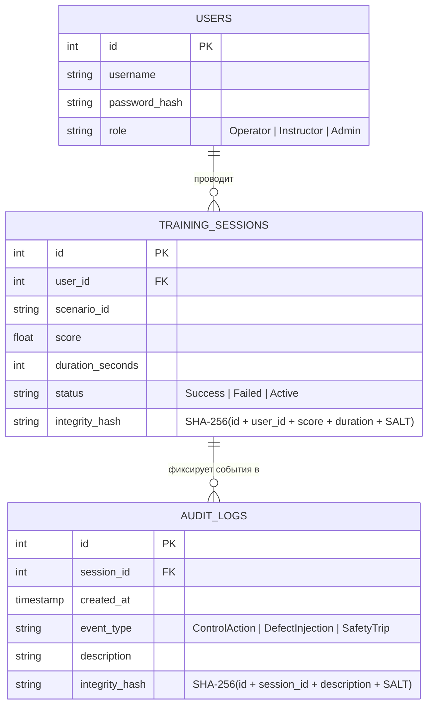
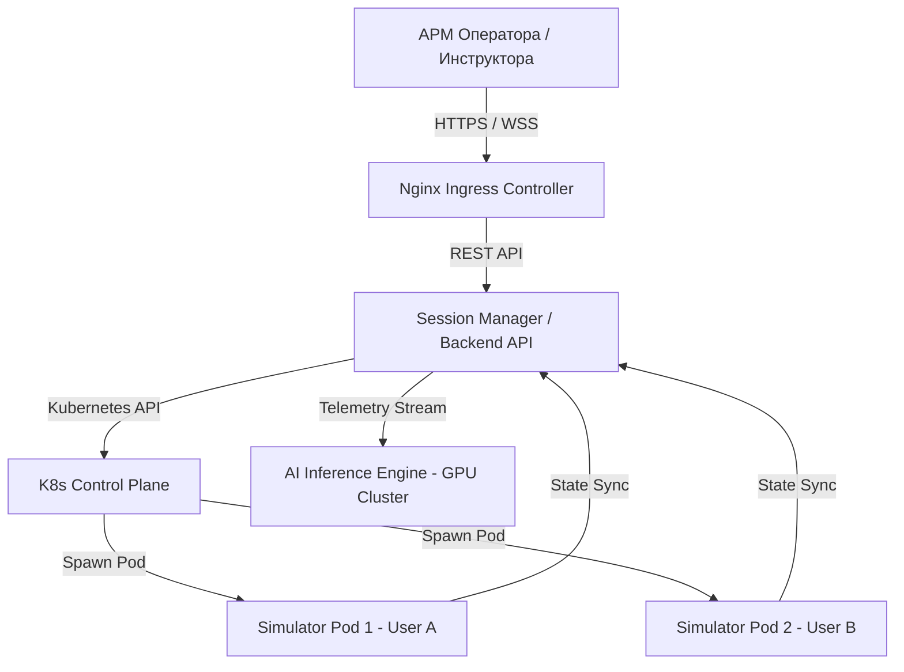
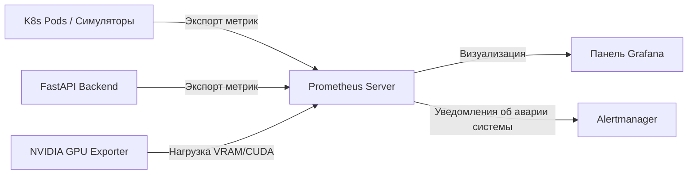
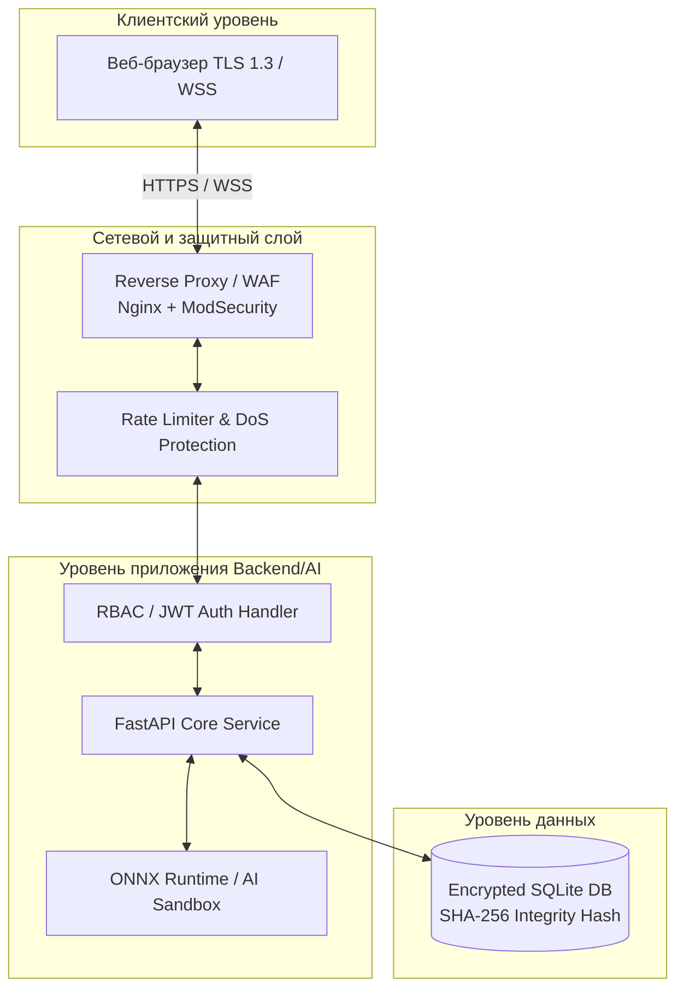
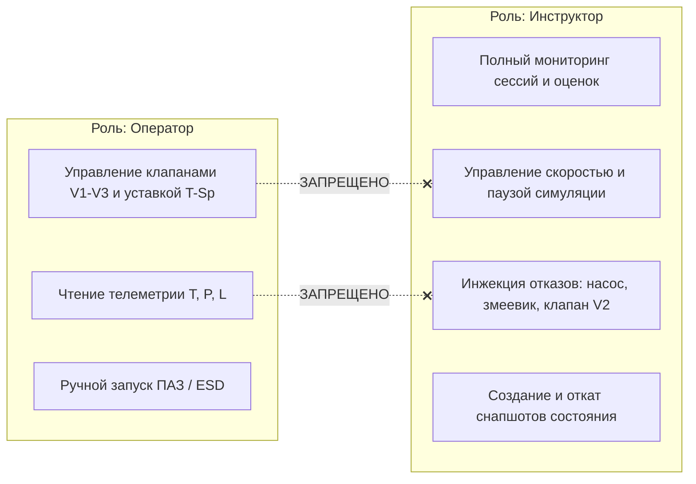
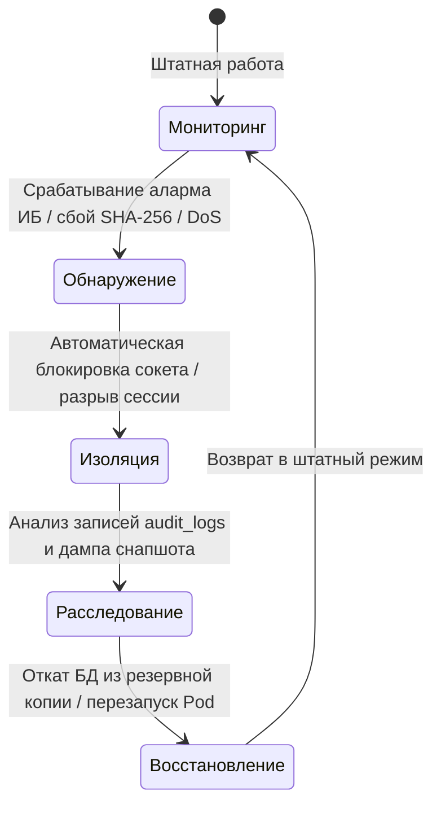

# Сводная Пояснительная Записка к КТК ЭЛОУ-АВТ Smart Tutor

**Сгенерировано автоматически:** 01.08.2026

---

> [!WARNING]
> **MVP vs ПРОМЫШЛЕННОЕ РЕШЕНИЕ:**
> Представленная в репозитории кодовая база — это Docker-MVP (Атмосферный блок П-1/К-1).
> Целевая промышленная архитектура (полный охват ЭЛОУ-АВТ-ВТ, Kubernetes, HA-кластер) подробно описывается ниже как модель следующего этапа пилотирования. На демонстрации мы показываем именно прототип, подтверждающий технологические и ИИ-гипотезы.


<!-- Начало раздела: market_analysis.md -->
# 📊 Анализ рынка и бенчмаркинг коммерческих КТК (Отечественный сегмент)

> [!NOTE]
> Настоящий документ содержит бенчмаркинг российских компьютерных тренажерных комплексов (КТК) и сравнение их характеристик с проектом `ELOU-AVT Smart Tutor`.

---

## 1. Сравнительный анализ отечественных решений

На основе данных, собранных АСУ ТП специалистом Андреем, проведено сравнение ключевых отечественных систем промышленного моделирования:

| Платформа | Назначение и описание | Ключевые возможности моделирования | Интеграция искусственного интеллекта (ИИ) | Ссылка / Источник |
|---|---|---|---|---|
| **DeltaSim** | Российская платформа операторных тренажёров для НПЗ, нефтехимии и энергетики. Основной акцент — реалистичность процессов и действий. | - Моделирующая станция для динамических процессов и аварий.<br>- Инструкторская станция (запуск сценариев, отслеживание, генерация аварий).<br>- Станция оператора с имитацией SCADA.<br>- Станция полевого обходчика (3D/панорамы).<br>- Автоматическая оценка действий оператора (время реакции, сравнение с эталоном). | - Анализ действий оператора.<br>- Интеллектуальная оценка ошибок.<br>- Сравнение с эталонными сценариями.<br>- Анализ последовательности действий.<br>- Адаптивное обучение (повторение сложных сценариев, подбор по слабым местам). | [DeltaSim (Томская ГРЭС)](https://testenergo.ru/tren-tomsk-gres/) |
| **ИНИУС** | Российский универсальный тренажёрный комплекс для промышленности и нефтехимии с упором на визуализацию и обучение. | - Гибкое распределение ролей (сервер, инструктор, оператор РСУ, полевой обходчик, инженер).<br>- Высокоточные физические модели, имитация РСУ и ПЛК ПАЗ.<br>- Автоматическое протоколирование сессии.<br>- Индивидуальные/групповые тренировки и экзамены.<br>- 3D-визуализация и VR-шлемы. | - Интеллектуальная оценка обучения.<br>- Поведенческая аналитика.<br>- Применение ИИ в связке с VR-визуализацией. | Официальные спецификации ИНИУС |
| **ТЕКОН** | Российская платформа промышленной автоматизации. Используется для тренажёров на базе SCADA и ПЛК. | - Эмуляция операторских интерфейсов (SCADA, ПЛК).<br>- Математические модели на основе дифференциальных уравнений физики процессов.<br>- Отработка базовых и нештатных сценариев. | - **Практически не используется**.<br>- Логика оценки завязана на жесткие статические правила (if-else). | Официальные спецификации ТЕКОН |

---

## 2. Конкурентные преимущества `ELOU-AVT Smart Tutor`

Наш тренажерный комплекс обладает рядом технологических и архитектурных преимуществ перед существующими коммерческими аналогами:

### 1. Интеллектуальный анализ последовательности действий (LCS)
* **У конкурентов:** Большинство систем (включая ТЕКОН и DeltaSim) используют жестко заданные временные окна или статические правила переключения (например, *"клапан А должен быть открыт в интервале от 10-й до 15-й секунды"*). Любое отклонение по времени считается ошибкой.
* **У нас:** Внедрен алгоритм выравнивания последовательностей **LCS (Longest Common Subsequence)** в сочетании с семантическим анализатором правил. Он сопоставляет *последовательность* действий оператора с эталонной, оценивая правильность логики и порядка операций независимо от темпа и пауз. Оператор может совершать действия медленнее или быстрее, но если логика и последовательность верны, система оценит это как правильное прохождение.

### 2. Предиктивный ИИ-контроль рисков (LSTM)
* **У конкурентов:** Системы сообщают об аварии постфактум, когда параметры давления или температуры уже превысили критические уставки.
* **У нас:** Обученная на исторических данных **LSTM-нейросеть (Long Short-Term Memory)** прогнозирует тренд изменения параметров (температур, давлений) и оценивает *вероятность наступления аварии* на 10-15 секунд вперед. Это позволяет оператору среагировать до физического срабатывания системы ПАЗ.

### 3. Легковесная Web-архитектура
* **У конкурентов:** Требуется установка тяжелого проприетарного ПО, локальных серверов и высокопроизводительных графических станций (особенно для VR/3D в ИНИУС). Это существенно увеличивает стоимость владения (TCO).
* **У нас:** Веб-ориентированная архитектура (FastAPI + WebSockets + React). Доступ к тренажеру осуществляется через стандартный веб-браузер с любого устройства. Развертывание в инфраструктуре предприятия занимает считанные минуты благодаря Docker.

---

## 3. Вектор развития для MVP (Спринт 2/3)

С учетом бенчмаркинга Андрея, мы должны сфокусировать разработку MVP на следующих точках:
1. **Адаптивные рекомендации ИИ-тьютора:** После завершения сессии ИИ должен не просто выводить сухую оценку, а сопоставлять допущенные оператором ошибки с конкретными пунктами техрегламента ЭЛОУ-АВТ (что уже частично реализовано в `ScoreCard.tsx`).
2. **АРМ Полевого оператора (обходчика):** В будущем расширении проекта (после сдачи основного кейса) мы можем интегрировать легкие схемы обходчика без необходимости тяжелого 3D/VR, используя интерактивные 2D-карты задвижек.


---

<div style='page-break-after: always;'></div>

<!-- Начало раздела: economics.md -->
# Экономическое обоснование и финансовая модель КТК ЭЛОУ-АВТ

> [!NOTE]
> Настоящий документ представляет собой финансово-экономическую модель (ФЭМ) и экономическое обоснование внедрения Компьютерного тренажерного комплекса «ЭЛОУ-АВТ Smart Tutor». Расчеты выполнены по стандартам Газпромнефти на основе методологии инвестиционного планирования и шаблонов IT Camp.

---

## 1. Экономический Canvas проекта

Логика экономической оценки проекта структурирована в виде проектно-продуктового канваса:

| 1. Описание проблемы | 4. Ожидаемые экономические эффекты | 7. Продуктовые метрики |
| :--- | :--- | :--- |
| • Длительный период ввода в строй новых операторов (AS IS: 4 месяца).<br>• Риски ошибок персонала на установке повышенной опасности ЭЛОУ-АВТ (стоимость аварийного останова печи/колонны достигает десятков миллионов рублей).<br>• Высокие трудозатраты инструкторов на ручную проверку знаний и аттестацию персонала. | • **Прямые эффекты (NPV):** Сокращение непродуктивного ФОТ стажеров на 25%.<br>• **Косвенные эффекты (UMV):** Сокращение стоимости обслуживания аварийных рисков и экономия топливного газа печи П-1.<br>• **Трудноизмеримые эффекты (DMV):** Повышение надежности работы оборудования, снижение износа арматуры. | • **Time to Market:** Скорость ввода оператора в должность.<br>• **Uptime тренажера:** >99.9% доступности.<br>• **Полнота ИИ (LSTM Recall):** 100% обнаружения аварийных трендов на тестовой выборке с упреждением 15 с (целевая метрика следующей итерации — precision).<br>• **Пропускная способность:** >50 одновременных сессий симуляции. |
| **2. Описание решения** | **5. Ожидаемые нематериальные эффекты** | **8. Потенциальные риски** |
| • Веб-ориентированный КТК Smart Tutor с математической моделью физики процессов ЭЛОУ-АВТ.<br>• ИИ-модуль LSTM для предиктивного прогнозирования рисков за 15 секунд до аварии.<br>• ИИ-модуль LCS-анализа для автоматического сравнения последовательности действий стажера с эталонным регламентом. | • Минимизация рисков травматизма и аварий в сфере ОЗТОС (HSE).<br>• Цифровизация базы знаний предприятия (оцифровка неписаных правил опытных операторов).<br>• Повышение привлекательности и престижа бренда работодателя. | • Риск сопротивления изменениям со стороны старого персонала.<br>• Риск изменения регламента установки (требует актуализации базы знаний тренажера).<br>• Риск деградации сетевых задержек. |
| **3. Итоговый образ-результат** | **6. Оценка затрат (TCO)** | |
| • Время адаптации снижено с 4 до 3 месяцев.<br>• 100% объективный контроль за счет автоматического выставления оценок ИИ-ассистентом.<br>• Полная прослеживаемость обучения и защита результатов хэшированием SHA-256. | • **CAPEX:** 6.90 млн руб. (Разработка расчетного ядра, покупка АРМ, лицензии).<br>• **OPEX:** 3.93 млн руб. (Техподдержка, хостинг, аудит ИБ).<br>• **Итого TCO (5 лет):** 10.83 млн руб. | |

---

## 2. Дерево КПЭ проекта (KPI Tree)

Дерево ключевых показателей эффективности связывает физические параметры работы тренажера с конечными финансовыми результатами.

```
                   [Уровень 1: Инвестиционные показатели]
                   ├── NPV = 5,660.57 тыс. руб. (Чистая ценность)
                   ├── PI = 1.91 (Индекс доходности инвестиций)
                   └── DPP = 3.71 года (Срок окупаемости с дисконтированием)
                                      │
                   [Уровень 2: Экономические эффекты]
                   ├── Оптимизация OPEX (Снижение затрат на подготовку)
                   └── Снижение стоимости рисков (Предотвращение инцидентов)
                                      │
                  [Уровень 2: Операционные параметры]
                  ├── Трудозатраты стажеров и инструкторов (AS IS vs TO BE)
                  └── Частота и средний ущерб от технологических аварий
                                      │
                   [Уровень 3: Физические параметры]
                   ├── FTE стажера на ввод в строй (с 320 до 240 часов)
                   ├── FTE инструктора на аттестацию (с 16 до 1 часа)
                   └── Вероятность останова печи П-1 (с 0.15 до 0.02 в год)
```

### Спецификация физико-экономических параметров (AS IS vs TO BE):

| № | Показатель КПЭ | Формула расчета | Год | AS IS | TO BE | Эффект (тыс. руб.) |
| :--- | :--- | :--- | :--- | :---: | :---: | :---: |
| **1** | **Сокращение трудозатрат на адаптацию стажеров** | `(FTE_AsIs - FTE_ToBe) * Стоимость_FTE` | 2026 | 320 ч. | 240 ч. | **190.00** |
| **2** | **Сокращение времени аттестации (АРМ Инструктора)** | `(FTE_AsIs - FTE_ToBe) * Стоимость_FTE` | 2027 | 16 ч. | 1 ч. | **570.00** |
| **3** | **Снижение рисков аварийных остановов установки** | `(Prob_AsIs - Prob_ToBe) * Средний_ущерб` | 2028 | 0.15 | 0.02 | **7 400.05** |
| **4** | **Снижение рисков аварийных остановов установки** | `(Prob_AsIs - Prob_ToBe) * Средний_ущерб` | 2029 | 0.15 | 0.02 | **7 400.05** |

*Параметры расчета: Средняя ставка часа специалиста (FTE) с налогами принята равной 1.91 тыс. руб. Средний ущерб от аварийного останова установки ЭЛОУ-АВТ-4 (простой, сброс газа, ремонт) оценен консервативно в 56.9 млн руб.*

---

## 3. Бюджет проекта и Совокупная стоимость владения (TCO)

Распределение затрат на создание и сопровождение тренажера Smart Tutor на горизонте планирования 5 лет (тыс. руб.):

| Статья затрат | 2026 | 2027 | 2028 | 2029 | 2030 | Итого по статье |
| :--- | :---: | :---: | :---: | :---: | :---: | :---: |
| **Капитальные затраты (CAPEX)** | | | | | | |
| Разработка симулятора и ИИ-модулей | 1 500 | 4 500 | - | - | - | **6 000** |
| Лицензии (СУБД, шифрование) | - | 450 | - | - | - | **450** |
| Закупка оборудования АРМ (CAPEX) | 250 | 200 | - | - | - | **450** |
| *Итого капитальные затраты (CAPEX):* | *1 750* | *5 150* | *0* | *0* | *0* | **6 900** |
| **Операционные затраты (OPEX)** | | | | | | |
| Поддержка ИТ-инфраструктуры (OPEX) | 600 | - | - | - | - | **600** |
| Управление проектом внедрения (OPEX) | 450 | 250 | - | - | - | **700** |
| Сервисное обслуживание и поддержка КТК | - | 300 | 300 | 300 | 300 | **1 200** |
| Сопровождение ИБ (крипто-аудит логов) | 230 | 100 | 100 | 100 | 100 | **630** |
| Аренда мощностей хостинга / IaaS | - | 200 | 200 | 200 | 200 | **800** |
| *Итого операционные затраты (OPEX):* | *1 280* | *850* | *600* | *600* | *600* | **3 930** |
| **ИТОГО ПО ПРОЕКТУ ЗА ГОД:** | **3 030** | **6 000** | **600** | **600** | **600** | **10 830** |

**Совокупная стоимость владения (TCO) КТК за 5 лет составляет: 10 830.00 тыс. руб. (номинальная), или 6 951.91 тыс. руб. (дисконтированная по гибридной ставке).**

---

## 4. Показатели инвестиционной привлекательности (ФЭМ)

Финансово-экономические показатели рассчитаны с использованием **гибридного метода дисконтирования**, принятого в ПАО «Газпром нефть»:
- Исторические периоды дисконтируются по базовой ставке **10%**.
- Будущие / плановые периоды дисконтируются по макроэкономической ставке **14%**.

### Итоговые инвестиционные параметры:

*   **PVI (Приведенная стоимость инвестиций):** **6 229.33 тыс. руб.** (дисконтированный CAPEX проекта).
*   **NPV (Чистая приведенная стоимость):** **5 660.57 тыс. руб.** 
    $$NPV = \sum_{t=0}^{n} \frac{FCF_t}{(1+i)^t} > 0$$
    Проект создает положительную чистую стоимость для предприятия, полностью окупая вложенные средства с учетом стоимости денег во времени.
*   **PI (Индекс доходности инвестиций):** **1.91**
    $$PI = \frac{NPV}{PVI} + 1 > 1.0$$
    Каждый вложенный рубль инвестиций приносит 1.91 рубля дисконтированного дохода.
*   **DPP (Дисконтированный срок окупаемости):** **3.71 года**
    Проект полностью окупается в течение 3.71 года с момента начала разработки, что существенно ниже нормативного горизонта полезного использования ИТ-систем (5 лет).
*   **IRR (Внутренняя норма доходности):** **45%**
    Определяет предельную ставку стоимости капитала, при которой проект остается безубыточным. IRR (45%) значительно превышает корпоративную барьерную ставку WACC (14%).

---

## 5. Распределение по инвестиционным корзинам

Согласно правилам ранжирования инвестиционного портфеля ИТ-сегмента Газпромнефти, проект КТК ЭЛОУ-АВТ Smart Tutor классифицируется по двум основным направлениям:

1.  **Корзина 1: «Безопасная эксплуатация» (HSE & Regulatory Compliance)**
    *   *Критерий:* Проект направлен на исполнение федеральных норм в области промышленной опасности (обучение персонала работе на опасных производственных объектах) и обеспечение защиты жизни сотрудников. Данные проекты имеют приоритетное право на финансирование вне зависимости от чистой окупаемости.
2.  **Корзина 4: «Проекты с косвенным экономическим эффектом» (UMV / Indirect FCF)**
    *   *Критерий:* Экономический эффект рассчитывается методом математического моделирования и оценки предотвращенного ущерба (снижение вероятности аварии с 0.15 до 0.02). Индекс доходности $J > 1$ (фактический $J = 1.91$) подтверждает высокую целесообразность включения проекта в портфель цифровой трансформации НПЗ.


---

<div style='page-break-after: always;'></div>

<!-- Начало раздела: requirements.md -->
# 📝 Техническое задание на КТК ЭЛОУ-АВТ Smart Tutor (ГОСТ 34.602-89)

> [!NOTE]
> Настоящее техническое задание (ТЗ) разработано на основе стандартов ГОСТ 34, свода знаний по бизнес-анализу **BABOK v3** и методологии проектирования требований **Карла Вигерса**. Документ консолидирует бизнес-требования (БТ), требования заинтересованных сторон (User Stories), функциональные (ФТ) и нефункциональные требования (НФТ) к Компьютерному тренажерному комплексу (КТК) «ЭЛОУ-АВТ Smart Tutor».

---

## 1. Общие сведения
*   **Наименование системы:** Компьютерный тренажерный комплекс «ЭЛОУ-АВТ Smart Tutor» (КТК Smart Tutor).
*   **Заказчик:** Команда жюри Кейса КТК ЭЛОУ-АВТ / АО "Газпромнефть-ОНПЗ".
*   **Сроки выполнения:** Спринт 1 (до 09.07.2026), Спринт 2 (до 16.07.2026).

### 1.1. Потребность бизнеса (Предпосылки)
Установка первичной переработки нефти ЭЛОУ-АВТ является критически важным и высокоопасным объектом нефтепереработки. На текущий момент на предприятии выявлены следующие проблемы:
1.  **Высокая стоимость и длительность подготовки кадров:** Традиционный ввод в строй нового оператора технологических установок занимает значительное время из-за невозможности практической отработки аварийных ситуаций на действующем оборудовании.
2.  **Риски человеческого фактора:** Ошибки операторов при пуске, останове или локализации аварий приводят к экономическим потерям, порче дорогостоящего катализатора и оборудования, а также угрожают промышленной безопасности.
3.  **Субъективизм при оценке квалификации:** Оценка готовности персонала к самостоятельной работе часто зависит от личного мнения инструктора, что не гарантирует объективного контроля навыков.

---

## 2. Назначение и цели создания системы
*   **Назначение:** Обучение, проверка знаний и автоматизированная оценка квалификации технологического персонала (операторов и полевых обходчиков) установки ЭЛОУ-АВТ.
*   **Цели создания:**
    *   Снижение аварийности на установке за счет безопасной отработки нештатных ситуаций в виртуальной среде.
    *   Беспристрастный автоматический анализ правильности действий оператора на основе сопоставления траекторий с регламентом.
    *   Снижение рисков возникновения инцидентов за счет раннего предиктивного оповещения об угрозах.

---

## 3. Бизнес-требования (БТ)

Бизнес-требования определяют глобальные цели внедрения системы и сформулированы по методологии **SMART**:

*   **БТ-01 (Сокращение времени адаптации):** Сократить среднее время подготовки нового оператора технологической установки ЭЛОУ-АВТ до самостоятельного допуска к работе на 25% (с 4 месяцев до 3 месяцев) к концу 2026 года.
*   **БТ-02 (Объективность аттестации):** Обеспечить 100% автоматизацию проверки и оценки прохождения учебных сценариев без участия человеческого фактора (с применением алгоритма выравнивания последовательностей LCS) с момента ввода тренажера в опытную эксплуатацию.
*   **БТ-03 (Обеспечение достоверности результатов):** Исключить возможность несанкционированного изменения результатов обучения и логов аудита обучаемыми операторами (целевой показатель: 0 успешных попыток фальсификации данных) за счет применения криптографической верификации.

### 3.1. Требования заинтересованных сторон (User Stories)

Потребности различных стейкхолдеров декомпозированы в формате пользовательских историй:

*   **US-01 (Стажер / Оператор):** 
    *   *Формулировка:* Я как обучающийся оператор хочу проходить симуляцию технологических процессов в интерактивном режиме и получать предиктивные предупреждения ИИ о рисках и подсказки из регламента, чтобы безопасно отработать навыки локализации аварий и не допускать ошибок на реальной установке.
*   **US-02 (Инструктор):** 
    *   *Формулировка:* Я как инструктор производственного обучения хочу гибко управлять ходом симуляции (запуск, пауза, сброс), инжектировать комплексные неисправности оборудования в сессию стажера и просматривать автоматические детальные отчеты с оценками, чтобы беспристрастно оценивать профпригодность персонала.
*   **US-03 (Методолог обучения):** 
    *   *Формулировка:* Я как методолог хочу настраивать эталонные последовательности технологических операций и привязывать к ним текстовые подсказки из регламента через конфигурационные файлы, чтобы оперативно обновлять базу знаний тренажера при изменении реальных регламентов без привлечения программистов.
*   **US-04 (Офицер информационной безопасности):** 
    *   *Формулировка:* Я как специалист по ИБ хочу, чтобы все действия пользователей и итоговые оценки подписывались хэш-суммой с секретной солью на сервере, чтобы гарантировать неизменяемость и достоверность результатов аттестации.

---

## 4. Функциональные требования к решению (ФТ)

Функциональные требования описывают поведение системы и ее возможности без привязки к конкретным элементам реализации интерфейса:

### 4.1. Математический симулятор физических процессов
*   **ФТ-СИМ-01:** Система должна непрерывно рассчитывать параметры материальных и тепловых балансов установки ЭЛОУ-АВТ (температуру, давление, расходы, уровни) в реальном времени с шагом в 1 секунду.
*   **ФТ-СИМ-02:** Симулятор должен поддерживать эмуляцию работы установки в диапазоне температур окружающего воздуха от 0°С до +40°С.
*   **ФТ-СИМ-03:** Система должна позволять проводить запуск симуляции из различных начальных состояний: «холодный старт», «номинальный рабочий режим» и «сохраненная точка».
*   **ФТ-СИМ-04:** Симулятор должен воспроизводить остывание технологических аппаратов (печи, колонны) и трубопроводов при прекращении подачи горячих сред.
*   **ФТ-СИМ-05:** Система должна рассчитывать гидравлические параметры и расходы сред с учетом степени открытия регулирующей и запорной арматуры.

### 4.2. Функционал АРМ Инструктора
*   **ФТ-ИНС-01:** Система должна предоставлять функционал сохранения текущего состояния симулятора в файл («снимок состояния») и мгновенного восстановления сессии из этого файла.
*   **ФТ-ИНС-02:** Система должна поддерживать изменение масштаба времени симуляции (пауза, ускорение процесса не менее чем в 2 раза).
*   **ФТ-ИНС-03:** Система должна обеспечивать принудительную инжекцию неисправностей в работающую сессию стажера (отказ насоса сырья, прекращение подачи пара, заклинивание клапана, утечка из трубопровода, ложная сработка СПАЗ).

### 4.3. Интеллектуальный ассистент (ИИ)
*   **ФТ-ИИ-01:** Система должна с помощью нейросети LSTM прогнозировать значения температуры и давления на 15 секунд вперед на основе скользящего окна телеметрии за последние 30 секунд.
*   **ФТ-ИИ-02:** Система должна рассчитывать мгновенный риск аварии в диапазоне от 0% до 100% на основе сравнения прогнозных трендов с критическими уставками регламента (например, превышение температуры змеевика печи >380°С или давления в колонне >0.6 МПа).
*   **ФТ-ИИ-03:** Система должна с помощью алгоритма выравнивания последовательностей (LCS) вычислять отклонение последовательности действий оператора от эталонного сценария, локализовать ошибку во времени и определять нарушенный пункт регламента.
*   **ФТ-ИИ-04:** Система должна автоматически формировать адаптивную траекторию обучения стажера, предлагая повторное прохождение тех сценариев, в которых были допущены критические ошибки.

### 4.4. АРМ Оператора (Интерфейс SCADA)
*   **ФТ-ОП-01:** Система должна визуализировать текущее состояние технологической схемы установки (мнемосхему) с динамическим обновлением значений параметров КИПиА каждую секунду.
*   **ФТ-ОП-02:** Система должна позволять передавать управляющие воздействия оператора (изменение степени открытия клапанов V-1, V-2, V-3, задание температуры печи П-1) на симулятор.
*   **ФТ-ОП-03:** Система должна вести журнал событий в реальном времени, фиксируя все действия оператора, срабатывания защитных блокировок и предупреждения ИИ.

---

## 5. Нефункциональные требования (НФТ)

Качественные характеристики системы формализованы в виде измеримых ограничений:

### 5.1. Требования к производительности (Performance)
*   **НФ-ПРО-01:** Время отклика интерфейса на любые действия управления пользователя должно составлять не более 200 мс в локальной сети.
*   **НФ-ПРО-02:** Время расчета одного шага физического симулятора не должно превышать 5 мс.
*   **НФ-ПРО-03:** Время инференса ИИ-модели для расчета риска аварии должно составлять не более 50 мс на один шаг прогноза.
*   **НФ-ПРО-04:** Сетевая задержка (Round-trip delay) при обмене данными по WebSocket не должна превышать 50 мс в нормальных условиях сети.

### 5.2. Требования к надежности и доступности (Availability)
*   **НФ-НАД-01:** Коэффициент доступности системы (uptime) должен составлять не менее 99.9% в годовом исчислении (за исключением плановых окон технического обслуживания).
*   **НФ-НАД-02:** В случае кратковременного обрыва сетевого соединения (до 30 секунд) система должна автоматически восстановить WebSocket-сессию без потери текущего прогресса обучения стажера.

### 5.3. Требования к информационной безопасности (Security)
*   **НФ-БЕЗ-01:** Доступ к системе должен предоставляться исключительно после прохождения аутентификации на основе ролевой модели (RBAC) с выпуском сессионных JWT-токенов.
*   **НФ-БЕЗ-02:** Все записи результатов обучения и логов событий перед сохранением в базу данных должны подписываться хэш-суммой по алгоритму SHA-256 с использованием секретной соли, хранящейся в переменных окружения сервера.
*   **НФ-БЕЗ-03:** При обнаружении компрометации хэша (несовпадение подписи при чтении) система должна блокировать изменение записи и выводить предупреждение в интерфейсе инструктора.

### 5.4. Требования к совместимости и окружению (Compatibility)
*   **НФ-СОВ-01:** Клиентская часть (фронтенд) должна корректно функционировать в веб-браузерах на базе движка Chromium (Google Chrome 110+, Яндекс.Браузер) без необходимости установки дополнительных плагинов.
*   **НФ-СОВ-02:** Разрешение экрана для работы с SCADA-мнемосхемой должно составлять не менее 1920x1080 пикселей.

### 5.5. Требования к масштабируемости (Scalability)
*   **НФ-МАС-01:** Система должна поддерживать одновременную работу не менее 50 активных сессий обучения на одном сервере приложений без деградации времени отклика.
*   **НФ-МАС-02:** Ресурсы контейнера для каждой сессии симулятора должны быть жестко ограничены лимитами (не более 0.5 CPU и 128 MB RAM) для предотвращения сбоев всей системы при утечках памяти в отдельной сессии.

---

## 6. Переходные требования (Transition Requirements)

Требования, описывающие условия успешного внедрения и перехода к использованию системы:

*   **ПТ-01 (Калибровка моделей по историческим данным):** Для обучения прогнозной ИИ-модели (LSTM) и калибровки коэффициентов физического симулятора в систему должны быть импортированы исторические данные телеметрии установки ЭЛОУ-АВТ-4 (расходы, температуры, давления) за период не менее 6 месяцев.
*   **ПТ-02 (Наполнение базы знаний):** Должна быть произведена первичная загрузка данных технологического регламента установки и базы типовых ошибок оператора (не менее 20 сценариев нарушений и соответствующих им инструкций по локализации).
*   **ПТ-03 (Обучение персонала администрированию):** Разработчик обязан провести обучающий курс (продолжительностью не менее 8 академических часов) для ИТ-администраторов и производственных инструкторов заказчика по вопросам развертывания, настройки сценариев и мониторинга системы КТК.


---

<div style='page-break-after: always;'></div>

<!-- Начало раздела: solution_architecture.md -->
# Архитектура ИТ-решения КТК ЭЛОУ-АВТ Smart Tutor

> [!NOTE]
> Настоящий документ представляет собой архитектурное описание (Solution Architecture) Компьютерного тренажерного комплекса (КТК) «ЭЛОУ-АВТ Smart Tutor». Документ разработан в соответствии с методологией **View Model 4+1** и стандартами проектирования ИТ-решений, принятыми в группе компаний ПАО «Газпром нефть».

---

## 1. Роль и место решения в ИТ-ландшафте предприятия

КТК ЭЛОУ-АВТ Smart Tutor интегрируется в существующий ИТ-ландшафт нефтеперерабатывающего завода (НПЗ) в качестве связующего звена между производственными системами (OT-контур) и корпоративными сервисами обучения (IT-контур).



### Потоки интеграции:
1. **Экспорт оценок в LMS:** Передача итоговых результатов прохождения сценариев стажерами для формирования личного профиля компетенций.
2. **Интеграция с SAP ERP / ТОРО:** Передача логов отказов оборудования для обучения планированию технического обслуживания и ремонтов (ТОиР).
3. **Эмуляция данных LIMS:** Симулятор моделирует отбор проб качества нефтепродуктов (фракций), предоставляя данные по запросу из виртуального интерфейса LIMS.
4. **Использование исторических трендов АСУ ТП:** Загрузка реальных исторических данных технологического процесса для дообучения прогнозных ИИ-моделей в автономном режиме.

---

## 2. Обоснование выбора варианта реализации (3 варианты)

В соответствии со стандартами Solution Architecture, были проанализированы три альтернативных варианта реализации КТК:

| Критерий | Вариант А: Коробочное ПО (Honeywell UniSim / Yokogawa OTS) | Вариант Б: Собственная веб-разработка (ВЫБРАННЫЙ) | Вариант В: Гибридное решение (Коробочный симулятор + кастомный ИИ) |
| :--- | :--- | :--- | :--- |
| **Стоимость (TCO)** | 🔴 **Крайне высокая** (дорогие лицензии на каждое рабочее место + поддержка). | 🟢 **Низкая** (разработка на open-source стеке, отсутствие лицензионных отчислений). | 🟡 **Средняя** (лицензирование только расчетного ядра симулятора). |
| **Импортозамещение** | 🔴 **Критическая зависимость** от зарубежных вендоров. Риск отзыва лицензий. | 🟢 **100% независимость**. Соответствие требованиям Минцифры РФ. | 🟡 **Частичная зависимость** от зарубежного ядра симуляции. |
| **Гибкость и ИИ** | 🔴 **Низкая**. Закрытые проприетарные API делают интеграцию сложных ИИ-ассистентов крайне сложной. | 🟢 **Максимальная**. Полный контроль над кодом позволяет бесшовно встраивать LSTM и LCS алгоритмы. | 🟢 **Высокая**. Кастомная ИИ-надстройка поверх открытых интерфейсов симулятора. |
| **Развертывание** | 🔴 **Сложное** (требует установки тяжелого desktop-клиента на каждое АРМ). | 🟢 **Простое** (веб-приложение, запуск в браузере на любом АРМ без установки ПО). | 🟡 **Среднее** (требует выделенных серверов под симулятор). |
| **Масштабируемость** | 🔴 **Ограниченная** лицензионными ключами. | 🟢 **Высокая** (ограничена только мощностью серверного оборудования). | 🟡 **Ограниченная** лицензиями вендора на расчетное ядро. |

**Обоснование выбора:** Вариант Б выбран как единственный, обеспечивающий технологический суверенитет, гибкость интеграции интеллектуальных ИИ-ассистентов и минимальную совокупную стоимость владения (TCO).

---

## 3. Логическое представление (Logical View)

Логическая архитектура разделяет систему на независимые слои, обеспечивая разграничение зон ответственности и ролевую модель безопасности.



### Ролевая модель доступа (RBAC):
*   **Стажер (Оператор):** Доступ только к `АРМ Оператора`. Разрешено управление регулирующей арматурой и уставками. Запрещен доступ к запуску неисправностей и просмотру логов безопасности.
*   **Инструктор:** Доступ к `АРМ Инструктора`. Разрешено управление жизненным циклом сессии (пуск, пауза, сброс), инжекция комплексных неисправностей, просмотр защищенных логов аудита и оценок. Запрещено прямое управление процессом.
*   **Администратор:** Полный доступ к конфигурации системы, управлению пользователями и сценариями обучения.

---

## 4. Представление разработки (Development View)

Проект разработан по структуре **Monorepo**, разделенной на изолированные пакеты с четкими границами зависимостей.

```
elou-avt-smart-tutor/
├── frontend/             # Клиентское SPA (React 18 + TS + Ant Design)
│   └── src/services/     # Единственная точка вызова API бэкенда (api.ts)
├── backend/              # Асинхронный веб-сервер (FastAPI + Pydantic)
│   ├── routes/           # REST-роутеры и WebSocket-обработчики
│   ├── models/           # Схемы валидации данных Pydantic
│   └── db/               # Модуль доступа к БД и криптографического контроля
├── simulator/            # Математический симулятор физики техпроцесса (NumPy/SciPy)
├── ai_core/              # Инференс ИИ-моделей (ONNX Runtime, NumPy LCS)
└── docs/                 # Документация проекта
```

### Обоснование технологического стека:
*   **React + TypeScript:** Обеспечивает строгую типизацию интерфейса SCADA, предотвращая ошибки рендеринга динамических параметров КИПиА в реальном времени.
*   **FastAPI:** Выбран из-за высокой производительности (сравнима с Node.js и Go), встроенной поддержки асинхронных WebSocket-соединений и автоматической генерации OpenAPI-схем по docstrings функций.
*   **ONNX Runtime:** Используется для инференса LSTM-моделей на CPU. Это исключает необходимость развертывания тяжелого PyTorch-окружения на сервере приложений, уменьшая объем Docker-образа и снижая требования к ресурсам.

---

## 5. Процессное представление (Process View)

Процессное представление описывает асинхронный цикл обмена данными в реальном времени, обеспечивающий мгновенный отклик системы.



### Характеристики производительности:
*   **Время круга (Round-trip latency):** Норматив составляет **<50 мс** на локальном сетевом контуре. В интерфейс встроен пинг-механизм для контроля задержки.
*   **Время расчета шага физики:** `<5 мс` на один шаг симулятора.
*   **Время инференса LSTM + LCS:** `<15 мс` на один шаг инференса через ONNX Runtime.

---

## 6. Физическое представление (Deployment View)

Архитектура развертывания поддерживает два режима: локальный (для разработки и MVP) и промышленный (для продуктивной среды предприятия).



### Описание сетевого взаимодействия:
*   Внешний трафик шифруется по протоколам **HTTPS** (для REST API и статики фронтенда) и **WSS** (для WebSocket-соединений).
*   Внутри кластера Kubernetes трафик между бэкендом и ИИ-модулем изолирован и может использовать протокол **gRPC** для снижения сетевых накладных расходов.
*   Каждая пользовательская сессия выполняется в изолированном контейнере с жестким ограничением ресурсов (`0.5 CPU` и `128 MB RAM`), что исключает взаимовлияние пользователей друг на друга при сбоях.

---

## 7. Сценарии (Use Cases)

### UC-01: Прохождение тренировки по сценарию «Пуск установки»
*   **Актер:** Стажер (Оператор).
*   **Поток событий:**
    1. Стажер открывает АРМ, выбирает сценарий «Пуск установки» из холодного состояния.
    2. Бэкенд инициализирует физический симулятор с начальными значениями (температура печи `20°C`, задвижки закрыты).
    3. Стажер открывает клапан сырья `V-1`. Симулятор начинает рассчитывать уровень в колонне.
    4. Стажер включает нагрев печи `П-1`.
    5. ИИ-модуль анализирует траекторию действий стажера и сверяет с эталоном.

### UC-02: Инжекция неисправности инструктором
*   **Актер:** Инструктор.
*   **Поток событий:**
    1. Инструктор в панели управления выбирает активную сессию Стажера и инжектирует дефект «Отказ сырьевого насоса».
    2. Бэкенд передает команду в симулятор. Симулятор принудительно обнуляет расход на входе, имитируя поломку насоса.
    3. Давление и температура на установке начинают аварийно изменяться.
    4. ИИ-модуль фиксирует рост риска аварии и выводит предупреждение стажеру.

---

## 8. Реестр интеграционных интерфейсов

### 8.1. WebSocket API (Протокол реального времени)
Используется для обмена сообщениями во время активной сессии симуляции.

#### Сообщение от клиента (Действие оператора):
```json
{
  "action": "control",
  "target": "valve_V1",
  "value": 45.5,
  "timestamp": 1718385600
}
```

#### Сообщение от сервера (Телеметрия + ИИ):
```json
{
  "type": "telemetry_update",
  "timestamp": 1718385601,
  "data": {
    "furnace_temp": 305.2,
    "column_press": 0.38,
    "column_level": 55.4
  },
  "ai": {
    "risk_score": 12.5,
    "predicted_temp_15s": 309.8,
    "recommendations": [
      {
        "code": "ERR_TEMP_RISE",
        "text": "Внимание! Температура печи приближается к критическому порогу 310°C. Согласно п. 5.2 регламента, увеличьте подачу пара."
      }
    ]
  }
}
```

### 8.2. REST API (Управление и Аудит)
*   `POST /api/auth/login` — Авторизация пользователя, возвращает JWT-токен и роль.
*   `POST /api/sessions/start` — Инициализация новой сессии обучения.
*   `POST /api/instructor/inject-defect` — Запуск неисправности в сессии (доступно только роли `Instructor`).
*   `GET /api/sessions/history` — Получение результатов прошлых сессий с проверкой контрольной суммы SHA-256 на стороне бэкенда для защиты от подделки оценок.

---

## 9. Логическая модель данных (ЛМД)

Схема базы данных КТК ориентирована на обеспечение полной прослеживаемости процесса обучения и некорректируемости результатов (ИБ-контроль).



### Обеспечение целостности данных (Критерий 8):
Для предотвращения несанкционированной модификации оценок в БД, поле `integrity_hash` в таблицах `TRAINING_SESSIONS` и `AUDIT_LOGS` рассчитывается при каждой записи. При чтении записей бэкенд верифицирует хэши. В случае расхождения запись помечается как скомпрометированная в панели инструктора.


---

<div style='page-break-after: always;'></div>

<!-- Начало раздела: infrastructure.md -->
# 🏛 Инфраструктурное решение КТК ЭЛОУ-АВТ (Критерий 7 — Оценка: 5 баллов)

> [!NOTE]
> Настоящий документ регламентирует аппаратные требования, сетевую топологию, ролевое резервирование, политики хранения данных и меры обеспечения отказоустойчивости Компьютерного тренажерного комплекса (КТК) ЭЛОУ-АВТ Smart Tutor в соответствии с **ГОСТ Р 59793-2021** (Стадии создания автоматизированных систем) и **ГОСТ Р 57700.37-2021** (Цифровые двойники).
>
> Общее архитектурное представление всей ИТ-системы по модели 4+1 приведено в документе [Архитектура IT-решения КТК ЭЛОУ-АВТ Smart Tutor](file:///e:/Git-Projects/elou-avt-smart-tutor/docs/solution_architecture.md).

---

## 🖥 1. Тип инфраструктуры и общие требования к оборудованию

Для обеспечения максимальной гибкости и соответствия корпоративным стандартам ПАО «Газпром нефть», КТК проектируется по **гибридной клиент-серверной архитектуре** с возможностью развертывания как на локальных серверах предприятия (On-Premise), так и в частном корпоративном облаке.

### 📊 Аппаратные требования к серверной инфраструктуре (на 50 одновременных сессий)

| Компонент инфраструктуры | Рекомендуемые требования | Минимальные требования | Назначение |
| :--- | :--- | :--- | :--- |
| **Центральный сервер приложений** | CPU: 16 Cores (AMD EPYC / Intel Xeon 3.0+ GHz)<br>RAM: 32 GB DDR4/DDR5<br>SSD: 500 GB NVMe (RAID 1) | CPU: 8 Cores<br>RAM: 16 GB<br>SSD: 240 GB | Работа оркестратора сессий, API бэкенда (FastAPI), СУБД и веб-сервера. |
| **Сервер симуляции процессов (Simulation Cluster)** | CPU: 32 Cores (высокая частота ядра)<br>RAM: 64 GB<br>SSD: 500 GB NVMe | CPU: 16 Cores<br>RAM: 32 GB | Изолированное выполнение математических моделей (stateful-вычисления). |
| **Вычислительный узел ИИ (AI Core Server)** | CPU: 8 Cores<br>RAM: 32 GB<br>GPU: NVIDIA A10G / T4 (16 GB VRAM)<br>CUDA Cores: 2560+ | CPU: 4 Cores<br>RAM: 16 GB<br>GPU: NVIDIA T4 (8 GB VRAM) | Инференс LSTM-моделей прогнозирования риска, расчет LCS-выравнивания и подбор рекомендаций. |

---

## 👩‍💻 2. Требования к рабочим местам (АРМ)

Поскольку клиентская часть КТК является **веб-приложением (React)** с рендерингом на стороне клиента, требования к АРМ минимизированы.

*   **АРМ Оператора (Стажер):**
    *   **Процессор:** Dual-Core 2.0 GHz или выше.
    *   **Оперативная память:** Не менее 4 ГБ.
    *   **Дисплей:** Разрешение не менее 1920x1080 (для корректного отображения SCADA-мнемосхемы без масштабирования). Рекомендуется двухмониторная конфигурация (на одном — мнемосхема, на втором — тренды параметров и подсказки ИИ-ассистента).
    *   **ПО:** Браузер на движке Chromium (Google Chrome 110+, Яндекс.Браузер) с поддержкой WebSockets и аппаратного ускорения Canvas.
*   **АРМ Инструктора:**
    *   Аналогично АРМ Оператора. Рекомендуется один широкоформатный монитор (2K/4K) для одновременного контроля таблиц успеваемости, логов действий стажеров и панели инжекции неисправностей.

---

## 🐳 3. Масштабирование и изоляция вычислительных ресурсов

Для перехода КТК от стадии MVP к промышленной эксплуатации внедряется **архитектура динамического выделения ресурсов (Container-per-session)**.



### 3.1. Изоляция математического симулятора (Criterion 7, Level 5)
Каждая учебная сессия запускается в **отдельном контейнере (Pod в Kubernetes)** на базе облегченного Linux-образа.
*   **Изоляция CPU/RAM:** Каждому контейнеру симулятора выделяются лимиты ресурсов (`resources.limits`): **0.5 CPU** и **128 MB RAM**. Это исключает ситуацию, когда утечка памяти или бесконечный цикл в сессии одного пользователя нарушает работу других обучающихся.
*   **Горизонтальное масштабирование:** При нехватке ресурсов Kubernetes автоматически масштабирует Simulation-ноды, добавляя новые физические сервера в кластер.

### 3.2. Обособленные ресурсы для искусственного интеллекта (AI Core Isolation)
*   Инференс нейросети прогнозирования рисков (LSTM) вынесен в **отдельный сервис `ai-inference-service`**, работающий на серверах с GPU-ускорением (NVIDIA CUDA).
*   Взаимодействие между контейнерами симулятора и ИИ-модулем происходит асинхронно через брокер сообщений (Redis / RabbitMQ). Бэкенд пачками отправляет 30-секундные срезы телеметрии на GPU-узел, получая обратно прогнозные значения. Это предохраняет процессор симулятора от перегрузки ИИ-вычислениями.

---

## 💾 4. Требования к хранению данных и резервному копированию

Данные КТК разделены на три категории:
1.  **Конфигурационные данные и метаданные сессий** (списки пользователей, сценарии, оценки).
2.  **Телеметрия процесса** (высокочастотные срезы датчиков каждые 1 сек).
3.  **Журнал событий (Audit Log)** (все действия оператора и ИБ-логи целостности).

### 4.1. СУБД и схема резервного копирования
*   В промышленной архитектуре используется отказоустойчивый кластер **PostgreSQL** с репликацией Master-Slave.
*   **Политика резервного копирования:**
    *   *Ежедневный бэкап:* Полный снимок базы данных (pg_dump) в 03:00 ночи.
    *   *Инкрементальный бэкап:* Запись журналов предзаписи (WAL-g) каждые 15 минут для восстановления на любой момент времени (Point-in-Time Recovery).
    *   *Хранение:* Бэкапы шифруются с помощью AES-256 и архивируются на выделенный S3-совместимый корпоративный сервер хранения. Глубина хранения архивов — 6 месяцев.

---

## 📶 5. Сетевое взаимодействие и синхронизация

Специфика КТК требует мгновенного отклика интерфейса на действия оператора (например, закрытие аварийного клапана). Подробная диаграмма сетевого взаимодействия и топология развертывания приведены в разделе **§6 Физическое представление** документа [solution_architecture.md](file:///e:/Git-Projects/elou-avt-smart-tutor/docs/solution_architecture.md).

*   **Протокол связи:** Двунаправленный **WebSocket (WSS)** используется для передачи состояний симулятора и команд управления стажера в реальном времени.
*   **Сетевые задержки (Latency):**
    *   Для Критерия 1 (производительность) в тренажер встроен механизм **Latency Measurement (Ping-Pong)**. Каждые 3 секунды фронтенд шлет пинг-сообщение бэкенду.
    *   Нормативное время сетевого круга (Round-trip delay) должно составлять **<50 мс** на локальном сетевом контуре. При превышении 150 мс интерфейс выводит предупреждение о сетевой нестабильности.
*   **Сжатие данных:** Пакеты телеметрии JSON оптимизированы по именам полей (сокращены до буквенных кодов в продакшене) для минимизации нагрузки на пропускную способность сети.

---

## 🛠 6. Отказоустойчивость и мониторинг

### 6.1. Непрерывность сессий (Session Session-state Persistence)
При кратковременном обрыве связи (до 30 секунд):
*   Клиент пытается автоматически восстановить WebSocket-соединение.
*   Состояние симулятора сохраняется в кэше `Redis` на стороне бэкенда. При переподключении сессия продолжается с того же шага времени без сброса прогресса.

### 6.2. Мониторинг работоспособности (Health-monitoring & Metrics)
Для отслеживания здоровья КТК разворачивается стек **Prometheus + Grafana**:



*   **Ключевые метрики мониторинга (KPI инфраструктуры):**
    1.  `sim_process_cpu_seconds_total` — утилизация процессора физической моделью.
    2.  `ai_inference_latency_seconds` — время отклика ИИ-модели (норма < 10 мс).
    3.  `websocket_active_connections` — число активных пользователей онлайн.
    4.  `gpu_memory_used_bytes` / `gpu_utilization` — нагрузка на ИИ-видеокарты.


---

<div style='page-break-after: always;'></div>

<!-- Начало раздела: security_threat_model.md -->
# 🛡️ Модель угроз и требования информационной безопасности (Критерий 8 — 5 баллов)

> [!IMPORTANT]
> Настоящий документ формализует архитектуру информационной безопасности, перечень угроз, технические меры защиты и регламент реагирования на инциденты для КТК ЭЛОУ-АВТ Smart Tutor в строгом соответствии со **ступенчатой шкалой оценки Критерия 8 (от 1 до 5 баллов)**, а также требованиями **ФЗ-152**, **ФЗ-187 (КИИ)** и **ГОСТ Р 57580**.

---

## Уровень 1 (1 балл): Классификация обрабатываемых данных и обоснование уровня защиты

Система КТК ЭЛОУ-АВТ Smart Tutor обрабатывает три категории информационных активов, для каждой из которых определен необходимый класс защиты:

| Категория данных | Состав и описание | Класс / Уровень защиты | Обоснование требований |
|---|---|---|---|
| **1. Учетные записи и персональные данные (ПДн)** | ФИО обучаемых операторов, идентификаторы сессий, временные метки активности, роли (Оператор / Инструктор). | **УЗ-3 (по ФЗ-152 и Приказу ФСТЭК № 21)** | Обработка данных сотрудников организации в рамках корпоративного обучения без передачи третьим лицам. Требуется защита от утечки и несанкционированного изменения. |
| **2. Телеметрия и технологические сценарии** | Динамические параметры техпроцесса ЭЛОУ-АВТ-1 (температура $T$, давление $P$, уровень $L$, состояния клапанов $V_1-V_3$), эталонные последовательности действий (LCS). | **КИИ 3-й категории (аналог АСУ ТП по ФЗ-187)** | Симулятор воспроизводит реальную физику критической информационной инфраструктуры (КИИ) нефтеперерабатывающего завода. Искажение параметров может привести к формированию неверных навыков у оператора с катастрофическими последствиями в реальной работе. |
| **3. Журналы аудита и результаты аттестации** | Оценки безопасности (ScoreCard: A/B/C/F), зафиксированные нарушения техрегламента, системные логи действий и попыток входа. | **Юридически значимые данные аудита (ГОСТ Р ISO/IEC 27001)** | Результаты прохождения тренажера являются основанием для допуска или недопуска оператора к реальной установке ЭЛОУ-АВТ. Подмена результатов недопустима. |

---

## Уровень 2 (2 балла): Требования ИБ к аппаратным и программным компонентам

Для обеспечения целостности, доступности и конфиденциальности комплекса предъявляются следующие обязательные требования к каждому слою архитектуры:



### Таблица требований к компонентам:

| Компонент | Требование информационной безопасности | Реализация в проекте |
|---|---|---|
| **Клиентский АРМ (Web SCADA)** | Запрет хранения токенов в открытом локальном хранилище; фильтрация XSS; валидация всех пользовательских вводов. | Использование React 18 с автоматическим экранированием DOM; строгая типизация TypeScript; валидация форм Ant Design. |
| **Сетевой слой (API / WebSocket)** | Шифрование транспортного уровня (TLS 1.3 / WSS); защита от перегрузок соединения (Rate Limiting). | Подключение через защищенный протокол `wss://`; встроенный механизм Heartbeat (Ping/Pong каждые 10 с с автоматическим разрывом зависших сессий). |
| **Сервер приложений (FastAPI)** | Разграничение доступа (RBAC); обработка исключений без раскрытия внутренних стеков в production; валидация типов. | Pydantic-схемы валидации всех входящих JSON-пакетов; централизованная обработка ошибок `fastapi.HTTPException`. |
| **Модуль ИИ (ai_core)** | Изоляция инференса от сетевых запросов; защита от переполнения памяти при обработке тензоров. | Инференс через ONNX Runtime без возможности выполнения произвольного кода Python/C++; жесткий лимит окна телеметрии (точно 30 шагов $\times$ 7 фичей). |
| **База данных (SQLite)** | Защита от SQL-инъекций; криптографический контроль неизменности каждой записи (Tamper-proofing). | Параметризованные SQL-запросы (`?`); SHA-256 хэширование каждой сессии и записи журнала аудита с секретной солью. |

---

## Уровень 3 (3 балла): Перечень актуальных угроз

На основе анализа архитектуры КТК выделены три критические векторы атак, представляющие наибольшую опасность для процесса аттестации операторов:

### 1. Угроза НСД (Несанкционированного доступа) к функциям Инструктора
* **Источник угрозы:** Обучаемый оператор или внешний нарушитель в локальной сети.
* **Цель:** Получить доступ к панели управления инструктора (`/api/ws?role=instructor`) для отключения аварийных сценариев, сброса таймера или подтасовки результатов тестирования.
* **Уязвимость:** Отсутствие проверки роли на уровне обработки входящих WebSocket-сообщений или подделка токена авторизации.

### 2. Угроза подмены логов и результатов аттестации (Data Tampering)
* **Источник угрозы:** Компрометация файла базы данных (`tutor.db`) на сервере или перехват/модификация пакета завершения сессии (`complete`).
* **Цель:** Изменить итоговый балл (например, с 45 баллов / «F» на 95 баллов / «A») и удалить записи о допущенных авариях из таблицы `training_sessions` и `audit_logs`.

### 3. Угроза отказа в обслуживании (DoS / DDoS) симулятора
* **Источник угрозы:** Вредоносный скрипт, открывающий тысячи одновременных WebSocket-соединений или отправляющий поток команд переключения клапанов (`toggle_valve`) с частотой 1000 раз/сек.
* **Цель:** Исчерпать вычислительные ресурсы процессора (CPU Loop) или заблокировать фоновый цикл моделирования `simulation_loop()`, сделав тренажер недоступным для сдачи экзамена.

---

## Уровень 4 (4 балла): Конкретные технические решения и ролевая модель RBAC

### 1. Ролевая модель доступа (RBAC)
В системе строго определены и разделены права двух ключевых ролей:



### 2. Защита целостности данных (Криптографический хэш SHA-256)
Для исключения возможности подмены результатов в файле `backend/utils/security.py` и `ConnectionManager.save_completed_session()` реализовано формирование подписи каждой записи:

$$\text{Hash} = \text{SHA-256}\Big(\text{operator\_name} + \text{role} + \text{scenario\_id} + \text{start\_time} + \text{duration} + \text{score} + \text{status} + \text{violations} + \text{session\_logs} + \text{SECRET\_SALT}\Big)$$

При каждом обращении к базе данных сервер пересчитывает хэш и сверяет его с сохраненным значением `integrity_hash`. При обнаружении расхождения строка помечается как компрометированная (`TAMPERED`), и инцидент фиксируется в журнале аудита.

---

## Уровень 5 (5 баллов): Безопасность алгоритмов ИИ, аудит и схема реагирования

### 1. Безопасность ИИ-моделей (AI Security & Anti-Adversarial Protection)
Критерий 5 высшего уровня требует защиты ИИ-модулей от специфических атак:
* **Защита от Adversarial Input (Состязательных возмущений):** Перед подачей вектора телеметрии `[V1, V2, V3, T_sp, T, P, L]` в нейросеть `RiskLSTM` или `RiskPredictor` (`predictive_engine.py`) происходит принудительная жесткая фильтрация и нормализация границ (`np.clip(..., min_val, max_val)`). Если атакующий пытается передать через модифицированный клиент давление `-999.0 МПа` или температуру `+10000°C` с целью вызвать переполнение тензора или ложное срабатывание предиктоpа, слой предварительной физической фильтрации отсекает аномалию.
* **Защита от отравления модели (Model Poisoning / Weight Tampering):** Файлы весов модели (`model.onnx`, `lstm_model.pth`) доступны только для чтения сервису инференса. Любое обновление весов происходит исключительно через проверенный CI/CD конвейер с проверкой контрольной суммы файла.
* **Резервирование инференса (Deterministic Fallback):** В случае сбоя или успешной DoS-атаки на процесс ONNX Runtime, система бесшовно переключается на математический экстраполятор (`_run_mathematical_fallback`), обеспечивая непрерывность контроля безопасности.

### 2. Журналирование и аудит (Audit Trail)
Все критические действия фиксируются в неизменяемой таблице `audit_logs`:
* Вход в систему (`LOGIN`), смена сценария (`SCENARIO_CHANGE`), управление клапанами (`VALVE_TOGGLE`), инжекция отказов инструктором (`DEFECT_TRIGGER`), сбой целостности (`INTEGRITY_VIOLATION`).

### 3. Схема реагирования на инциденты ИБ (Incident Response Procedure)



1. **Обнаружение (Detection):** Системный мониторинг выявляет попытку НСД, несовпадение хэша сессии или аномальную частоту WebSocket-пакетов.
2. **Локализация и изоляция (Containment):** Сервер (`ws.py`) немедленно разрывает WebSocket-соединение с нарушителем (`websocket.close(code=4003)`), IP/токен заносится в временный черный список.
3. **Расследование (Analysis):** Администратор ИБ выгружает журнал `audit_logs` по сработалвшему хэшу и определяет вектор компрометации.
4. **Восстановление (Recovery):** Если файл БД был поврежден или модифицирован снаружи, происходит автоматическое восстановление из последней валидной копии с верифицированным `integrity_hash`.
5. **Анализ извлеченных уроков (Post-Incident Review):** Внесение корректировок в правила WAF и обновление солей хэширования в случае утечки ключей.


---

<div style='page-break-after: always;'></div>

<!-- Начало раздела: ai_architecture.md -->
# Архитектура ИИ-модуля КТК ЭЛОУ-АВТ (Smart-MVP)

> [!NOTE]
> Настоящий документ представляет собой детализированное описание компонентов искусственного интеллекта. Общая концепция ИТ-решения, спроектированная по методологии 4+1, представлена в документе [Архитектура IT-решения КТК ЭЛОУ-АВТ Smart Tutor](file:///e:/Git-Projects/elou-avt-smart-tutor/docs/solution_architecture.md).

На основе выбранной стратегии **Гибридного Smart-MVP** интеллектуальный модуль тренажера будет состоять из двух независимых компонентов на Python (FastAPI), интегрированных с симулятором техпроцесса и фронтендом.

## 🏗 3 Уровня тренажерного комплекса и чёткое разграничение ИИ

Согласно разъяснениям консультационного семинара с Евгением Вылегжаниным (Газпромнефть-ЦР), архитектура разделена на три уровня:

```
+-----------------------------------------------------------------------------------+
| УРОВЕНЬ 3: ЗОНА ИИ (Smart Tutor)                                                  |
| • Упреждающий прогноз риска до ошибки (RiskLSTM Lead Time = 15 сек)               |
| • Классификация и локализация ошибок во времени (LCS ErrorAnalyzer)              |
| • Защищенный RAG по регламентам без галлюцинаций (VectorStore min_score = 0.08)  |
| • Адаптивное назначение траектории дообучения (ScoreCard Tutor)                   |
+-----------------------------------------------------------------------------------+
                                         ↑
+-----------------------------------------------------------------------------------+
| УРОВЕНЬ 2: ДЕФЕКТЫ И БЛОКИРОВКИ ПАЗ (Логика и уставки)                            |
| • Пороговые уставки техрегламента (T > 380°C, P > 0.48 МПа)                       |
| • Моделирование дефектов оборудования (прогар, отказ насосов, заклинивание V-2)   |
+-----------------------------------------------------------------------------------+
                                         ↑
+-----------------------------------------------------------------------------------+
| УРОВЕНЬ 1: ФИЗИКО-ХИМИЧЕСКАЯ МОДЕЛЬ (НЕ ИИ)                                       |
| • Симулятор дифференциальных уравнений тепломассопереноса и гидравлики (simulator)|
+-----------------------------------------------------------------------------------+
```

---

## 🛠 Компоненты ИИ-системы


```
+-----------------------------------------------------------------------+
|                             ФРОНТЕНД (UI)                             |
|       Отправляет действия оператора и телеметрию по WebSocket        |
|       Отображает прогноз риска (%) и текстовые подсказки              |
+----------------------------------+------------------------------------+
                                   | ↑ (WebSocket)
                                   v |
+----------------------------------+------------------------------------+
|                           FastAPI БЭКЕНД                              |
|                                                                       |
|  +-----------------------------+   +-------------------------------+  |
|  |    1. PREDICTIVE ENGINE     |   |      2. ERROR ANALYZER        |  |
|  |     (Нейросеть LSTM/GRU)    |   |        (Алгоритм LCS)         |  |
|  |                             |   |                               |  |
|  |  Принимает временной ряд    |   |  Сравнивает последователь-    |  |
|  |  показаний датчиков.        |   |  ность кликов оператора с     |  |
|  |  Прогнозирует параметры на  |   |  эталонным сценарием.         |  |
|  |  15 секунд вперед.          |   |  При отклонении находит шаг и |  |
|  |  Вычисляет риск аварии.     |   |  вытаскивает подсказку из БД. |  |
|  +-----------------------------+   +-------------------------------+  |
|                                                                       |
+-----------------------------------------------------------------------+
```

---

## 1. Блок прогнозирования рисков (Predictive Engine)
*   **Задача:** Предотвратить аварию до её совершения (прогноз тренда).
*   **Алгоритм:** Рекуррентная нейросеть (LSTM или GRU).
*   **Схема работы:**
    1. Каждую секунду фронтенд шлет массив `[Time, Temp, Pres, Level]`.
    2. Бэкенд накапливает скользящее окно за последние 30 секунд (размерность `30 x 3`).
    3. Сеть LSTM предсказывает значения `Temp` и `Pres` на отметку `t + 15` секунд.
    4. Если предсказанные значения превышают критические уставки (`Temp > 310°C` или `Pres > 0.4 МПа`), вычисляется риск аварии по формуле:
       $$\text{Risk} = \max\left(0, \frac{\text{Predicted} - \text{Setpoint}}{\text{Limit} - \text{Setpoint}} \times 100\right)$$
    5. Риск отправляется обратно на фронтенд.

---

## 2. Блок поиска и локализации ошибок (Error Analyzer)
*   **Задача:** Понять, какое именно правило регламента нарушил оператор.
*   **Алгоритм:** **LCS (Longest Common Subsequence — выравнивание последовательностей)** + База знаний шаблонов.
*   **Схема работы:**
    1. Имеется эталонный вектор действий для сценария (например, «Аварийный останов печи»):
       `Etalon = [V1_CLOSE, V3_CLOSE, V2_OPEN]`
    2. Оператор совершает действия:
       `Current = [V1_CLOSE, V2_CLOSE]` (ошибка: забыл открыть сброс V2, закрыл дренаж V3 раньше времени).
    3. Алгоритм LCS сопоставляет два вектора и находит пропущенные и лишние действия в последовательности.
    4. Из SQLite/JSON базы данных по индексу ошибки извлекается готовая жестко прописанная подсказка из технологического регламента:
       > *«Ошибка: Нарушена последовательность останова. Вы перекрыли дренаж V-3, не открыв сброс давления V-2. Это привело к росту давления в колонне К-1. Согласно разделу 7.7 регламента, сначала откройте задвижку сброса V-2».*

---

## 📅 Распределение задач в команде

### Денис (Fullstack, AI, DevOps)
*   Создает каркас FastAPI, настраивает WebSocket-соединение. Обучает LSTM в Google Colab на сгенерированных симулятором данных и экспортирует веса в формат `.onnx` (для быстрого инференса на CPU без PyTorch).
*   Интегрирует WebSocket во фронтенд (внутри `SimulatorContext`), передает телеметрию датчиков и выводит полученный с бэка риск аварии и подсказки в UI.

### Андрей (АСУ ТП)
*   **Задача:** Написать эталонные сценарии действий (какие клапаны и в каком порядке открывать/закрывать при пуске, нормальной работе и аварии).
*   **Результат:** JSON-файл эталонных сценариев для алгоритма LCS и база текстовых подсказок по регламенту.

---

## 🎓 3. Ответы на 6 ключевых вопросов методологии ML в ЦД

Согласно рекомендациям лекции Евгения Вылегжанина («ML в цифровых двойниках»):

1. **Какую бизнес-задачу решаем?**  
   Предотвращение аварийных остановов установки ЭЛОУ-АВТ-6 за счет упреждающего предупреждения оператора за 15 секунд до выхода параметров за технологические пределы.
2. **Как измеряем успех?**  
   Сравнение по метрикам **Recall, Precision, F1-Score, PR-AUC** против порогового baseline на непересекающемся тестовом наборе (15% от 100K строк). Целевой Lead Time = 15 секунд.
3. **Где берем данные?**  
   Синтетический генератор телеметрии (`ai_core/data_generator.py`) на основе физической модели `simulator/`, воспроизводящий 8 сценариев (пуск, перегрев печи, отказ насосов, заклинивание задвижки и др.).
4. **Какой используем Baseline?**  
   Пороговый классификатор на основе физических уставок техрегламента (`ai_core/baselines.py`), фиксирующий риски на текущем шаге $t=0$.
5. **Как модель встраивается в замкнутый контур?**  
   Физическая модель $\leftrightarrow$ WebSocket $\leftrightarrow$ SCADA $\leftrightarrow$ Движок прогнозирования $\leftrightarrow$ Обратная связь инструктора (фидбек алармов ✅/❌).
6. **Как защищаемся от ошибок и галлюцинаций?**  
   - Инференс ML через `np.clip()` (физические пределы).
   - RAG-защитное правило: если релевантность статьи в базе знаний $< 0.08$, выводится предупреждение «Информация не найдена».

---

## 📊 4. Валидация: RiskLSTM vs Baseline

Результаты честной оценки на непересекающемся Test Set — 10 330 окон по 30 с, разбиение строго по `session_id` (полный отчёт: `ai_core/evaluation_report.md`):

| Метрика | Threshold Baseline (t=0) | RiskLSTM (t+15с) | Комментарий |
|---|---|---|---|
| **Recall (Полнота)** | 0.00 | **1.00** | Ни одно аварийное окно не пропущено (FN = 0) |
| **Precision (Точность)** | 0.00 | 0.03 | 73 ложных срабатывания на 2 истинных случая |
| **F1-Score** | 0.00 | 0.05 | Ограничен низкой precision |
| **Accuracy** | 0.999 | 0.993 | На сильно несбалансированной выборке малоинформативна |
| **Lead Time** | 0 сек (по факту) | **15 сек (упреждение)** | **Главное преимущество LSTM** |

> [!IMPORTANT]
> **Честная интерпретация для защиты.** Ключевая ценность модели в MVP — **упреждение (Lead Time 15 с) при полноте 100%**: система не пропускает развивающиеся аварийные тренды, давая оператору время на реакцию. Низкая precision (2.7%) обусловлена крайней редкостью аварийных окон в тестовой выборке (2 из 10 330) и консервативной политикой «лучше ложная тревога, чем пропуск аварии», принятой для учебного контура. Приоритеты следующей итерации: балансировка датасета (генерация большего числа аварийных сценариев), калибровка порога срабатывания и расчёт PR-AUC. Модель обучена на синтетических данных физического симулятора и **не является валидированным предиктором аварий реальной установки** — для этого требуется калибровка на архивной телеметрии.


---

<div style='page-break-after: always;'></div>

